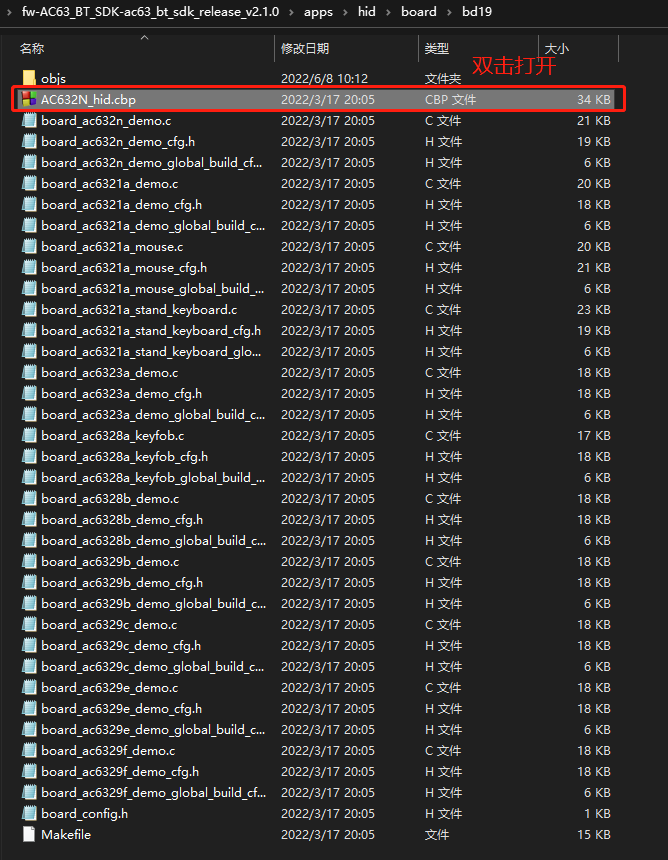
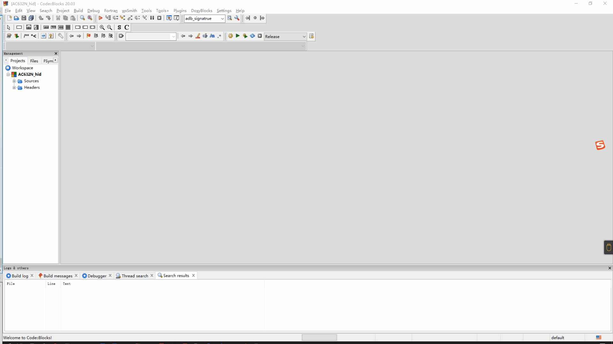
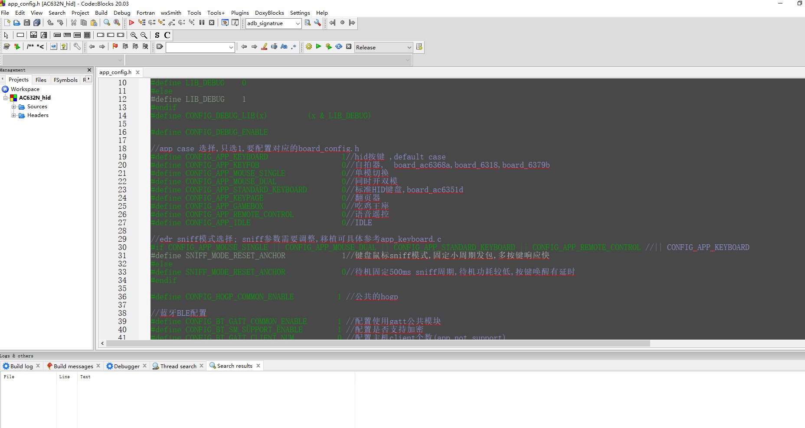
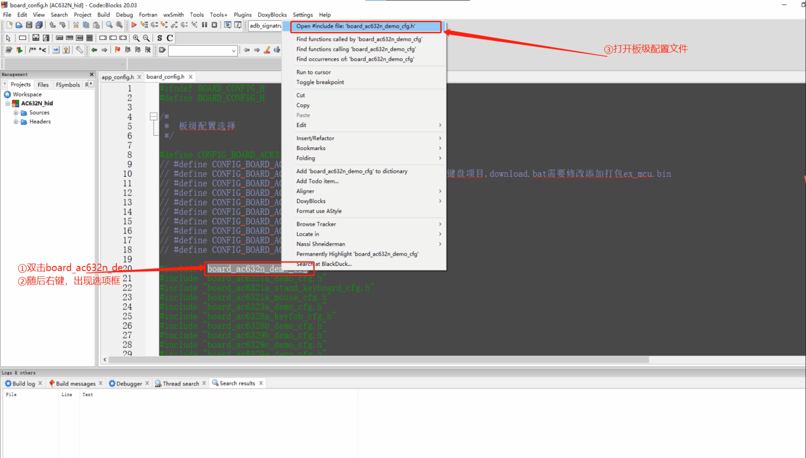
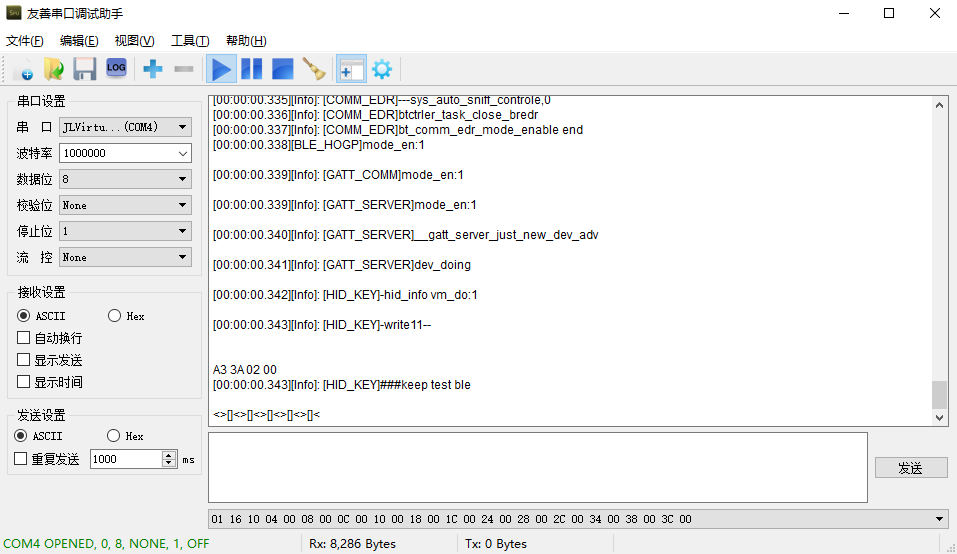

# 2. HID DEMO说明

## 2.1. 工程介绍

- 通用Human Interface Devices（HID）工程，一般做蓝牙从机连接手机/电脑/蓝牙主机,使用领域：hid按键、自拍器、 鼠标、键盘、翻页器、吃鸡王座、语音遥控器…

## 2.2. 配置使用

- 以下的DEMO的配置与说明均使用CodeBlocks进行演示。

### 2.2.1. 打开工程

- 按照 :[fw-AC63_BT_SDK](https://gitcode.com/yunthinker/fw-AC63_BT_SDK) 下载官方SDK。
- 去到/fw-AC63_BT_SDK-ac63_bt_sdk_release_vx.x.x/apps/hid/board/bd19目录下，双击AC632N_hid.cbp打开工程。
  

### 2.2.2. 配置板级

- 打开工程后，使用快捷键Alt + g 搜索board_config.h文件并双击打开。一般选择默认的板级（不同的板级有不同的开发需求）。

> **Note**
>
> 板级配置选择是单选，只能选择一个板级。

### 2.2.3. 选择case（默认选择hid按键示例）

- 使用快捷键Alt + g 打开app_config.h，配置CONFIG_APP_KEYBOARD使能。

- 让芯片处于下载模式，后进行编译下载。

- 下载代码后，根据代码将按键接线和log接线连接好。

  代码配置如下：

> **Note**
>
> 需要注意的是，上图的代码配置是默认配置，若开发者想更换按照需求更换即可（更换AD key时需要注意IO是否具有AD功能）， `同时board_ac632n_demo_cfg.h里面包含基本所有模块的宏开关，开发者应该特别重视`。

按照代码配置接线如下(下图按键接线：ADkey–PB1(ad按键,连接蓝牙后可控制播歌等操作)；RX–PA1(打印口))：

- 重新上电可查看log（baud:1000000）。至此恭喜你已经完成从安装到下载的全部步骤

- 代码下载好了也能跑了，作为一个蓝牙开发板他肯定具备被手机连接的功能。但是开发者怎么知道设备叫什么名字呢？ 双击打开/fw-AC63_BT_SDK-ac63_bt_sdk_release_vx.x.x/cpu/bd19/tools/AC632N_config_tool下的“AC632N_配置工具入口(Config Tools Entry).jlxproj”工具，为自己的设备设置一个蓝牙名字，并点击保存，再重新编译下载代码即可完成蓝牙名字设置。下载好后重新上电即可用手机搜索到设置的蓝牙名，开发者可以点击连接这个设备。

> **Note**
>
> 这个配置工具除了配置蓝牙名字，还能设置充电、电压提醒、设置蓝牙地址、设置蓝牙发射功率等功能，每次设置之后必须保存再重新下载代码才有效。