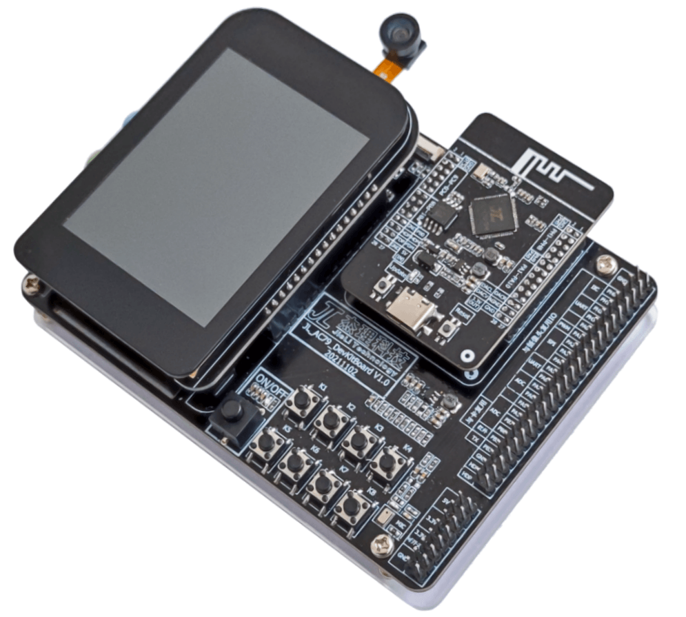

# 1. 开发板概述

JL_AC79_DevKit V1.0 是一款高集成度WiFi 802.11b/g/n以及双模蓝牙V2.1到V5.3组合的音视频多媒体系统板。搭载的AC7916属于杰理梧桐二代芯片，内部集成了主频高达320MHz的双核浮点DSP处理器，自带D-cache、I-cache、MMU等为各类方案提供了强大的运算能力；并完整支持了单天线40MHz BW WiFi 802.11b/g/n AP和STA各种通讯模式；提供ADC/DAC/ISC/推屏等丰富的音视频处理资源，同时自带PMU模块提供多种低功耗工作模式，能使用LDO或者DCDC供电模式满足工作方案供电管理需求。

JL_AC79_DevKit V1.0 开发板主要由底板JL_AC79_DevKitBoard V1.0，核心板JL_AC79_WIFI V1.0以及屏幕板JL_AC79_DevKitLCD V1.0组成，提供了多种音视频开发接口，主要包括了触摸显示屏、DVP摄像头、TF卡、DAC、USB、ADC、IIC、SPI、PWM等丰富的外设接口。适用于高性能无线传输音视方案及智能设备的应用开发。

