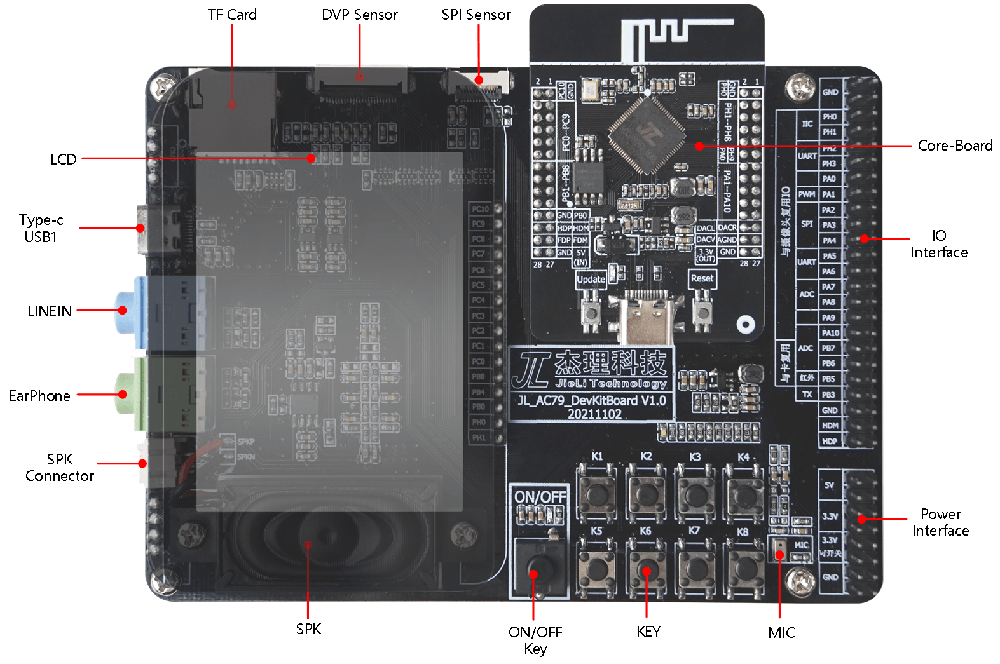
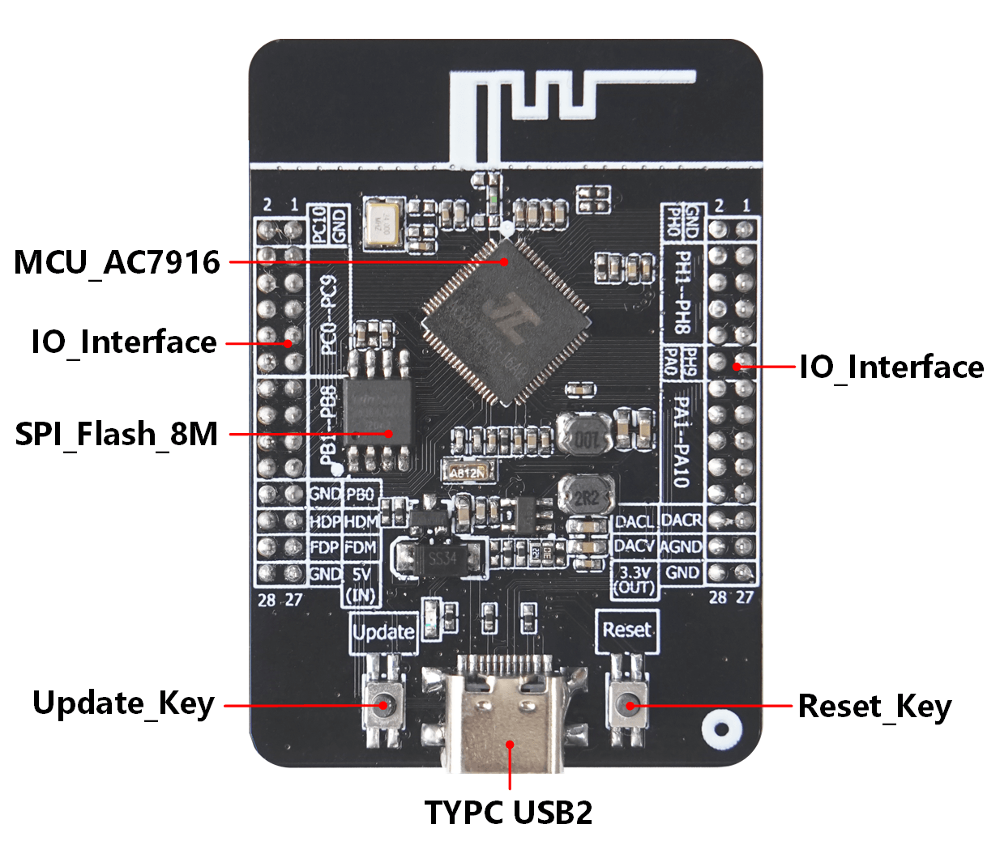

# 4. 功能框图

## 4.1. 底板功能框图

JL_AC79_DevKit V1.0 功能框图如下所示：

> 
>
> **
>     JL_AC79_DevKit V1.0 功能框图**
>
> | **主要组件** | **基本介绍**                             |
> | ------------------ | ---------------------------------------------- |
> | LCD                | 触摸一体屏LCD（320*240），触摸IC GT911         |
> | Type-C USB1        | USB1.1,TYPE-C USB接口，用于供电及程序下载      |
> | Linein             | Linein输入，3.5mm音频接口                      |
> | EarPhone           | 耳机输出，3.5mm音频接口                        |
> | SPK Connector      | 外置喇叭接口，PH2.0 2P卧贴                     |
> | SPK                | 腔体喇叭（38*18mm），8欧2W                     |
> | ON/OFF Key         | 电源开关，电源开关打开时,红色LED亮             |
> | KEY                | ADKEY按键，由8个6*6*5H 轻触开关组成          |
> | MIC                | 模拟硅麦                                       |
> | POWER Interacee    | 电源接口，包含5V,3.3V,3.3V(可开关)三路电源     |
> | IO Interface       | 多功能外置接口，可外接多种传感器或模块进行开发 |
> | Core Board         | 核心板，可作为模块独立进行开发                 |
> | SPI Sensor         | SPI接口摄像头，支持640*480@15fps               |
> | DVP Sensor         | DVP接口摄像头,支持1280*720@15fps               |
> | TF Card            | TF卡，单线模式，最高支持50M时钟速率            |

## 4.2. 核心板功能框图

核心板JL_AC79_WIFI V1.0是基于AC7916A的设计，拥有8M Byte SDRAM和外置8M Byte FLASH超大存储容量。此外，可通过TYPC USB2口，单独进行供电和下载，可独立于底板或者重新设计功能底板进行对应功能的开发。

JL_AC79_WIFI V1.0 功能框图如图所示：

 **
    JL_AC79_WIFI V1.0 功能框图**
