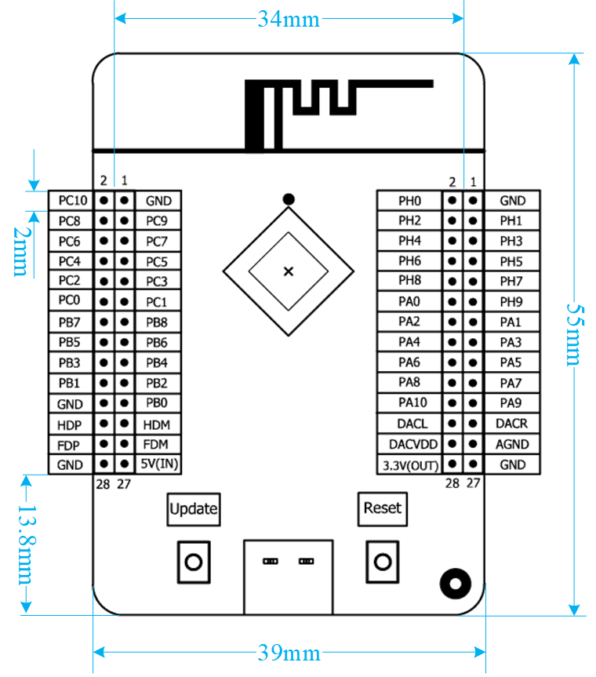
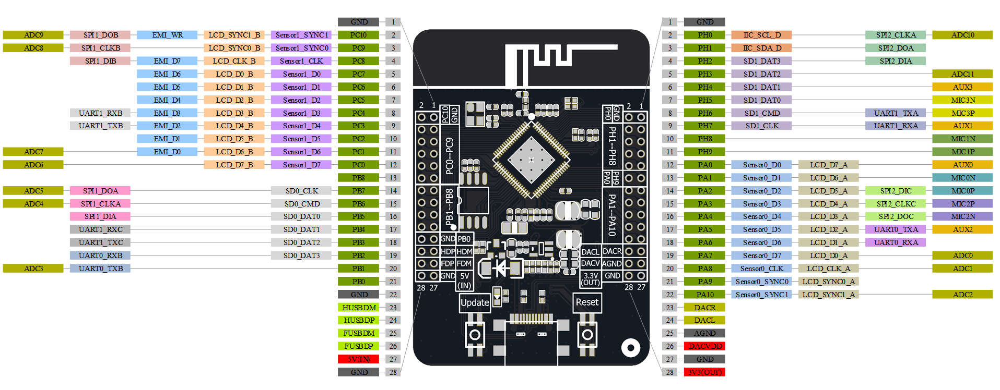

# 5. 核心板IO功能图表

核心板 JL_AC79_WIFI V1.0 的板框尺寸及 IO 接口信息如下图所示。核心板 JL_AC79_WIFI V1.0 采用 2 个 2mm 的 2*14P 排针和底板相连。开发者可将核心板单独作为模块，另外设计功能底板进行方案开发。

 												**JL_AC79_WIFI V1.0 板框尺寸及IO接口**

核心板的IO功能图如下所示：

**
    JL_AC79_WIFI V1.0 IO功能图**

核心板的IO功能表如下：

### 排针1功能表

| 排针1 | 名称   | 功能1              | 功能2     | 功能3      | 功能4              | 功能5         | 功能6         | 功能7         | 功能8  | 功能9              | 功能10        | 功能11   |
| ----- | ------ | ------------------ | --------- | ---------- | ------------------ | ------------- | ------------- | ------------- | ------ | ------------------ | ------------- | -------- |
| 1     | GND    | **接地**          |           |            |                    |               |               |               |        |                    |               |          |
| 2     | PC10   | ADC9               | SPI1_DOB  |            | Q-decoder1⁽¹⁰⁾ | Touch10⁽¹⁾ | TMR5CK⁽²⁾  | PWM3          | EMI_WR | LCD_SYNC1_B        | Sensor1_SYNC1 |          |
| 3     | PC9    | ADC8               | SPI1_CLKB |            | Q-decoder0         | Touch9        | TMR4CK        |               |        | LCD_SYNC0_B        | Sensor1_SYNC0 |          |
| 4     | PC8    |                    | SPI1_DIB  |            | SPDIF_B            | Touch8        | PWMCH2L⁽³⁾ | CAP5⁽⁴⁾    | EMI_D7 | LCD_CLK_B(SPI 屏） | Sensor1_CLK   |          |
| 5     | PC7    |                    |           |            | SPDIF_A            | Touch7        | PWMCH2H       | CAP4          | EMI_D6 | LCD_D0_B(SPI 屏）  | Sensor1_D0    |          |
| 6     | PC6    |                    |           | ALNK1_DAT3 |                    | Touch6        | TMR3CK        | PWM5          | EMI_D5 | LCD_D1_B(SPI 屏）  | Sensor1_D1    |          |
| 7     | PC5    |                    |           | ALNK1_DAT2 |                    | Touch5        | TMR2CK        | PWM4          | EMI_D4 | LCD_D2_B           | Sensor1_D2    |          |
| 8     | PC4    |                    | UART1_RXB | ALNK1_DAT1 |                    | Touch4        | FPIN7⁽⁵⁾   | TMR5          | EMI_D3 | LCD_D3_B           | Sensor1_D3    |          |
| 9     | PC3    |                    | UART1_TXB | ALNK1_DAT0 |                    | Touch3        | FPIN6         | TMR4          | EMI_D2 | LCD_D4_B           | Sensor1_D4    |          |
| 10    | PC2    |                    |           | ALNK1_LRCK |                    | Touch2        | PWMCH4L       | CAP1          | EMI_D1 | LCD_D5_B           | Sensor1_D5    |          |
| 11    | PC1    | ADC7               |           | ALNK1_SCLK | Wakeup11           | Touch1        |               | PWM1          | EMI_D0 | LCD_D6_B           | Sensor1_D6    |          |
| 12    | PC0    | ADC6               |           | ALNK1_MCLK | Wakeup10           | Touch0        | PWMCH4H       | CLKOUT0⁽⁶⁾ |        | LCD_D7_B           | Sensor1_D7    |          |
| 13    | PB8    |                    |           |            |                    |               |               |               |        |                    |               |          |
| 14    | PB7    | ADC5               | SPI1_DOA  |            |                    |               | PWMCH7L       |               |        |                    |               | SD0_CLK  |
| 15    | PB6    | ADC4               | SPI1_CLKA |            | Wakeup9            |               | PWMCH7H       |               |        |                    |               | SD0_CMD  |
| 16    | PB5    |                    | SPI1_DIA  | PLNK0_DAT1 |                    |               | FPIN2         | CAP0          |        |                    |               | SD0_DAT0 |
| 17    | PB4    |                    | UART1_RXC |            |                    |               | FPIN1         | TMR2          |        |                    |               | SD0_DAT1 |
| 18    | PB3    |                    | UART1_TXC | PLNK0_SCLK |                    |               | PWMCH6L       |               |        |                    |               | SD0_DAT2 |
| 19    | PB2    |                    | UART0_RXB | PLNK0_DAT0 |                    |               | PWMCH6H       | CAP2          |        |                    |               | SD0_DAT3 |
| 20    | PB1    | ADC3               | UART0_TXB |            | Wakeup8            |               |               | TMR1          |        |                    |               |          |
| 21    | PB0    | LVD⁽⁷⁾          |           |            |                    |               |               |               |        |                    |               |          |
| 22    | GND    | 数字地             |           |            |                    |               |               |               |        |                    |               |          |
| 23    | HDM    | Hight Speed USB DM |           |            |                    |               |               |               |        |                    |               |          |
| 24    | HDP    | Hight Speed USB DP |           |            |                    |               |               |               |        |                    |               |          |
| 25    | FDM    | Full Speed USB DM  |           |            |                    |               |               |               |        |                    |               |          |
| 26    | FDP    | Full Speed USB DP  |           |            |                    |               |               |               |        |                    |               |          |
| 27    | 5V(IN) | 电源外接输入 5V    |           |            |                    |               |               |               |        |                    |               |          |
| 28    | GND    | 数字地             |           |            |                    |               |               |               |        |                    |               |          |

| 排针2 | 名称      | 功能1                         | 功能2     | 功能3      | 功能4    | 功能5   | 功能6   | 功能7 | 功能8 | 功能9              | 功能10        | 功能11   |
| ----- | --------- | ----------------------------- | --------- | ---------- | -------- | ------- | ------- | ----- | ----- | ------------------ | ------------- | -------- |
| 1     | GND       | 数字地                        |           |            |          |         |         |       |       |                    |               |          |
| 2     | PH0       | ADC10                         | SPI2_CLKA | IIC_SCL_D  | Wakeup12 | Touch11 | PWMCH3H |       |       |                    |               |          |
| 3     | PH1       |                               | SPI2_DOA  | IIC_SDA_D  |          | Touch12 | PWMCH3L |       |       |                    |               |          |
| 4     | PH2       |                               | SPI2_DIA  |            |          | Touch13 |         |       |       |                    |               | SD1_DAT3 |
| 5     | PH3       | ADC11                         |           |            |          | Touch14 | PWMCH5H |       |       |                    |               | SD1_DAT2 |
| 6     | PH4       | AUX3⁽⁸⁾                    |           |            |          | Touch15 | FPIN4   |       |       |                    |               | SD1_DAT1 |
| 7     | PH5       | MIC3N⁽⁹⁾                   |           |            |          |         | FPIN5   |       |       |                    |               | SD1_DAT0 |
| 8     | PH6       | MIC3P                         | UART1_TXA |            |          |         | FPIN3   | PWM2  |       |                    |               | SD1_CMD  |
| 9     | PH7       | AUX1                          | UART1_RXA |            | Wakeup13 |         | PWMCH5L |       |       |                    |               | SD1_CLK  |
| 10    | PH8       | MIC1N                         |           |            |          |         |         |       |       |                    |               |          |
| 11    | PH9       | MIC1P                         |           |            |          |         |         |       |       |                    |               |          |
| 12    | PA0       | AUX0                          |           |            | Wakeup2  |         | TMR1CK  |       |       | LCD_D7_A           | Sensor0_D0    |          |
| 13    | PA1       | MIC0N                         |           |            |          |         |         | PWM0  |       | LCD_D6_A           | Sensor0_D1    |          |
| 14    | PA2       | MIC0P                         | SPI2_DIC  |            |          |         | TMR0CK  |       |       | LCD_D5_A           | Sensor0_D2    |          |
| 15    | PA3       | MIC2P                         | SPI2_CLKC |            |          |         | PWMCH0H |       |       | LCD_D4_A           | Sensor0_D3    |          |
| 16    | PA4       | MIC2N                         | SPI2_DOC  | ALNK0_MCLK | CLKOUT1  |         | PWMCH0L |       |       | LCD_D3_A           | Sensor0_D4    |          |
| 17    | PA5       | AUX2                          | UART0_TXA | ALNK0_SCLK |          |         |         | CAP3  |       | LCD_D2_A           | Sensor0_D5    |          |
| 18    | PA6       |                               | UART0_RXA | ALNK0_LRCK |          |         | FPIN0   |       |       | LCD_D1_A(SPI 屏）  | Sensor0_D6    |          |
| 19    | PA7       | ADC0                          |           | ALNK0_DAT0 | Wakeup3  |         | PWMCH1H | TMR0  |       | LCD_D0_A(SPI 屏）  | Sensor0_D7    |          |
| 20    | PA8       | ADC1                          |           | ALNK0_DAT1 | Wakeup4  |         | PWMCH1L |       |       | LCD_CLK_A(SPI 屏） | Sensor0_CLK   |          |
| 21    | PA9       |                               |           | ALNK0_DAT2 |          |         | TMR6CK  |       |       | LCD_SYNC0_A        | Sensor0_SYNC0 |          |
| 22    | PA10      | ADC2                          |           | ALNK0_DAT3 |          |         | TMR7CK  |       |       | LCD_SYNC1_A        | Sensor0_SYNC1 |          |
| 23    | DACR      | 音频输出通道 1–单通道/立体声 |           |            |          |         |         |       |       |                    |               |          |
| 24    | DACL      | 音频输出通道 2–单通道/立体声 |           |            |          |         |         |       |       |                    |               |          |
| 25    | AGND      | 模拟地                        |           |            |          |         |         |       |       |                    |               |          |
| 26    | DACVDD    | 模拟电源输出                  |           |            |          |         |         |       |       |                    |               |          |
| 27    | GND       | 数字地                        |           |            |          |         |         |       |       |                    |               |          |
| 28    | 3.3V(OUT) | 3.3V 输出，可设置关闭         |           |            |          |         |         |       |       |                    |               |          |

### 注释说明

**关于数字和字母编号的说明：** 以串口 UART0_TXA 为例，表示串口第 0 组的 A 出口，它与 UART0_TXB 属于同一组串口，仅 A/B 出口不同，当使用了同一组串口的 A 出口时， 就不能使用该串口的 B 出口，不支持同时使用。不同数字编号的同一种功能属于不同组，可以支持同时使用。上表其余功能项的数字和字母编号，与之串口编号类似。

- 注[1]: Touch*指触摸按键功能
- 注[2]: TMR*CK 为 MCPWM 电机驱动的输入时钟源
- 注[3]: PWMCH为 MCPWM 电机驱动的 PWM 高端或低端输出
- 注[4]: FPIN*为 MCPWM 电机驱动模块异常输入
- 注[5]: CAP*定时器捕获，具有红外过滤功能，可接红外一体接收头
- 注[6]: CLKOUT*为时钟输出功能，可设置输出内部时钟
- 注[7]: LVD 为低电检测功能
- 注[8]: AUX*为音频输入功能
- 注[9]: MIC*N/P 为麦克风信号输入，支持单通道或者差分输入
- 注[10]: Q-decoder*为旋转编码器功能
