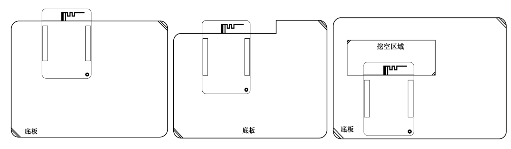

# 6. 扩展使用指南

JL_AC79_DevKit V1.0开发板集成了屏幕、摄像头、TF卡、DAC、MIC、LINEIN等音视频开发接口，同时还预留了常用的USB2、IIC、SPI、UART、PWM等接口，可以外接多种传感器或者硬件模块进行开发调试。其中核心板JL_AC79_WIFI V1.0还可单独作为模块配合用户自行设计的底板进行开发使用。

**Warning**

开发板右侧的IO_Interface与摄像头、TF卡有复用，注意在使用时不要冲突。

**核心板作为模块进行开发**

核心板JL_AC79_WIFI V1.0可作为模块板，灵活的用在其他方案板上进行开发使用。开发者可根据上文核心板IO布局及尺寸图，自行设计底板进行使用开发。开发者在自行设计底板原理图设计及PCB时，有以下注意点：

**1.电源部分**

输入：可使用TypeC座的电源输入或者5V电源连接排针5V(VIN )； 输出：可使用系统板的3.3V(OUT)排针输出的3.3V供扩展外设使用（注：低功耗模式时此3.3V为关闭状态）。

**2.音频部分**

外接音频输入(MIC、AUX)或者音频输出（DACL、DACR）时候，模拟地AGND需与数字地GND在电源入口处或者麦克风处相接，减少音频底噪。PCB布局时最好能单独分出音频模拟部分区域，音频信号(MIC、AUX、DACL、DACR)布线时应远离数字信号线并做包地(模拟地AGND)处理。

**3.位置布局**

系统板的布局时，应尽量减少底板对天线的干扰衰减作用，条件允许的情况下，推荐系统板延伸出板外，使得板载PCB天线刚好伸出板外（如图）；若无法满足延伸板外的条件，请尽量避免板载天线的靠近外壳或者金属固件，可以选择切掉或者挖空相关区域（如图），尽量扩大板载天线的净空区域，减少底板对于PCB天线RF性能的影响。

