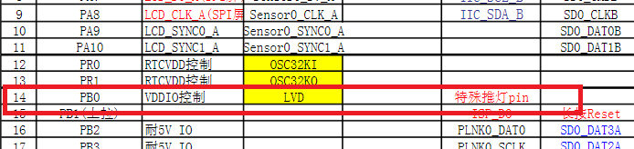
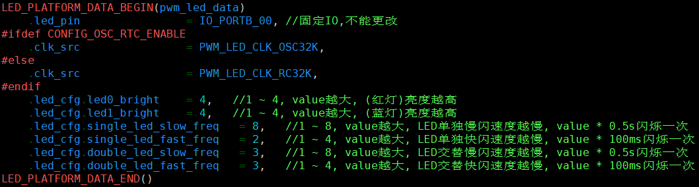
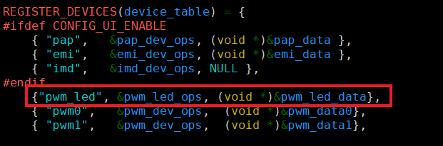
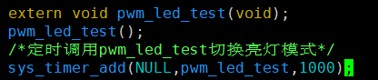
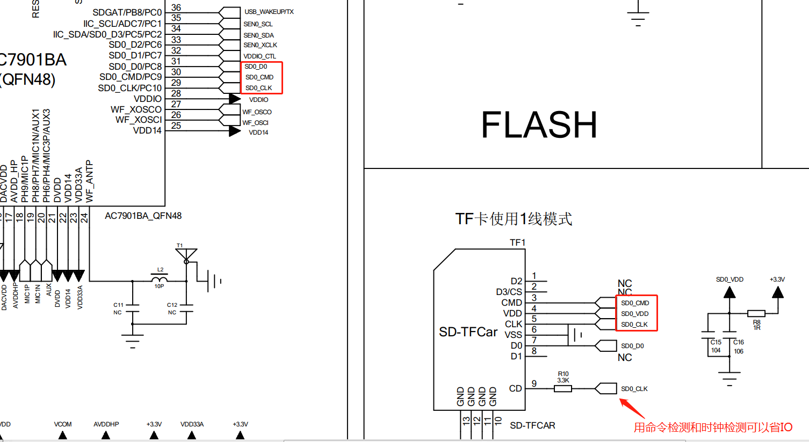
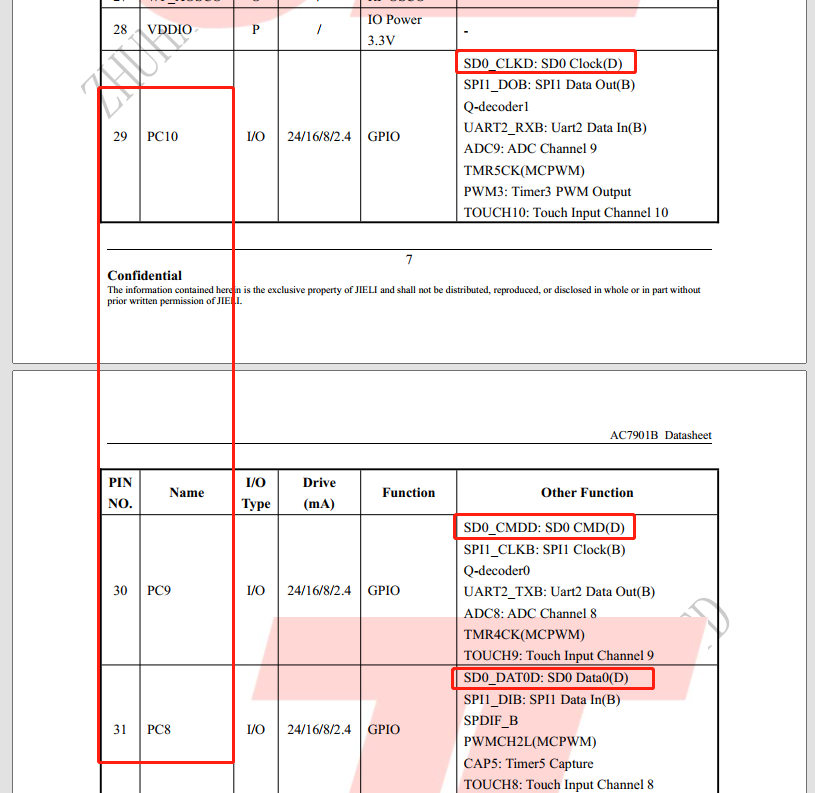
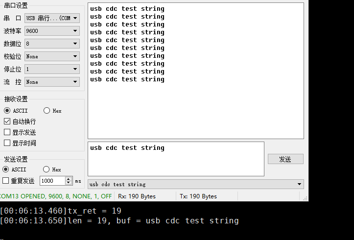

# 2. 外设部分

# 2.1. ADC


提供ADC应用示例、常用相关API介绍和常见问题。

## 2.1.1. 应用实例

**示例演示：**

- 配置测量引脚
- 添加测量通道
  example: 具体示例代码详见 `apps/common/example/peripheral/adc/adc_test.c` ,示例工程实现需在 `apps/demo/demo_DevKitBoard/include/demo_config.h` 中开启宏 `USE_ADC_TEST_DEMO` 。

## 2.1.2. 常见问题说明

- 一般初始化函数在 `JL_AC79_DevKitBoard.c` 的  `void board_init()` 函数中已经声明调用
- 添加测量通道之后，需延时操作，不能马上去读取ADC值。
- 8 bitADC(A/D转换器)，其时钟最大不可超过1MHz, 精度8bit。
- 电压测量范围是0~VDDIO。
- 使用 `adc_get_voltage()` 函数时，若数据不对,芯片需要经过杰理烧写器trim校准才行。
- 若使用VBAT通道采集电池电压，所能测量最低电压阈值是VDDIO电压+300mV，低于该电压值会出现测量不准确的问题，采用低电池电压工作的方案需要短接VDDIO和外部3.3V

**Important**

测试IO误差每800mv误差累积是10mv，误差累积是线性的，用户可以据此自行估计所测的误差范围。

## 2.1.3. API参考

AD channel define

AD_CH_PA07
AD_CH_PA08
AD_CH_PA10
AD_CH_PB01
AD_CH_PB06
AD_CH_PB07
AD_CH_PC00
AD_CH_PC01
AD_CH_PC09
AD_CH_PC10
AD_CH_PH00
AD_CH_PH03
AD_CH_DM
AD_CH_DP
AD_CH_RTC
AD_CH_PMU
AD_CH_SYSPLL
AD_CH_AUDIO
AD_CH_WIFI
AD_CH_CTMU
ADC_PMU_CH_VBG
ADC_PMU_CH_VDC14
ADC_PMU_CH_SYSVDD
ADC_PMU_CH_VTEMP
ADC_PMU_CH_PROGF
ADC_PMU_CH_VBAT
ADC_PMU_CH_LDO5V
ADC_PMU_CH_WVDD
AD_CH_LDOREF
AD_CH_PMU_VBG
AD_CH_VDC14
AD_CH_SYSVDD
AD_CH_VTEMP
AD_CH_VBAT
AD_CH_LDO5V
AD_CH_WVDD
AD_AUDIO_VCM
AD_AUDIO_VOUTL
AD_AUDIO_VOUTR
AD_AUDIO_DACVDD
AD_CH_VCM
AD_CH_VOUTL
AD_CH_VOUTR
AD_CH_DACVDD
ADC_MAX_CH

**void adc_init(void)**

adc_init, adc初始化

**void adc_pmu_detect_en(u32 ch)**

adc_pmu_detect_en, 使能adc通道
**Parameters:** ch – : ADC通道号, AD_CH_PA07

**void adc_vdc14_save(void)**

adc_vdc14_save, 存储vdc14的值

**void adc_vdc14_restore(void)**

adc_vdc14_restore, 再次存储vdc14的值，避免被中途修改

**u32 adc_get_value(u32 ch)**

adc_get_value, 获取adc通道测得的数值(3.3*数值/1024)即得对应的电压值采用等待的方式采值，直到转换结束，才出来，即死等
**Parameters:** ch – : ADC通道号, AD_CH_PA07
**Returns:** 当前通道的AD值

**u32 adc_add_sample_ch(u32 ch)**

adc_add_sample_ch, 添加adc测试通道
**Parameters:** ch – : ADC通道号
**Returns:** 当前通道值

**u32 adc_remove_sample_ch(u32 ch)**

adc_remove_sample_ch, 移除adc测试通道
**Parameters:** ch – : ADC通道号
**Returns:** 当前通道值

**u32 adc_get_voltage(u32 ch)**

adc_get_voltage, 换算电压的公式函数, 获取adc通道电压值，如果测得与实际不符，则需留意芯片是否trim过，trim值是否正确。
**Parameters:** *ch – : ADC通道号
**Returns:** 	当前通道的电压值，单位mv

# 2.2. GPIO

**Overview**

提供 GPIO 应用示例、常用相关 API 介绍和常见问题。

## 2.2.1. 应用示例

**示例演示：**

* GPIO 输入,上下拉配置
* GPIO 输出,强驱配置
* GPIO 中断模式使用
* 特殊引脚如 USB/配置为 GPIO 使用方法
* 双重绑定 IO 配置方法
* 无互斥高速度要求操作 GPIO 方法
* 复位IO维持电平使用说明
* IO口说明

example: 具体示例代码详见 `apps/common/example/peripheral/gpio/gpio.c` ，示例工程实现需在 `apps/demo/demo_DevKitBoard/include/demo_config.h` 中开启宏 `USE_GPIO_TEST_DEMO` 。

**复位维持某IO电平使用说明：**

* 1、复位前设置IO状态

  * 注意有些封装多IO内绑在一起，则需要设置另外IO为高阻模式，如PB8高阻：

  ```
  gpio_set_die(IO_PORTB_08,0);
  gpio_set_pull_up(IO_PORTB_08,0);
  gpio_set_pull_down(IO_PORTB_08,0);
  gpio_direction_input(IO_PORTB_08);
  ```

  * 硬件没外置上拉电阻则使用内部上下拉电阻
    硬件外部上下拉，则需要关闭内部的上下拉
    硬件没有上下拉，则使用内部上下拉：根据输出1开上拉关下拉，输出0关上拉开下拉
    如：使用内部上拉电阻，输出1,
    ```
    gpio_latch_en(IO_PORTC_00,0);//先解除IO
    gpio_direction_output(IO_PORTC_00,1);//设置输出
    gpio_set_pull_up(IO_PORTC_00,1)//开上拉，0则关上拉
    gpio_set_pull_down(IO_PORTC_00,0);//关下拉，1则开上拉
    gpio_latch_en(IO_PORTC_00,1);//锁住IO
    ```
* 2、使用system_reset()函数复位函数才能维持IO
* 3、uboot启动配置

  * `isd_tools_sdram.cfg` 配置uboot启动的IO状态

  > 如port_output=PC00_0;//PC00输出0
  >
  > 如port_output=PC00_1;//PC00输出1
  >

  * 或者 `isd_config_rule.c`文件配置uboot启动的IO状态
    PORT_OUTPUT=PC00_0;//PC00输出0
    PORT_OUTPUT=PC00_1;//PC00输出1

Note

uboot默认把PD6设置成SFGAT功能，若用户若想将PD6当作普通IO来使用，需要在SDK里面使能CONFIG_DISABLE_P3_FSPG_CON宏，来关闭SFGAT功能。 另外，关闭SFGAT后，PD6口会有一个较强的下拉，阻值1K左右。

**IO口说明：**

>> 如下图是IO口说明图
>>
>
> * IO的驱动能力可通过 `gpio_set_hd()` 和 `gpio_set_hd0()` 这两个函数控制，当默认都为0时普通IO的驱动能力为最大8mA + 120 欧姆的等效电阻。
> * 当使用IO为模拟功能时，如图中IE=0显示小于1.2V电压时input为0，同理IEH。

## 2.2.2. 常见问题

* __gpio_ 和 gpio接口有什么不同？
  答：两套接口函数实现的功能是一样的，只是gpio的这套接口在操作寄存器的时候都上了锁，确保操作时不会影响到同组引脚。 如果同一组引脚之间没有互斥, 针对用户有高速度要求, 并且不需要考虑同一组引脚之间操作互斥推荐使用 __gpio_这套api。
* 哪些口不能做中断检测？
  答：除了PB0和USB其他普通IO都可以。
* 特殊引脚如 USB配置为 GPIO 时注意是否开启以下的宏：

```c
#define IO_PORT_USB_DPA              (IO_PR_MAX + 0)
#define IO_PORT_USB_DMA              (IO_PR_MAX + 1)
#define IO_PORT_USB_DPB              (IO_PR_MAX + 2)
#define IO_PORT_USB_DMB              (IO_PR_MAX + 3)
```

## 2.2.3. API参考

**void gpio_port_lock(unsigned int port)**

gpio_port_lock，自旋锁，即不能被另一个cpu打断，也不能被中断打断

**Parameters:** port – 参考宏IO_PORTx_xx，如IO_PORTA_00

**void gpio_port_unlock(unsigned int port)**

gpio_port_unlock，解除自旋锁

**Parameters:** port – 参考宏IO_PORTx_xx，如IO_PORTA_00

**int gpio_direction_input(unsigned int gpio)**

gpio_direction_input，将引脚直接设为输入模式

**Parameters:** gpio – 参考宏IO_PORTx_xx，如IO_PORTA_00
**Returns:** 0：成功 非0：失败

**int gpio_direction_output(unsigned int gpio, int value)**

gpio_direction_output，设置引脚的方向为输出，并设置一下电平

**Parameters:** gpio – 参考宏IO_PORTx_xx，如IO_PORTA_00
  			value – 1，输出1, 0，输出0
**Returns:** 0：成功 非0：失败

**int gpio_set_pull_up(unsigned int gpio, int value)**

gpio_set_pull_up，设置引脚的上拉，上拉电阻10K，当引脚为输入模式时才有效

**Parameters:** gpio – 参考宏IO_PORTx_xx，如IO_PORTA_00
  			value – 1，上拉；0，不上拉
**Returns:** 0：成功 非0：失败

**int gpio_set_pull_down(unsigned int gpio, int value)**

gpio_set_pull_down，设置引脚的下拉，下拉电阻10K，当引脚为输入模式时才有效

**Parameters:** gpio – 参考宏IO_PORTx_xx，如IO_PORTA_00
  			value – 1，下拉；0，不下拉
**Returns:** 0：成功 非0：失败

**int gpio_set_hd(unsigned int gpio, int value)**

gpio_set_hd, 设置引脚的内阻，当引脚为输出模式时才有效

**Parameters:** gpio – 参考宏IO_PORTx_xx，如IO_PORTA_00
  			value – 1，关闭内阻增强输出 0，存在内阻，芯片默认的
**Returns:** 0：成功 非0：失败

**int gpio_set_hd1(unsigned int gpio, int value)**

gpio_set_hd1, 设置引脚的输出电流，当引脚为输出模式时才有效

**Parameters:** gpio – 参考宏IO_PORTx_xx，如IO_PORTA_00
  			value – 1，电流变大增强输出； 0，默认电流
**Returns:** 0：成功 非0：失败

**int gpio_set_die(unsigned int gpio, int value)**

gpio_set_die，设置引脚为数字功能还是模拟功能，比如引脚作为ADC的模拟输入，则die要置0

**Parameters:** gpio – 参考宏IO_PORTx_xx，如IO_PORTA_00
  			value – 1，数字功能，即01信号； 0，跟电压先关的模拟功能
**Returns:** 0：成功 非0：失败

**int gpio_set_output_clk(unsigned int gpio, int clk)**

gpio_set_output_clk，将引脚设为时钟输出

**Parameters:** gpio – 参考宏IO_PORTx_xx，如IO_PORTA_00
  			clk – 12,24分别是12M时钟和24M时钟，0是默认24M时钟
**Returns:** 0：成功 非0：失败

**int gpio_clear_output_clk(unsigned int gpio, int clk)**

gpio_clear_output_clk，清除引脚时钟输出

**Parameters:** gpio – 参考宏IO_PORTx_xx，如IO_PORTA_00
  			clk – 12,24分别是12M时钟和24M时钟，0是默认24M时钟
**Returns:** 0：成功 非0：失败

**int gpio_read(unsigned int gpio)**

gpio_read，读取引脚的输入电平，引脚为输入模式时才有效

**Parameters:** gpio – 参考宏IO_PORTx_xx，如IO_PORTA_00
**Returns:** 电平值

**int gpio_set_direction(unsigned int gpio, unsigned int dir)**

gpio_set_direction，设置引脚方向

**Parameters:** gpio – 参考宏IO_PORTx_xx，如IO_PORTA_00
  			dir – 1，输入；0，输出
**Returns:** 0：成功 非0：失败

**void gpio_latch_en(unsigned int gpio, unsigned char en)**

gpio_latch_en，保持引脚电平，软硬件无法改变它，如需取消则再调用一次并把en设置为0

**Parameters:** gpio – 参考宏IO_PORTx_xx，如IO_PORTA_00
  			en – 1，使能；0，取消使能

**int gpio_set_dieh(unsigned int gpio, int value)**

gpio_set_dieh, 设置引脚为数字功能还是模拟功能，但模拟功能时，跟die的不一样而已

**Parameters:** gpio – 参考宏IO_PORTx_xx，如IO_PORTA_00
  			value – 1，数字功能，即01信号； 0，跟电压先关的模拟功能
**Returns:** 0：成功 非0：失败

**unsigned int gpio_output_channle(unsigned int gpio, enum gpio_out_channle clk)**

gpio_set_output_channle, 将IO映射成特殊引脚

**Parameters:** gpio – 参考宏IO_PORTx_xx，如IO_PORTA_00
  			clk – 参考枚举CHx_UTx_TX，如CH0_UT0_TX
**Returns:** 0：成功 非0：失败

**unsigned int gpio_clear_output_channle(unsigned int gpio, enum gpio_out_channle clk)**

gpio_clear_output_channle，取消将IO映射成特殊引脚

**Parameters:** gpio – 参考宏IO_PORTx_xx，如IO_PORTA_00
  			clk – 参考枚举CHx_UTx_TX，如CH0_UT0_TX
**Returns:** 0：成功 非0：失败

**unsigned int gpio_uart_rx_input(unsigned int gpio, unsigned int ut, unsigned int ch)**

gpio_uart_rx_input，将引脚映射成RX脚

**Parameters:** gpio – 参考宏IO_PORTx_xx，如IO_PORTA_00
  			ut – 0,1,2，分别代表串口0，1，2
  			ch – 0,1,2,3，分别代表input_channel0，1，2，3
**Returns:** 0：成功 非0：失败

**unsigned int gpio_close_uart0(void)**

gpio_close_uart0，关闭串口0

**Returns:** 0：成功 非0：失败

**unsigned int gpio_close_uart1(void)**

gpio_close_uart1，关闭串口1

**Returns:** 0：成功 非0：失败

**unsigned int gpio_close_uart2(void)**

gpio_close_uart2，关闭串口2

**Returns:** 0：成功 非0：失败

**unsigned int gpio_set_uart0(unsigned int ch)**

gpio_set_uart0

**Parameters:** ch – 0:3 选择对应IO wl82

| ch | tx                     | rx     |
| -- | ---------------------- | ------ |
| 0  | PA5_TX                 | PA6_RX |
| 1  | PB1_TX                 | PB2_RX |
| 2  | PA3_TX                 | PA4_RX |
| 3  | PH0_TX                 | PH1_RX |
| -1 | 关闭对应的IO口串口功能 | no     |

**Returns:**

**unsigned int gpio_set_uart1(unsigned int ch)**

gpio_set_uart1

**Parameters:** ch – 0:3 选择对应IO wl82

| ch | tx                     | rx     |
| -- | ---------------------- | ------ |
| 0  | PH6_TX                 | PH7_RX |
| 1  | PC3_TX                 | PC4_RX |
| 2  | PB3_TX                 | PB4_RX |
| 3  | USBDP                  | USBDM  |
| -1 | 关闭对应的IO口串口功能 | no     |

**Returns:**

**unsigned int gpio_set_uart2(unsigned int ch)**

gpio_set_uart2

**Parameters:** ch – 0:3 选择对应IO wl82

| ch | tx                     | rx      |
| -- | ---------------------- | ------- |
| 0  | PH2_TX                 | PH3_RX  |
| 1  | PC9_TX                 | PC10_RX |
| 2  | PB6_TX                 | PB7_RX  |
| 3  | PE0_TX                 | PE1_RX  |
| -1 | 关闭对应的IO口串口功能 | no      |

**Returns:**

# 2.3. UART

**Overview**

提供 UART 应用示例、配置介绍、串口控制流的使用和常见问题。

## 2.3.1. 应用实例

**示例演示：**

* 根据条件执行对应的 uart 收发模式,等待接受来自 UART2 的数据，收到数据后发送回去。

example: 具体示例代码详见 `apps/common/example/peripheral/uart/uart_test.c` ，示例工程实现需在 `apps/demo/demo_DevKitBoard/include/demo_config.h` 中开启宏 `USE_UART_TEST_DEMO`。

## 2.3.2. 常见问题

* 使用固定引脚的时候，需注意芯片封装是否有支持的引脚, 具体可以通过对应型号原理图查看。
* 如果有不需要用到的 tx_pin 或者 rx_pin, 需要将其赋值为-1。
* USB脚只有UART1支持使用、串口流控制也只有UART1支持。
* 使用通信功能时,例如使用串口1作为通信串口，需要在使用的 board 文件加入以下代码注册串口, 只使用到打印功能时不需要注册。

  ```
  REGISTER_DEVICES(device_table) = {
          {"uart1", &uart_dev_ops, (void *)&uart1_data },
  };
  ```
* 使用打印功能时,例如使用串口2作为打印，需要在使用的 board 文件加入以下代码初始化串口。

  ```
  void debug_uart_init()


  {
      uart_init(&uart2_data);
  }
  ```
* 注意使用到的串口引脚在程序其他地方有没有同时占据使用。
* 使用重映射方法时需要注意 OUTPUT_CHANNEL 和 INPUT_CHANNEL 在程序其他地方有没有同时占据使用。
* 串口 TX 或者 RX 能否配置任意引脚？
  答：能,使用重映射方法配置 OUTPUT_CHANNEL和INPUT_CHANNEL。
* 优先推荐使用一个串口的配置方法, 优先推荐使用固定引脚的配置方法，可以节省 OUTPUT_CHANNEL 和 INPUT_CHANNEL 供其他功能使用。

## 2.3.3. 串口控制流配置说明使用

* 1.首先在 `board.c` 中配置串口信息

  > ```
  > UART1_PLATFORM_DATA_BEGIN(uart1_data)
  >     .baudrate = 9600,
  >     .port = PORT_REMAP,
  >     .output_channel = OUTPUT_CHANNEL1,
  >     .input_channel = INPUT_CHANNEL1,
  >     .tx_pin = IO_PORTC_01,
  >     .rx_pin = IO_PORTC_02,
  >     .max_continue_recv_cnt = 500,
  >     .idle_sys_clk_cnt = 500000,
  >     .clk_src = PLL_48M,
  >     .rts_pin = IO_PORTB_07,  //配置RTS控制引脚
  >     .cts_pin = IO_PORTC_06,  //配置CTS控制引脚
  >     .rts_output_channel = OUTPUT_CHANNEL2,  //配置RTS启用的通道
  >     .flow_ctl_enable = 1,  ////开启控制流
  > UART1_PLATFORM_DATA_END();
  > ```
  >
* 2. 使用dev_ioctl来调用串口控制流挂起和唤醒

  > ```
  > dev_ioctl(hdl, UART1_FLOW_CTL_RTS_SUSPEND,0);
  >
  > dev_ioctl(hdl,UART1_FLOW_CTL_RTS_RESUME,0);
  > ```
  >

## 2.3.4. UART配置说明

**两个串口使用情况配置：**

* 1.串口2用做打印，串口1做通信只用RX引脚
  **Note**

  串口2使用固定组引脚的配置方法，使用PORTC_9_10中的IO_PORTC_9作为打印,

  串口1使用INPUT_CHANNEL3重映射引脚的配置方法，使用IO_PORTC_10作为通信RX引脚

> ```
> UART1_PLATFORM_DATA_BEGIN(uart1_data)
>     .baudrate = 460800,
>     .port = PORT_REMAP,
>     .tx_pin = -1,
>     .rx_pin = IO_PORTC_10,
>     .input_channel = INPUT_CHANNEL3,
>     .max_continue_recv_cnt = 1024,
>     .idle_sys_clk_cnt = 500000,
>     .clk_src = PLL_48M,
>     .disable_tx_irq=1,
> UART1_PLATFORM_DATA_END();
>
> UART2_PLATFORM_DATA_BEGIN(uart2_data)
>     .baudrate = 1000000,
>     .port = PORTC_9_10,
>     .tx_pin = IO_PORTC_09,
>     .rx_pin = -1,
>     .max_continue_recv_cnt = 1024,
>     .idle_sys_clk_cnt = 500000,
>     .clk_src = PLL_48M,
>     .flags = UART_DEBUG,
> UART2_PLATFORM_DATA_END();
> ```
>
> **Note**
>
>> 串口2使用OUTPUT_CHANNEL0重映射引脚的配置方法使用IO_PORTH_06作为打印,
>>
>> 串口1使用固定组引脚的配置方法，使用PORTH_6_7中的IO_PORTH_07作为通信RX引脚
>>
>
> ```
> UART1_PLATFORM_DATA_BEGIN(uart1_data)
>     .baudrate = 460800,
>     .port = PORTH_6_7,
>     .tx_pin = -1,
>     .rx_pin = IO_PORTH_07,
>     .max_continue_recv_cnt = 1024,
>     .idle_sys_clk_cnt = 500000,
>     .clk_src = PLL_48M,
>     .disable_tx_irq=1,
> UART1_PLATFORM_DATA_END();
>
> UART2_PLATFORM_DATA_BEGIN(uart2_data)
>     .baudrate = 1000000,
>     .port = PORT_REMAP,
>     .tx_pin = IO_PORTH_06,
>     .rx_pin = -1,
>     .output_channel = OUTPUT_CHANNEL0,
>     .max_continue_recv_cnt = 1024,
>     .idle_sys_clk_cnt = 500000,
>     .clk_src = PLL_48M,
>     .flags = UART_DEBUG,
> UART2_PLATFORM_DATA_END();
> ```
>
> **Note**
>
>> 串口2使用OUTPUT_CHANNEL0重映射引脚的配置方法，使用IO_PORTC_00作为打印,
>>
>> 串口1使用INPUT_CHANNEL3重映射引脚的配置方法，使用IO_PORTB_01作为通信RX引脚
>>
>
> ```
>  UART1_PLATFORM_DATA_BEGIN(uart1_data)
>     .baudrate = 460800,
>     .port = PORT_REMAP,
>     .tx_pin = -1,
>     .rx_pin = IO_PORTB_01,
>     .input_channel = INPUT_CHANNEL3,
>     .max_continue_recv_cnt = 1024,
>     .idle_sys_clk_cnt = 500000,
>     .clk_src = PLL_48M,
>     .disable_tx_irq=1,
> UART1_PLATFORM_DATA_END();
>
> UART2_PLATFORM_DATA_BEGIN(uart2_data)
>     .baudrate = 1000000,
>     .port = PORT_REMAP,
>     .tx_pin = IO_PORTC_00,
>     .rx_pin = -1,
>     .output_channel = OUTPUT_CHANNEL0,
>     .max_continue_recv_cnt = 1024,
>     .idle_sys_clk_cnt = 500000,
>     .clk_src = PLL_48M,
>     .flags = UART_DEBUG,
> UART2_PLATFORM_DATA_END();
> ```
>
> **Note**
>
> 串口2使用固定组引脚的配置方法，使用PORTC_9_10中的IO_PORTC_9作为打印,
>
> 串口1使用固定组引脚的配置方法，使用PORTH_6_7中的IO_PORTH_07作为通信RX引脚
>
> ```
> UART1_PLATFORM_DATA_BEGIN(uart1_data)
>     .baudrate = 460800,
>     .port = PORTH_6_7,
>     .tx_pin = -1,
>     .rx_pin = IO_PORTH_07,
>     .max_continue_recv_cnt = 1024,
>     .idle_sys_clk_cnt = 500000,
>     .clk_src = PLL_48M,
>     .disable_tx_irq=1,
> UART1_PLATFORM_DATA_END();
>
> UART2_PLATFORM_DATA_BEGIN(uart2_data)
>     .baudrate = 1000000,
>     .port = PORTC_9_10,
>     .tx_pin = IO_PORTC_09,
>     .rx_pin = -1,
>     .max_continue_recv_cnt = 1024,
>     .idle_sys_clk_cnt = 500000,
>     .clk_src = PLL_48M,
>     .flags = UART_DEBUG,
> UART2_PLATFORM_DATA_END();
> ```

* 2.串口2用做打印，串口1做通信只用TX引脚。

> **Note**
>
> 串口1使用重映射引脚的配置方法，将PC00重映射做tx引脚。使用了OUTPUT_CHANNEL3。
>
> 串口2使用固定引脚的配置方法，使用了固定的一组引脚PC9,PC10。只用了PC09做tx脚。
>
> ```
> UART1_PLATFORM_DATA_BEGIN(uart1_data)
>     .baudrate = 460800,
>     .port = PORT_REMAP,
>     .tx_pin = IO_PORTC_00,
>     .rx_pin = -1,
>     .output_channel = OUTPUT_CHANNEL3,
>     .max_continue_recv_cnt = 1024,
>     .idle_sys_clk_cnt = 500000,
>     .clk_src = PLL_48M,
>     .disable_tx_irq=1,
> UART1_PLATFORM_DATA_END();
>
> UART2_PLATFORM_DATA_BEGIN(uart2_data)
>     .baudrate = 1000000,
>     .port = PORTC_9_10,
>     .tx_pin = IO_PORTC_09,
>     .rx_pin = -1,
>     .max_continue_recv_cnt = 1024,
>     .idle_sys_clk_cnt = 500000,
>     .clk_src = PLL_48M,
>     .flags = UART_DEBUG,
> UART2_PLATFORM_DATA_END();
> ```
>
> **Note**
>
> 串口1使用重映射引脚的配置方法，将PC00重映射做tx引脚。使用了OUTPUT_CHANNEL3。
>
> 串口2使用重映射引脚的配置方法，将PC01重映射做tx引脚。使用了OUTPUT_CHANNEL0。
>
> ```
> UART1_PLATFORM_DATA_BEGIN(uart1_data)
>     .baudrate = 460800,
>     .port = PORT_REMAP,
>     .tx_pin = IO_PORTC_00,
>     .rx_pin = -1,
>     .output_channel = OUTPUT_CHANNEL3,
>     .max_continue_recv_cnt = 1024,
>     .idle_sys_clk_cnt = 500000,
>     .clk_src = PLL_48M,
>     .disable_tx_irq=1,
> UART1_PLATFORM_DATA_END();
>
> UART2_PLATFORM_DATA_BEGIN(uart2_data)
>     .baudrate = 1000000,
>     .port = PORT_REMAP,
>     .tx_pin = IO_PORTC_01,
>     .rx_pin = -1,
>     .output_channel = OUTPUT_CHANNEL0,
>     .max_continue_recv_cnt = 1024,
>     .idle_sys_clk_cnt = 500000,
>     .clk_src = PLL_48M,
>     .flags = UART_DEBUG,
> UART2_PLATFORM_DATA_END();
> ```
>
> **Note**
>
> 串口1使用固定引脚的配置方法，使用了固定的一组引脚PH06和PH07。只用了PH06做tx脚。
>
> 串口2使用固定引脚的配置方法，使用了固定的一组引脚PC09和PC10。只用了PC09做tx脚。
>
> ```
> UART1_PLATFORM_DATA_BEGIN(uart1_data)
>     .baudrate = 460800,
>     .port = PORTH_6_7,
>     .tx_pin = IO_PORTH_06,
>     .rx_pin = -1,
>     .max_continue_recv_cnt = 1024,
>     .idle_sys_clk_cnt = 500000,
>     .clk_src = PLL_48M,
>     .disable_tx_irq=1,
> UART1_PLATFORM_DATA_END();
>
> UART2_PLATFORM_DATA_BEGIN(uart2_data)
>     .baudrate = 1000000,
>     .port = PORT_REMAP,
>     .tx_pin = IO_PORTC_01,
>     .rx_pin = -1,
>     .output_channel = OUTPUT_CHANNEL0,
>     .max_continue_recv_cnt = 1024,
>     .idle_sys_clk_cnt = 500000,
>     .clk_src = PLL_48M,
>     .flags = UART_DEBUG,
> UART2_PLATFORM_DATA_END();
> ```
>
> **Note**
>
> 串口1使用固定引脚的配置方法，使用了固定的一组引脚PH06和PH07。只用了PH06做tx脚。
>
> 串口2使用重映射引脚的配置方法，将PC01重映射做tx引脚。使用了OUTPUT_CHANNEL0。
>
> ```
>  UART1_PLATFORM_DATA_BEGIN(uart1_data)
>     .baudrate = 460800,
>     .port = PORTH_6_7,
>     .tx_pin = IO_PORTH_06,
>     .rx_pin = -1,
>     .max_continue_recv_cnt = 1024,
>     .idle_sys_clk_cnt = 500000,
>     .clk_src = PLL_48M,
>     .disable_tx_irq=1,
> UART1_PLATFORM_DATA_END();
>
> UART2_PLATFORM_DATA_BEGIN(uart2_data)
>     .baudrate = 1000000,
>     .port = PORTC_9_10,
>     .tx_pin = IO_PORTC_09,
>     .rx_pin = -1,
>     .max_continue_recv_cnt = 1024,
>     .idle_sys_clk_cnt = 500000,
>     .clk_src = PLL_48M,
>     .flags = UART_DEBUG,
> UART2_PLATFORM_DATA_END();
> ```

* 3.串口2用做打印，串口1做通信既用TX引脚又用RX引脚。

> **Note**
>
> 串口1使用重映射引脚的配置方法，将PC00重映射做tx引脚。使用了OUTPUT_CHANNEL3。将PC01重映射做rx引脚。使用了INPUT_CHANNEL3。 串口2使用固定引脚的配置方法，使用了固定的一组引脚PC9,PC10。只用了PC09做tx脚。
>
> ```
>  UART1_PLATFORM_DATA_BEGIN(uart1_data)
>     .baudrate = 460800,
>     .port = PORT_REMAP,
>     .tx_pin = IO_PORTC_00,
>     .rx_pin = IO_PORTC_01,
>     .output_channel = OUTPUT_CHANNEL3,
>     .input_channel = INPUT_CHANNEL3,
>     .max_continue_recv_cnt = 1024,
>     .idle_sys_clk_cnt = 500000,
>     .clk_src = PLL_48M,
>     .disable_tx_irq=1,
> UART1_PLATFORM_DATA_END();
>
> UART2_PLATFORM_DATA_BEGIN(uart2_data)
>     .baudrate = 1000000,
>     .port = PORTC_9_10,
>     .tx_pin = IO_PORTC_09,
>     .rx_pin = -1,
>     .max_continue_recv_cnt = 1024,
>     .idle_sys_clk_cnt = 500000,
>     .clk_src = PLL_48M,
>     .flags = UART_DEBUG,
> UART2_PLATFORM_DATA_END();
> ```
>
> **Note**
>
> 串口1使用固定引脚的配置方法，使用了固定的一组引脚PH06和PH07。PH06做tx脚，PH07做rx脚。 串口2使用固定引脚的配置方法，使用了固定的一组引脚PC9,PC10。只用了PC09做tx脚。
>
> ```
> UART1_PLATFORM_DATA_BEGIN(uart1_data)
>     .baudrate = 460800,
>     .port = PORTH_6_7,
>     .tx_pin = IO_PORTH_06,
>     .rx_pin = IO_PORTH_07,
>     .max_continue_recv_cnt = 1024,
>     .idle_sys_clk_cnt = 500000,
>     .clk_src = PLL_48M,
>     .disable_tx_irq=1,
> UART1_PLATFORM_DATA_END();
>
> UART2_PLATFORM_DATA_BEGIN(uart2_data)
>     .baudrate = 1000000,
>     .port = PORTC_9_10,
>     .tx_pin = IO_PORTC_09,
>     .rx_pin = -1,
>     .max_continue_recv_cnt = 1024,
>     .idle_sys_clk_cnt = 500000,
>     .clk_src = PLL_48M,
>     .flags = UART_DEBUG,
> UART2_PLATFORM_DATA_END();
> ```
>
> Note
>
> 串口1使用固定引脚的配置方法，使用了固定的一组引脚PH06和PH07。PH06做tx脚，PH07做rx脚。
>
> 串口2使用重映射引脚的配置方法，将PC01重映射做tx引脚。使用了OUTPUT_CHANNEL0。
>
> ```
> UART1_PLATFORM_DATA_BEGIN(uart1_data)
>     .baudrate = 460800,
>     .port = PORTH_6_7,
>     .tx_pin = IO_PORTH_06,
>     .rx_pin = IO_PORTH_07,
>     .max_continue_recv_cnt = 1024,
>     .idle_sys_clk_cnt = 500000,
>     .clk_src = PLL_48M,
>     .disable_tx_irq=1,
> UART1_PLATFORM_DATA_END();
>
> UART2_PLATFORM_DATA_BEGIN(uart2_data)
>     .baudrate = 1000000,
>     .port = PORT_REMAP,
>     .tx_pin = IO_PORTC_01,
>     .rx_pin = -1,
>     .output_channel = OUTPUT_CHANNEL0,
>     .max_continue_recv_cnt = 1024,
>     .idle_sys_clk_cnt = 500000,
>     .clk_src = PLL_48M,
>     .flags = UART_DEBUG,
> UART2_PLATFORM_DATA_END();
> ```
>
> **Note**
>
> 串口1使用重映射引脚的配置方法，将PC06重映射做tx引脚。使用了OUTPUT_CHANNEL3。将PC07重映射做rx引脚。使用了INPUT_CHANNEL3。
>
> 串口2使用重映射引脚的配置方法，将PC01重映射做tx引脚。使用了OUTPUT_CHANNEL0。
>
> ```
> UART1_PLATFORM_DATA_BEGIN(uart1_data)
>     .baudrate = 460800,
>     .port = PORT_REMAP,
>     .tx_pin = IO_PORTC_06,
>     .rx_pin = IO_PORTC_07,
>     .output_channel = OUTPUT_CHANNEL3,
>     .input_channel = INPUT_CHANNEL3,
>     .max_continue_recv_cnt = 1024,
>     .idle_sys_clk_cnt = 500000,
>     .clk_src = PLL_48M,
>     .disable_tx_irq=1,
> UART1_PLATFORM_DATA_END();
>
> UART2_PLATFORM_DATA_BEGIN(uart2_data)
>     .baudrate = 1000000,
>     .port = PORT_REMAP,
>     .tx_pin = IO_PORTC_01,
>     .rx_pin = -1,
>     .output_channel = OUTPUT_CHANNEL0,
>     .max_continue_recv_cnt = 1024,
>     .idle_sys_clk_cnt = 500000,
>     .clk_src = PLL_48M,
>     .flags = UART_DEBUG,
>
> UART2_PLATFORM_DATA_END();
> ```

**一个串口使用情况配置：**

> **Note**
>
> 串口1使用固定组引脚的配置方法，使用PORTH_6_7中的IO_PORTH_06作为打印, IO_PORTH_07作为通信RX引脚
>
> ```
> UART1_PLATFORM_DATA_BEGIN(uart1_data)
>     .baudrate = 460800,
>     .port = PORTH_6_7,
>     .tx_pin = IO_PORTH_06
>     .rx_pin = IO_PORTH_07,
>     .max_continue_recv_cnt = 1024,
>     .idle_sys_clk_cnt = 500000,
>     .clk_src = PLL_48M,
>     .disable_tx_irq=1,
>     .flags = UART_DEBUG,
> UART1_PLATFORM_DATA_END();
> ```
>
> **Note**
>
> 串口1使用固定组引脚的配置方法，使用PORTH_6_7中的IO_PORTH_06作为打印, IO_PORTH_07作为通信RX引脚
>
> ```
> UART1_PLATFORM_DATA_BEGIN(uart1_data)
>           .baudrate = 460800,
>     .port = PORT_REMAP,
>     .tx_pin = IO_PORTC_00
>     .rx_pin = IO_PORTC_01,
>     .input_channel = INPUT_CHANNEL3,
>     .output_channel = OUTPUT_CHANNEL3,
>     .max_continue_recv_cnt = 1024,
>     .idle_sys_clk_cnt = 500000,
>     .clk_src = PLL_48M,
>     .disable_tx_irq=1,
>     .flags = UART_DEBUG,
> UART1_PLATFORM_DATA_END();
> ```

## 2.3.5. API参考

UART dev_ioctl funciton selest

UART_MAGIC
UART_FLUSH
串口重载

UART_SET_RECV_ALL
设置串口等待接收满才退出，需先调用下面的阻塞指令

UART_SET_RECV_BLOCK
设置串口接收阻塞

UART_SET_RECV_TIMEOUT
设置串口接收超时

UART_SET_RECV_TIMEOUT_CB
设置串口超时之后回调的函数

UART_GET_RECV_CNT
获得串口当前接收到的计数值

UART_START
开启串口

UART_SET_CIRCULAR_BUFF_ADDR
设置串口循环buf地址

UART_SET_CIRCULAR_BUFF_LENTH
设置串口循环buf长度

UART_SET_BAUDRATE
串口运行过程中更换波特率，初始化串口时不需要调用这

UART1_FLOW_CTL_RTS_SUSPEND
串口1控制流挂起

UART1_FLOW_CTL_RTS_RESUME
串口1控制流恢复

UART_SET_9BIT_MODE
设置串口接收是否使用9bit模式

UART_CLK selest

enum **uart_clk_src**
*Values:*

enumerator **LSB_CLK**
低速时钟

enumerator **OSC_CLK**
晶振时钟

enumerator **PLL_48M**
PLL48M时钟

UART error

enum **[anonymous]**
*Values:*

enumerator **UART_CIRCULAR_BUFFER_WRITE_OVERLAY**
循环buf写满

enumerator **UART_RECV_TIMEOUT**
接收超时

enumerator **UART_RECV_EXIT**
接收终止退出

struct **uart_platform_data**
Public Members

u8 *****name
串口名称，在注册的时候已经配好

u8 **irq**
中断号，在注册的时候已经对应设置好了

u8 **flow_ctl_enable**
1:串口1控制流开启

u8 **disable_tx_irq**
1:不使用发送中断

u8 **disable_rx_irq**
1:不使用中断接收

u8 **disable_ot_irq**
1:不使用超时中断

u8 **tx_pin_hd**
1:tx io开强驱

int **tx_pin**
发送引脚,不配置需设置-1

int **rx_pin**
接收引脚,不配置需设置-1

int **flags**
串口用作打印

u32 **baudrate**
波特率设置

int **port**
enum _uart_port0-3的值

int **input_channel**
输入通道

int **output_channel**
输出通道

u32 **max_continue_recv_cnt**
连续接收最大字节

u32 **idle_sys_clk_cnt**
超时计数器，如果在指定的时间里没有收到任何数据，则产生超时中断

enum **uart_**clk_src**** **clk_src**
选择时钟源

int **rts_pin**
串口一控制流RTS脚

int **cts_pin**
串口一控制流CTS脚

int **rts_output_channel**
RTS输出通道,只支持输出通道2，3

# 2.4. I2C

**Overview**

提供 I2C 应用示例、配置介绍和常见问题。

## 2.4.1. 应用实例

**示例演示：**

* 软件 I2C 读写数据
* 硬件 I2C 读写数据

example: 具体示例代码详见 `apps/common/example/periphUSE_HW_I2C_TEST_DEMO` 或 `USE_SW_I2C_TEST_DEMO`。

## 2.4.2. 常见问题

* 硬件 I2C 和软件 I2C 的如何配置驱动程序？
  答：① 硬件 I2C 在 board.c 中配置参数
  >> ```
  >> //1.添加头文件
  >> #include "device/iic.h"
  >> #include "asm/iic.h"
  >>
  >> //2.添加软件IIC硬件配配置信息
  >> HW_IIC0_PLATFORM_DATA_BEGIN(hw_iic1_data)
  >>     .clk_pin = IO_PORTC_01,//clk
  >>     .dat_pin = IO_PORTC_02,//sdat
  >>     .baudrate = 2,//baudrate为lsb_clk时钟的分频系数，越小IIC时钟越快，IIC时钟=lsb_clk/((baudrate+1)*2) + 上拉电阻时间
  >> HW_IIC0_PLATFORM_DATA_END()
  >>
  >> //3.设备列表添加iic设备
  >> { "iic0",  &iic_dev_ops, (void *)&hw_iic1_data },
  >> ```
  >>
  >
  > ② 软件 I2C 在 board.c 中配置参数
  >
  >> ```
  >> //1.添加头文件
  >> #include "device/iic.h"
  >>
  >> //2.添加软件IIC硬件配配置信息
  >> SW_IIC_PLATFORM_DATA_BEGIN(sw_iic0_data)
  >>     .clk_pin = IO_PORTC_01,//clk
  >>     .dat_pin = IO_PORTC_02,//sdat
  >>     .sw_iic_delay = 50,//clk时钟周期（系统的nop时间个数）
  >> SW_IIC_PLATFORM_DATA_END()
  >>
  >> //3设备列表添加iic设备
  >> { "iic0",  &iic_dev_ops, (void *)&sw_iic0_data },
  >> ```
  >>
  >
* baudrate 值太大，则会引起 IIC 读写速度慢，需要留意该值配置。
* 软件 IIC 可以指定任意引脚，但是硬件 IIC 只能跟随硬件 IO，硬件 IIC 的 IO 详情请查看对应封装的数据手册。

## 2.4.3. API参考

* I2C 的 API 接口说明如下：

**void *dev_open(const char *name, void *arg)**

dev_open：用于打开一个设备

**Parameters:** name – 设备名称
  arg – 控制参数，一般为NULL

**int dev_read(void *device, void *buf, u32 len)**

dev_read：用于设备数据的接收。

**Parameters:** device – 设备句柄
  buf – 要读入的 buffer 缓冲区
  len – 要读入的长度

**int dev_write(void *device, void *buf, u32 len)**

dev_write：用于设备数据的发送。

**Parameters:** device – 设备句柄
  buf – 要写入的 buffer 缓冲区
  len – 要写入的长度

**int dev_ioctl(void *device, int cmd, u32 arg)**

dev_ioctl：用于对设备进行控制和参数的修改
  cmd – 设备控制命令
  arg – 控制参数

**int dev_close*(void* *device)*

dev_close：用于关闭一个设备

**Parameters:** device – 设备句柄

# 2.5. SPI 主机

**Overview**

提供 SPI 主机应用示例、配置介绍和常见问题。

## 2.5.1. 应用实例

**示例演示：**

* 设置 spi 主机参数
* 主 spi 设备收发数据

example: 具体示例代码详见 `apps/common/example/peripheral/spi/spi_master/main.c` ，示例工程实现需在 `apps/demo/demo_DevKitBoard/include/demo_config.h` 中开启宏 `USE_SPI_MASTER_TEST_DEMO` 。

## 2.5.2. 常见问题

* SPI 主机如何配置驱动程序？
  答：SPI 主机在 board.c 中配置参数

  >> ```
  >> //1 添加SPI硬件参数，标准spi协议mosi miso clk
  >> SPI1_PLATFORM_DATA_BEGIN(spi1_data)//当使用SPI2则：SPI2_PLATFORM_DATA_BEGIN(spi2_data)
  >>     .clk    = 24000000, //主机spi时钟
  >>     .mode   = SPI_STD_MODE,//spi数据线传输:mosi miso clk
  >>     .port   = 'B',//SPI接口
  >>     .attr   = SPI_SCLK_H_UPL_SMPH,//参数：默认为主机，CLK高 更新数据高。
  >> SPI1_PLATFORM_DATA_END()//当使用SPI2则：SPI2_PLATFORM_DATA_END()
  >>
  >> //2 设备列表添加SPI设备
  >> {"spi1", &spi_dev_ops, (void *)&spi1_data },
  >> ```
  >>
  >
  > **Note**
  >
  > 关于 SPI 主机配置参数的几个说明：
  >
  > 1. 一般用户可用 SPI1 和 SPI2，SPI0 为系统使用的 flash。
  > 2. clk：spi 时钟，最高为 lsb_clk 时钟。
  > 3. port：SPI 硬件接口，数据手册的 SPI 的 spi_do、spi_di、spi_clk 即为标准的 MOSI、MISO、CLK。
  >    | SPI 1 | spi_do | spi_di | spi_clk |
  >    | ----- | ------ | ------ | ------- |
  >    | A     | PB7    | PB5    | PB6     |
  >    | B     | PC0    | PC2    | PC9     |
  >
  >    | SPI 2 | spi_do | spi_di | spi_clk         |
  >    | ----- | ------ | ------ | --------------- |
  >    | A     | PH1    | PH2    | PH0             |
  >    | B     | USBMDA | PG15   | IO_PORT_USB_DPA |
  >    | C     | PA4    | PA2    | PA3             |
  > 4. mode：SPI_STD_MODE，默认的标准 spi 模式（mosi miso clk）。
  > 5. attr：参数共 2 组：1) 主从模式：从机模式 SPI_MODE_SLAVE（默认 0 则主机模式）；2) 采样模式：SPI_SCLK_H_UPL_SMPH 为 CLK 空闲 H 高电平，上升沿更新数据，下降沿采样数据；其他采样如下，详情对应 CPU 下的 `include_lib\driver\cpu\wl80\asm\spi.h`。（注意，spi 作接收时，不可使用 SPI_SCLK_H_UPL_SMPH 和 SPI_SCLK_L_UPH_SMPL，会出现数据接收错误，这是芯片 spi 模块自身设计问题。）
  >    | SPI_SCLK_H_UPH_SMPL | CLK空闲H,上升沿更新数据，下降沿采样数据 |
  >    | ------------------- | --------------------------------------- |
  >    | SPI_SCLK_H_UPL_SMPH | CLK空闲H,下降沿更新数据，上升沿采样数据 |
  >    | SPI_SCLK_H_UPH_SMPH | CLK空闲H,上升沿更新数据，上升沿采样数据 |
  >    | SPI_SCLK_H_UPL_SMPL | CLK空闲H,下降沿更新数据，下降沿采样数据 |
  >    | SPI_SCLK_L_UPH_SMPL | CLK空闲L,上升沿更新数据，下降沿采样数据 |
  >    | SPI_SCLK_L_UPL_SMPH | CLK空闲L,下降沿更新数据，上升沿采样数据 |
  >    | SPI_SCLK_L_UPH_SMPH | CLK空闲L,上升沿更新数据，上升沿采样数据 |
  >    | SPI_SCLK_L_UPL_SMPL | CLK空闲L,下降沿更新数据，下降沿采样数据 |
  >
* WL80 (790x系列) DMA 最大字节数的 SPI_MAX_SIZE ，当芯片为 AC790N 则 SPI_MAX_SIZE = 65535，当芯片为 AC791N 则 SPI_MAX_SIZE = 2^31，因此在 DMA 接收和发送是需注意 DMA 数据量不能超过最大值。 WL82(7910) 系列 DMA 支持超 64k 读写数据。
* 主机模式硬件也不支持 CS 拉，CS 需要用户自行加代码，参考测试程序代码。
* 使用时需要注意调用 SPI 底层驱动互斥问题。

## 2.5.3. API参考

* SPI 的 API 接口说明如下：

void ***dev_open**(const char *name, void *arg)**

dev_open：用于打开一个设备

**Parameters:** **name** – 设备名称
  **arg** – 控制参数，一般为NULL

int **dev_read**(void *device, void *buf, u32 len)**

dev_read：用于设备数据的接收。

**Parameters:** device – 设备句柄
  buf – 要读入的 buffer 缓冲区
  len – 要读入的长度

int **dev_write**(void *device, void *buf, u32 len)**

dev_write：用于设备数据的发送。

**Parameters:** device – 设备句柄
  buf – 要写入的 buffer 缓冲区
  len – 要写入的长度

int **dev_ioctl***(void *device, int cmd, u32 arg)**

dev_ioctl：用于对设备进行控制和参数的修改

**Parameters:** device – 设备句柄
  cmd – 设备控制命令
  arg – 控制参数

int **dev_close***(void* *device)*

dev_close：用于关闭一个设备

**Parameters:** device – 设备句柄

# 2.6. SPI 从机

**Overview**

提供 SPI 从机应用示例、配置介绍和常见问题。

## 2.6.1. 应用实例

**示例演示：**

* 设置 spi 从机参数
* 从机 spi 设备读取接收到的数据

example: 具体示例代码详见 `apps/common/example/peripheral/spi/spi_slave/main.c`。

## 2.6.2. 常见问题

* SPI 从机如何配置驱动程序？
  答：SPI 从机在 board.c 中配置参数

  >> ```
  >> //1 添加SPI硬件参数，标准spi协议mosi miso clk
  >> SPI1_PLATFORM_DATA_BEGIN(spi1_data)//当使用SPI2则：SPI2_PLATFORM_DATA_BEGIN(spi2_data)
  >>     .clk    = 80000000, //时钟，可设置，无影响，时钟从机模式跟随主机模式
  >>     .mode   = SPI_STD_MODE,//spi数据线传输:mosi miso clk
  >>     .port   = 'B',//SPI接口
  >>     .attr   = SPI_MODE_SLAVE | SPI_SCLK_H_UPL_SMPH | SPI_UNIDIR_MODE,//参数：从机，CLK高 更新数据高，单向模式
  >> SPI1_PLATFORM_DATA_END()//当使用SPI2则：SPI2_PLATFORM_DATA_END()
  >>
  >> //2 设备列表添加SPI设备
  >> {"spi1", &spi_dev_ops, (void *)&spi1_data },
  >> ```
  >>
  >
  > **Note**
  >
  > 关于 SPI 从机配置参数的几个说明：
  >
  > 1. clk：SPI 时钟，从机模式则跟随主机。
  > 2. port：SPI 硬件接口，数据手册的 SPI 的 spi_do、spi_di、spi_clk 即为标准的 MOSI、MISO、CLK。
  >
  > | SPI 1 | spi_do | spi_di | spi_clk |
  > | ----- | ------ | ------ | ------- |
  > | A     | PB7    | PB5    | PB6     |
  > | B     | PC10   | PC8    | PC9     |
  >
  > | SPI 2 | spi_do | spi_di | spi_clk         |
  > | ----- | ------ | ------ | --------------- |
  > | A     | PH1    | PH2    | PH0             |
  > | B     | USBDMA | PG15   | IO_PORT_USB_DPA |
  > | C     | PA4    | PA2    | PA3             |
  >
  > 3. mode：SPI_STD_MODE，默认的标准 spi 模式（mosi miso clk）。
  > 4. attr：参数共 2 组：1) 主从模式：从机模式 SPI_MODE_SLAVE（默认 0 则主机模式）；2) 采样模式：SPI_SCLK_H_UPL_SMPH 为 CLK 空闲H高电平，上升沿更新数据，下降沿采样数据；其他采样如下，详情对应 CPU 下的 `include_lib\driver\cpu\wl80\asm\spi.h`。（注意，spi 作接收时，不可使用 SPI_SCLK_H_UPL_SMPH 和 SPI_SCLK_L_UPH_SMPL，会出现数据接收错误，这是芯片 spi 模块自身设计问题。）
  >
  > | SPI_SCLK_H_UPH_SMPL | CLK空闲H,上升沿更新数据，下降沿采样数据 |
  > | ------------------- | --------------------------------------- |
  > | SPI_SCLK_H_UPL_SMPH | CLK空闲H,下降沿更新数据，上升沿采样数据 |
  > | SPI_SCLK_H_UPH_SMPH | CLK空闲H,上升沿更新数据，上升沿采样数据 |
  > | SPI_SCLK_H_UPL_SMPL | CLK空闲H,下降沿更新数据，下降沿采样数据 |
  > | SPI_SCLK_L_UPH_SMPL | CLK空闲L,上升沿更新数据，下降沿采样数据 |
  > | SPI_SCLK_L_UPL_SMPH | CLK空闲L,下降沿更新数据，上升沿采样数据 |
  > | SPI_SCLK_L_UPH_SMPH | CLK空闲L,上升沿更新数据，上升沿采样数据 |
  > | SPI_SCLK_L_UPL_SMPL | CLK空闲L,下降沿更新数据，下降沿采样数据 |
  >
  > 5. 参数 3 单双向模式：SPI_UNIDIR_MODE 为单向：只用 SPI 的 DO 一根线数据传输（一般只用于作为从机只接收数据，或者只发送数据），SPI_BIDIR_MODE 为双向：用 SPI 的 DO/DI 两根线数据传输，从机单双向都可用（具体看实际应用）。
  >
* WL80 (790x系列) DMA 最大字节数的 SPI_MAX_SIZE ，当芯片为 AC790N 则 SPI_MAX_SIZE = 65535，当芯片为 AC791N 则 SPI_MAX_SIZE = 2^31，因此在 DMA 接收和发送是需注意 DMA 数据量不能超过最大值。 WL82(7910) 系列 DMA 支持超 64k 读写数据。
* 当使用 SPI 作为从机接收不固定数据时，需要知道通信协议，详情参考程序 `spi_nomask_interrupt.c`。
* 使用不可屏蔽中断时，中断函数不能调用系统 API（调试期间可加打印 printf 函数），调用函数需要用户自写，调用其他 API 也需要指定到内部 sram，即 `sec (.volatile_ram_code)` 指定函数，详情参考程序 `spi_nomask_interrupt.c`。
* 从机模式下不支持 CS 拉低或者拉高触发接收（主机下用户自行处理 CS 引脚时序，一般在读写前改变即可）。

## 2.6.3. API参考

* SPI 的 API 接口说明如下：

void ***dev_open**(const char *name, void *arg)**

dev_open：用于打开一个设备

**Parameters:** name – 设备名称
  arg – 控制参数，一般为NULL

int **dev_read**(void *device, void *buf, u32 len)**

dev_read：用于设备数据的接收。

**Parameters:** device – 设备句柄
  buf – 要读入的 buffer 缓冲区
  len – 要读入的长度

int **dev_write**(void *device, void *buf, u32 len)**

dev_write：用于设备数据的发送。

**Parameters:** device – 设备句柄
  buf – 要写入的 buffer 缓冲区
  len – 要写入的长度

int **dev_ioctl***(void *device, int cmd, u32 arg)**

dev_ioctl：用于对设备进行控制和参数的修改

**Parameters:** device – 设备句柄
  cmd – 设备控制命令
  arg – 控制参数

int **dev_close**(*void *device)**

dev_close：用于关闭一个设备

**Parameters:** device – 设备句柄

# 2.7. KEY

**Overview**

提供 KEY 应用示例、配置介绍和常见问题。

## 2.7.1. 应用实例

**示例演示：**

* 演示读取按键方法

example: 具体示例代码详见 `apps/common/example/peripheral/key/main.c`，示例工程实现需在 `apps/demo/demo_DevKitBoard/include/demo_config.h` 中开启宏 `USE_KEY_TEST_DEMO`。

## 2.7.2. 常见问题

* AD 值的硬件计算原理？
  答：AD 值的硬件计算原理（board.c）:

  >> ```
  >> /*-------ADKEY GROUP 1------*/
  >> #define ADKEY_UPLOAD_R  22
  >> #define ADC_VDDIO (0x3FF)
  >> ```
  >>
  >
  > ADKEY_UPLOAD_R 为 22K 上拉电阻，ADC_VDDIO 为上拉时即电源电压 3.3v 所采集到的 ADC 的值，因为是 10bit ADC，所以是 0x3ff(1023)。
  >
  >> ```
  >> #define ADC_09   (0x3FF * 220 / (220 + ADKEY_UPLOAD_R))
  >> #define ADC_08   (0x3FF * 120 / (120 + ADKEY_UPLOAD_R))
  >> #define ADC_07   (0x3FF * 51  / (51  + ADKEY_UPLOAD_R))
  >> #define ADC_06   (0x3FF * 33  / (33  + ADKEY_UPLOAD_R))
  >> #define ADC_05   (0x3FF * 22  / (22  + ADKEY_UPLOAD_R))
  >> #define ADC_04   (0x3FF * 15  / (15  + ADKEY_UPLOAD_R))
  >> #define ADC_03   (0x3FF * 10  / (10  + ADKEY_UPLOAD_R))
  >> #define ADC_02   (0x3FF * 62  / (62  + ADKEY_UPLOAD_R * 10))
  >> #define ADC_01   (0x3FF *  3  / ( 3  + ADKEY_UPLOAD_R))
  >> #define ADC_00   (0)#define ADC_09 (0x3FF * 220 / (220 + ADKEY_UPLOAD_R))
  >> #define ADC_08 (0x3FF * 120 / (120 + ADKEY_UPLOAD_R))
  >> #define ADC_07 (0x3FF * 51 / (51 + ADKEY_UPLOAD_R))
  >> #define ADC_06 (0x3FF * 33 / (33 + ADKEY_UPLOAD_R))
  >> #define ADC_05 (0x3FF * 22 / (22 + ADKEY_UPLOAD_R))
  >> #define ADC_04 (0x3FF * 15 / (15 + ADKEY_UPLOAD_R))
  >> #define ADC_03 (0x3FF * 10 / (10 + ADKEY_UPLOAD_R))
  >> #define ADC_02 (0x3FF * 62 / (62 + ADKEY_UPLOAD_R * 10))
  >> #define ADC_01 (0x3FF * 3 / (3 + ADKEY_UPLOAD_R))
  >> #define ADC_00 (0)
  >> ```
  >>
  >
  > 上面的宏定义是 AD 按键不同电阻根据电阻分压原理计算出来的电压值转换后的 ADC 值。
  >
  >> ```
  >> #define ADKEY_V_9       ((ADC_09 + ADC_VDDIO)/2)
  >> #define ADKEY_V_8                 ((ADC_08 + ADC_09)/2)
  >> #define ADKEY_V_7                 ((ADC_07 + ADC_08)/2)
  >> #define ADKEY_V_6                 ((ADC_06 + ADC_07)/2)
  >> #define ADKEY_V_5                 ((ADC_05 + ADC_06)/2)
  >> #define ADKEY_V_4                 ((ADC_04 + ADC_05)/2)
  >> #define ADKEY_V_3                 ((ADC_03 + ADC_04)/2)
  >> #define ADKEY_V_2                 ((ADC_02 + ADC_03)/2)
  >> #define ADKEY_V_1                 ((ADC_01 + ADC_02)/2)
  >> #define ADKEY_V_0                 ((ADC_00 + ADC_01)/2)
  >> ```
  >>
  >
  > 上面为 ADC 取中间值的宏定义。
  >
* 若用户不需要使用所有按键，其他按键应该如何设置？
  答：可将不使用的按键 ADC 值均置为 0x3FF，例如：

  >> ```
  >> #define ADC_09   (0x3FF)
  >> #define ADC_08   (0x3FF)
  >> #define ADC_07   (0x3FF)
  >> #define ADC_06   (0x3FF)
  >> #define ADC_05   (0x3FF)
  >> #define ADC_04   (0x3FF * 15  / (15  + ADKEY_UPLOAD_R))
  >> #define ADC_03   (0x3FF * 10  / (10  + ADKEY_UPLOAD_R))
  >> #define ADC_02   (0x3FF * 62  / (62  + ADKEY_UPLOAD_R * 10))
  >> #define ADC_01   (0x3FF *  3  / ( 3  + ADKEY_UPLOAD_R))
  >> #define ADC_00   (0)
  >> ```
  >>
  >
* 如何修改 ad_key 连接的引脚？
  答：ad_channel 与 adkey_pin 一一对应，PB01 脚对应通道 3。

  >> ```
  >> #define AD_CH_PA07    (0x0)
  >> #define AD_CH_PA08    (0x1)
  >> #define AD_CH_PA10    (0x2)
  >> #define AD_CH_PB01    (0x3)
  >> #define AD_CH_PB06    (0x4)
  >> #define AD_CH_PB07    (0x5)
  >> #define AD_CH_PC00    (0x6)
  >> #define AD_CH_PC01    (0x7)
  >> #define AD_CH_PC09    (0x8)
  >> #define AD_CH_PC10    (0x9)
  >> #define AD_CH_PH00    (0xa)
  >> #define AD_CH_PH03    (0xb)
  >> #define AD_CH_DM      (0xc)
  >> #define AD_CH_DP      (0xd)
  >> #define AD_CH_RTC     (0xe)
  >> #define AD_CH_PMU     (0xf)
  >> #define AD_CH_SYSPLL  (0xf)
  >> #define AD_CH_AUDIO   (0xf)
  >> #define AD_CH_WIFI    (0xf)
  >> #define AD_CH_CTMU    (0xf)
  >> ```
  >>
  >
* io_key 双按键如何使用？
  答：配置 `key_type.two_io.in_port` 接 GND 即触发，`key_type.two_io.out_port` 配置的引脚输出低电平。
* io_key 的 key_value 值与 ad_key 的值是否一样？
  答：不一样，io_key 的 key_value 参考以下定义：

  >> ```
  >> #define     KEY_POWER           0
  >> #define     KEY_PREV            1
  >> #define     KEY_NEXT            2
  >> #define     KEY_PLAY            3
  >> #define     KEY_VOLUME_DEC      4
  >> #define     KEY_VOLUME_INC      5
  >> #define     KEY_MODE            6
  >> #define     KEY_MENU            7
  >> #define     KEY_ENC             8
  >> #define     KEY_PHONE           9
  >> #define     KEY_PHOTO           10
  >>
  >> #define     KEY_F1              11
  >> #define     KEY_OK              12
  >> #define     KEY_CANCLE          13
  >> #define     KEY_LEFT            14
  >> #define     KEY_UP              15
  >> #define     KEY_RIGHT           16
  >> #define     KEY_DOWN            17
  >> #define     KEY_MUTE            18
  >> #define     KEY_COLLECT         19
  >> #define     KEY_LOCAL           20
  >>
  >> #define      KEY_0               30
  >> #define      KEY_1               31
  >> #define      KEY_2               32
  >> #define      KEY_3               33
  >> #define      KEY_4               34
  >> #define      KEY_5               35
  >> #define      KEY_6               36
  >> #define      KEY_7               37
  >> #define      KEY_8               38
  >> #define      KEY_9               39
  >>
  >> #define     NO_KEY              255
  >> ```
  >>
  >
* uart_key 如何使用？
  答：

  1. 在 `apps/demo/demo_DevKitBoard/include/app_config.h` 中开启宏 `#define TCFG_UART_KEY_ENABLE 1`。
  2. 在 board.c 的 `void board_init()` 中调用 `key_driver_init()`。
  3. 配置打印串口脚时，把 rx 脚也配置好；如需修改命令可在 `apps/common/key/uart_key.c` 中自定义。

## 2.7.3. API参考

* iokey API 接口说明

**iokey_init**
io按键初始化

Parameters
iokey_data – io按键句柄

**io_get_key_value**
获取io按键值

**struct one_io_key**
Public Members

u8 port
io按键引脚

**struct two_io_key**
Public Members

u8 in_port
io按键输入引脚

u8 out_port
io按键输出引脚

**union key_type**
Public Members

struct one_io_key one_io
单io按键

struct two_io_key two_io
双io按键

**struct iokey_port**
Public Members

union key_type key_type
io按键类型

u8 connect_way
io按键连接方式

u8 key_value
io按键值

**struct iokey_platform_data**
Public Members

u8 enable
io按键使能，使能为1，不使能为0

u8 num
io按键数量

const struct iokey_port *port
io按键参数

* adkey API 接口说明

**adkey_init**
ad按键初始化

Parameters
adkey_data – ad按键句柄

**ad_get_key_value**
获取ad按键值

**struct adkey_platform_data**
Public Members

u8 enable
ad按键使能，使能为1，不使能为0

u8 adkey_pin
ad按键引脚

u8 extern_up_en
是否用外部上拉，1：用外部上拉， 0：用内部上拉10K

u32 ad_channel
ad通道

u16 ad_value[ADKEY_MAX_NUM]
ad值

u8 key_value[ADKEY_MAX_NUM]
key值

# 2.8. RTC 时间

**Overview**

提供 RTC 系统时间应用示例、配置介绍和常见问题。

## 2.8.1. 应用实例

**示例演示：**

* 设置和获取系统的 RTC 时间
* 获取系统 NTP 时间
* 获取系统运行时间
* 闹钟响铃
* 时间字符串格式化方法
* gettimeofday() 使用方法
* time_lapse() 使用方法

example: 具体示例代码详见 `apps/common/example/peripheral/rtc/main.c` ，示例工程实现需在 `apps/demo/demo_DevKitBoard/include/demo_config.h` 中开启宏 `USE_RTC_TEST_DEMO` 。

**Important**

1. 测试例程rtc默认是本地sdk编译时间
2. 用户若要自己设置rtc时间，则还需要开启宏 `USER_SET_RTC_TIME` ，并在user_set_rtc_time()函数中设置时间参数
3. 在user_set_rtc_time()函数中设置的时间一定要比当前编译的时间偏后，否则rtc会按当前编译时间计时间

* RTC介绍 79系列RCT支持内部RC200k走时和外部32.768k时钟走时，支持外部供电和内部供电两种方式。支持闹钟响铃唤醒，能提供年月日时分秒以及星期等信息。 使用外部32.768K时钟能更精确的走时，内部RC会产生走时误差。 需要注意的是当使用内部供电的时候需要将HSB配置为2，LSB配置为5以降低IC于RTC模块通信时钟.
* RTC版籍参数说明
  ```
  #ifdef CONFIG_RTC_ENABLE
   //下面配置为7913使用内部RTC的配置使用内部电源的配置
    const struct rtc_init_config rtc_init_data = {
      .rtc_clk_sel = RTC_CLK_SEL_INSIDE,
      .rtc_power_sel = RTCVDD_FLOAT,
      .rtc_power_res_sel = RES_6K,
    };
  #endif
  //下面配置为使用外部32.768k时钟配置
  const struct rtc_init_config rtc_init_data = {
    .rtc_clk_sel = RTC_CLK_SEL_OUTSIDE,
    .rtc_power_sel = RTCVDD_SUPPLY_OUTSIDE,
  };
  enum sel_rtc_clk {
    RTC_CLK_SEL_INSIDE = 0,//使用内部RC时钟
    RTC_CLK_SEL_OUTSIDE, //使用外部32.768K时钟
  };
  enum sel_rtcvdd { //提供了三种供电选择
    RTCVDD_SUPPLY_OUTSIDE = 0, //使用外部供电
    RTCVDD_SUPPLY_BOUND_INSIDE_VDDIO,//内部已经将RTCVDDIO供电
    RTCVDD_FLOAT,//浮空需要自己配置电源库里已经做了操作 列如7913,7915需要使用内部供电
  };
  ```

## 2.8.2. 常见问题

* 如何添加 RTC 设备并进行 RTC 初始化？ 答：在 board.c 中添加 RTC 设备并进行 RTC 初始化：
  > ```
  > //设备列表 device_table 添加RTC设备，默认demo_hello和demo_wifi已经添加，例如demo_hello的board.c如下。
  > REGISTER_DEVICES(device_table) = {
  >     {"rtc", &rtc_dev_ops, NULL},//添加RTC设备
  > };
  >
  > //添加RTC初始化函数，系统上电会调用（有wifi功能的在board_init()函数检查有没有rtc_early_init()，没有就需要加上该函数），如demo_hello的board.c
  > void board_init()
  > {
  >     rtc_early_init();
  > }
  > ```
  >
* 如何获取内部RTC电压值
  ```
  u8rtc_vdd_value;
  intget_rtc_vddio();
  rtc_vdd_value=get_rtc_vddio();
  ```
* 当使用内部RTC时如何使用外部PR0, PR1引脚用做GPIO，用法与其余GPIO一样
  ```
  u8 time=0;
  time = ++time % 2;
  if(time){
    gpio_direction_output(IO_PORT_PR_00, 1);
    gpio_direction_output(IO_PORT_PR_01, 1);
  }else{
    gpio_direction_output(IO_PORT_PR_00, 0);
    gpio_direction_output(IO_PORT_PR_01, 0);
  }
  ```
* 当使用内部电源时需要注意关机后的电压需要配置到3.2v不然会存在关机不走时
  ```
  #define TCFG_LOWPOWER_VDDIOW_LEVEL                              VDDIOW_VOL_32V       //弱VDDIO电压档位
  ```

**Note**

注意事项：

1. rtc_early_init()
2. RTC内部系统有一个SDK发布时间作为默认时间：当应用层重定义set_rtc_default_time原函数时（例如上述测试例子 的set_rtc_default_time函数定义），则设置默认时间为该函数设置的时间。
3. 当没有定义set_rtc_default_time函数则是系统默认时间为SDK发布时间，RTC设置时间不能小于默认时间。
4. 外部晶振接芯片的PR0和PR1引脚，当在某些封装中PR口可能会和其他IO内绑在一块，此时在board_init()函数首先需要把其他IO关闭上下拉并设置输入模式，才能调用rtc_early_init初始化RTC。

* 外部晶振已经接了，为什么RTC不走时？
  答：① 先查看外部晶振是否震荡起来，如果不震荡，确定晶振是否已坏，同时晶振引脚需要接电容到地。② 检查芯片封装是否有内部IO和晶振的PR口内绑在一起，有则设置IO关闭上下拉并设置输入模式。

## 2.8.3. API参考

* rtc 的 API 接口说明如下：

void *dev_open(const char *name, void *arg)**

dev_open：用于打开一个设备

**Parameters:** **name** – 设备名称
  **arg** – 控制参数，一般为NULL

int dev_read(void *device, void *buf, u32 len)**

dev_read：用于设备数据的接收。

**Parameters:** **device** – 设备句柄
  **buf** – 要读入的 buffer 缓冲区
  **len** – 要读入的长度

int dev_write(void *device, void *buf, u32 len)**

dev_write：用于设备数据的发送。

**Parameters:** **device** – 设备句柄
  **buf** – 要写入的 buffer 缓冲区
  **len** – 要写入的长度

int dev_ioctl(*void *device, int cmd, u32 arg)**

dev_ioctl：用于对设备进行控制和参数的修改

**Parameters:** **device** – 设备句柄
  **cmd** – 设备控制命令
  **arg** – 控制参数

int dev_close(*void *device)**

dev_close：用于关闭一个设备

**Parameters:** **device** – 设备句柄

# 2.9. TIMER

**Overview**

提供TIMER应用示例、常见问题。

## 2.9.1. 应用实例

**示例演示：**

* 可用定时器选择
* 定时器中断/轮询方法使用
* 开始/暂停/继续/停止/计时功能使用
* 定时器捕获功能使用
* 1.以上整体功能example: 具体示例代码详见 `apps/common/example/peripheral/timer/test1.c` ，示例工程实现需在 `apps/demo/demo_DevKitBoard/include/demo_config.h` 中开启宏 `USE_TIMER_TEST2_DEMO`。

> **Note**
>
> c_main()入口：
>
> A）timer_clk = clk_get(“timer”);//先获取定时器的时钟源
>
> B）request_irq(timer_irq, 3, timer_isr, 0);//注册中断函数定和中断优先级
>
> C）timer_set(50 * 1000);//初始化50ms进一次中断
>
> D）os_time_dly(500);//延时5s后，timer4_stop();//定时器停止
>
> E）os_time_dly(500);//延时5s后，timer4_run(2);//定时器开始
>
> F）os_time_dly(500);//延时5s后，test();//输入捕获功能测试,引脚为PC8
>
> test()入口：
>
> A）timer5_init(1);//定时器5初始化，1代表下降沿捕获
>
> B）while（1）//进入while循环中
>
> while(1):
>
> A）timer5_start();//清空数据
>
> B）while(!timer5_interrupt())
>
>> {os_time_dly(20);//检测到有下降沿则为true,采用轮询方式每200ms检测一次
>>
>> }
>>
>
> C) printf(”——-%s——-%d get cnt = %drn”,__func__,__LINE__,timer5_get_cnt()); //返回出来的单位是10us 的cnt 就是 cnt* 100 000就是秒

* 2.定时中断example: 具体示例代码详见 `apps/common/example/peripheral/timer/test2.c` ，示例工程实现需在 `apps/demo/demo_DevKitBoard/include/demo_config.h` 中开启宏 `USE_TIMER_TEST1_DEMO `。
* 3.如果想获得精确的time_delay，可以如下配置：
  ```
  static void timer_cfg(u32 freq, u32 us)
  {
      JL_TIMER_TypeDef *TMR = JL_TIMER4;//选择定时器4
      u8 timer_irq = IRQ_TIMER4_IDX;//选择定时器4
      const u8 timer_index[16] =  {0, 4, 1, 5, 2,  6,  3,  7,   8,   12,  9,    13,   10,   14,   11,    15};
      const u32 timer_table[16] = {1, 2, 4, 8, 16, 32, 64, 128, 256, 512, 1024, 2048, 4096, 8192, 16384, 32768};
      u32 clock = clk_get("timer");
      u8 psc = 0;
      u8 tmp = 0;
      u32 prd = 0;
      u32 ts = us / (1000 * 1000);//计算秒
      u32 tu = us % (1000 * 1000);//计算秒剩余us
      u8 i;
      float tp = 0;

      if (freq >= clock) {
          freq = clock;
      } else if (freq <= 1) {
          freq = 1;
          if (ts) {
              tp = (float)tu / (1000 * 1000);
          }
      }
      /*求prd值*/
      prd = clock / freq;
      if (prd > 65535) {
          for (psc = 0; psc < 16; psc++) {
              prd = (u32)(clock / (timer_table[psc]) / freq);
              if (prd <= 65535) {
                  break;
              } else if (psc == 15) {
                  prd = 65535;
                  break;
            }
        }
      }
    prd = ts ? (prd * ts + tp * prd) : prd;
    psc = timer_index[psc];
    TMR->CON = 0;
    TMR->CNT = 0;
    TMR->CON |= BIT(14);
    TMR->PRD = prd;
    TMR->CON |= psc << 4; //lsb_clk分频
    TMR->CON |= BIT(0);
    while(!(TMR->CON & BIT(15)));
    TMR->CON |= BIT(14);
    TMR->CON = 0;
  }
  void time_delay(u32 us)//设置时间
  {
    u32 freq = 1000000 / us;
    timer_cfg(freq, us);//传参：当只需要设置频率，则us = 0
  }
  ```

## 2.9.2. 常见问题

* 定时器频率比较高，中断响应慢，或者使得系统变慢。
  答：中断函数和中断函数调用函数全部指定在内部sram，指定方法：在函数定义加上 `SEC_USED(.volatile_ram_code) `。
  建议中断时间<=1ms使用这种方法，以便提高整个系统效率。
  例如：`stati SEC_USED(.volatile_ram_code) 	voidtimer_cfg(u32 freq,u32 us)`

# 2.10. LCD接口(PAP,EMI,RGB)

**Overview**

提供LCD接口应用示例、配置介绍和常见问题。

## 2.10.1. 应用实例

**示例演示：**

* EMI驱动的屏幕
* PAP驱动的屏幕
* IMD驱动的屏幕

**EMI驱动的屏幕:**

协议类型：并行8/16/32bitDATA+WR，数据类型：由屏幕确定，硬件负责发数据，不分数据类型，数据量：应用层决定，不确定字节，数据由应用层发送。

**PAP驱动的屏幕：**

协议类型：并行8/16bitDATA+WR+RD，数据类型：由屏幕确定，硬件负责发数据，不分数据类型，数据量：应用层决定，不确定字节，数据由应用层发送。

**IMD驱动的屏幕：**

协议类型：并行8/6bitDATA+HSYNC+VSYNC+DE，数据类型：RGB888/666，数据量：width x height x 3字节(RGB666则1字节剔除低2位发送高6位)，数据由硬件自动发送，应用层只能修改缓冲区。

> **1、EMI接口**
>
>> EMI接口是专为8bit、16bit、32bit的并行数据通信接口。EMI的结构体详情对应CPU的 `emi.h`。
>>
>
> （1）`board.c` 添加emi设备应用层结构体、添加到设备列表、头文件 `#include "asm/emi.h"`
>
> ```
> /***********************下列为：AC790N（WL80）***********************/
> //emi设备应用层的硬件相关配置
> static const struct emi_platform_data emi_data = {
>   .bits_mode      = EMI_8BITS_MODE,       //并行接口数据位，固定IO，详情查看硬件数据手册，EMI_8BITS_MODE、EMI_16BITS_MODE、EMI_32BITS_MODE
>   .baudrate       = EMI_BAUD_DIV2,        //时钟 = LSB_CLK / (baudrate + 1) , LSB分频
>   .colection      = EMI_FALLING_COLT,     //从设备边缘采集数据：EMI_FALLING_COLT / EMI_RISING_COLT : 下降沿 上升沿 采集数据
> };
>
> /***********************下列为：AC791N（WL82）***********************/
> //emi设备应用层的硬件相关配置
> static const struct emi_platform_data emi_data = {
>   .bits_mode      = EMI_8BITS_MODE,       //并行接口数据位，固定IO，详情查看硬件数据手册，EMI_8BITS_MODE、EMI_16BITS_MODE、EMI_32BITS_MODE
>   .baudrate       = EMI_BAUD_DIV2,        //时钟 = HSB_CLK / (baudrate + 1) , HSB分频
>   .colection      = EMI_FALLING_COLT,     //从设备边缘采集数据：EMI_FALLING_COLT / EMI_RISING_COLT : 下降沿 上升沿 采集数据
>   .time_out       = 1*1000,               //最大写超时时间ms
>   .data_bit_en    = 0,                    //数据位使能输出位：0默认根据bits_mode数据位来配置
>   .th             = EMI_TWIDTH_NO_HALF,   //具体看emi.h
>   .ts             = 0,                    //具体看emi.h
>   .tw             = (EMI_BAUD_DIV > 1) ? EMI_BAUD_DIV / 2 : 1,//具体看emi.h
> };
>
> //设备列表添加emi设备
> { "emi",   &emi_dev_ops, (void *)&emi_data},
>
>
> /***************************************时序图*************************************************/
> /*注意：
> AC790N（WL80）不能调节WR信号的脉宽，使用时需注意从设备是否能采集WR信号（脉宽信号为几个emi的时钟）。
> AC791N（WL82）可调节WR信号的脉宽。
>
> timing_setup(tw) timing_half(th) timing_width(tw):数据传输配置
> 写时钟信号(极性):AC791N（WL82）才可以修改tw时间宽度
>                        __________               _________
> wr =0: ____________|          |_____________|         |__________
> wr =1: ____________            _____________           __________
>                       |__________|             |_________|
> 数据信号:
>                 ________________________                       ______
> data:  _____|                        |_____________________|
>                  |          |
> ts,tw:      |      |          |      |
>           |<-ts->|<---tw--->|      |
>           |      |          |      |
>           |                        |
>           |<---hsb/(baudrate+1)--->|
>           |                        |
>           |                        |
>           |                        |
> ts:0-255,ts个hsb时钟宽度
> tw:0-255,tw个hsb时钟宽度
> th:0-1,0-->tw：wr不减少半个hsb时钟周期，1-->tw：wr减少半个hsb时钟周期
> */
> ```
>
> （2）EMI硬件使用IO说明：EMI只有固定接口，只有一个WR信号，主要分布在PC、PG、PH、PE，详情数据手册。
>
> **2、PAP接口**
>
>> PAP口是专为8bit、16bit并行数据通信接口。PAP的结构体详情对应CPU的 `pap.h` 。
>>
>
> （1） `board.c` 添加pap设备应用层结构体、添加到设备列表、头文件 `#include "asm/pap.h"`。
>
> ```
> //pap设备应用层的硬件相关配置
> static const struct pap_info pap_data = {
> .datawidth        = PAP_PORT_8BITS,       //并行接口数据位，固定IO，详情查看硬件数据手册
> .endian           = PAP_LE,               //数据输出大小端
> .cycle            = PAP_CYCLE_ONE,        //1/2字节发送次数
> .pre              = PAP_READ_LOW,         //读取rd有效电平
> .pwe              = PAP_WRITE_LOW,        //写wr有效电平
> .use_sem          = TRUE,                 //使用信号等待
> .rd_en            = FALSE,                //不使用rd读信号
> .port_sel         = PAP_PORT_A,           //PAP_PORT_A PAP_PORT_B
> .timing_setup     = 1,                    //具体看pap.h
> .timing_hold      = 1,                    //具体看pap.h
> .timing_width     = 2,                    //具体看pap.h
> };
>
> //设备列表添加pap设备
> { "pap",   &pap_dev_ops, (void *)&pap_data},
>
>
> /***************************************时序图*************************************************/
> /*注意：
> AC790N（WL80）:8bit模式使用硬件高位IO时，低8位不可用作其他功能（使用低8位IO则先关闭PAP IO占据。即PAP_PORT_DIS()）。
> AC791N（WL82）:8bit模式使用硬件高位IO时，低8位可以使用做其他功能。
>
> timing_setup(tw) timing_half(th) timing_width(tw):数据传输配置
>
> 写时钟信号（极性）:
>                        __________               _________
> pwe=H: ____________|          |_____________|         |__________
> pwe=L: ____________            _____________           __________
>                       |__________|             |_________|
> 数据信号:
>                 ________________________                       ______
> data:  _____|                        |_____________________|
>                  |          |
> ts,tw,th:   |      |          |      |
>           |<-ts->|<---tw--->|<-th->|
>           |      |          |      |
> ts:0-3,ts个lsb系统时钟宽度
> tw:0-15,0-->16个lsb系统时钟宽度，1-15：tw个lsb系统时钟宽度
> th:0-3,th个lsb系统时钟宽度
> */
> ```
>
> （2）PAP硬件使用IO说明：
>
>> A：当.datawidth = PAP_PORT_8BITS，则硬件可以选择数据IO：D0-D7或者D8-D15
>>
>>> ①.endian == PAP_LE，则使用PH0 - PH7
>>>
>>> ②.endian == PAP_BE，.port_sel=PAP_PORT_A，则使用PC1 - PC8
>>>
>>> ②.endian == PAP_BE，.port_sel=PAP_PORT_B，则使用PE2 - PE9
>>>
>>
>> B：当.datawidth = PAP_PORT_16BITS，endian无效，则硬件可以选择数据IO：D0-D15
>>
>>> ①.port_sel=PAP_PORT_A，则使用PH0 - PH7，PC1-PC8
>>>
>>> ②.port_sel=PAP_PORT_B，则使用PPH0 - PH7，PE2-PE7
>>>
>>
>> C：当.port_sel = PAP_PORT_A，则WR硬件使用PC9，RD使用PC10
>>
>>> 当.port_sel = PAP_PORT_B，则WR硬件使用PE0，RD使用PC0
>>>
>>
>
> **注意：.rd_en = FALSE,则可以不使用RD硬件IO。**
>
> **3、IMD接口**
>
> IMD是8bit RGB并行数据通信接口。IMD的结构体详情对应CPU的 `WL82_imd.h`。
>
> **注意：**
>
>> A.只有AC791N（WL82）芯片才具有IMD接口，硬件接口为固定的PA和PC和PH3，同时sync0、sync1、sync2都可选择为VSYN或HSYN或DE信号输入，详见芯片的数据手册。
>>
>> B.由于资源有限，较大大分辨率RGB屏资源（SDRAM、总线带宽等）消耗较大，因此芯片只能推纯UI方案，较大分辨率视频流方案不建议使用IMD接口。
>>
>
> （1）board.c添加imd设备应用层结构体、添加到设备列表、头文件 `#include "asm/WL82_imd.h"`。应用层结构体配置详见 `apps/common/ui/lcd_driver/lcd_480x272_8bits.c` 。
>
> ```
> /IMD应用层结构体信息硬件相关配置
> IMD_RGB_PLATFORM_DATA_BEGIN(lcd_rgb_data)
>   .test_mode      = TRUE,                 //初始化颜色显示
>   .double_buffer  = TRUE,                 //底层使用双buffer切换
>   .test_color     = 0xFFFF00,             //初始化颜色(r<<16|g<<8|b)
>   .group_port     = IMD_IO_GROUPA,        //IO口选择:IMD_IO_GROUPA/IMD_IO_GROUPC
>   .irq_en         = TRUE,//FALSE,             //使能GB传输的帧中断,频率较高建议关闭:TRUE/FALSE
>   .clk_edge       = IMD_CLK_UPDATE_H,     //更新数据边缘选择:IMD_CLK_UPDATE_H/IMD_CLK_UPDATE_L
>   .sync0          = IMD_VSYN_EN | IMD_SYN_EDGE_H,     //行帧同步信号选择:
>   .sync1          = IMD_DE_EN | IMD_SYN_EDGE_H,       //行帧步信号选择:
>   .sync2          = IMD_HSYN_EN | IMD_SYN_EDGE_H,     //行帧同步信号选择:
>   //.sync2            = IMD_SYNC_DIS,     //行帧同步信号选择:IMD_SYNC_DIS不使用该sync信号
>   .data_out_mode  = IMD_DATA_LSB,         //输出输出大小端:IMD_DATA_MSB/IMD_DATA_LSB
>   .data_format    = IMD_RGB_888,          //RGB输出格式:IMD_RGB_888/IMD_RGB_565
>   .data_shift_en  = FALSE,                    //RGB666数据右移位2位(先右移在按照MSB/LSB输出)
>   .pll_clk_div    = IMD_PLL_DIV14,//IMD_PLL_DIV40,  //clk时钟:IMD_PLL_DIV1 --> IMD_PLL_DIV56（480M的分频系数）
>   .hsync_forward  = 10,                   //行前沿宽度周期个数
>   .hsync_behind   = 10,                   //行后沿宽度周期个数
>   .hsync_time     = 268,                  //行同步脉冲宽度周期个数
>   .vsync_forward  = 8,                    //帧前沿宽度的行时间个数
>   .vsync_behind   = 3,                    //帧后沿宽度的行时间个数
>   .vsync_time     = 5,                    //帧同步脉冲宽的行时间个数
>   .width          = LCD_DEV_WIDTH,                    //RGB屏宽
>   .height         = LCD_DEV_HIGHT,                    //RGB屏高
> IMD_RGB_PLATFORM_DATA_END()
>
> //设备列表添加emi设备
> { "imd",   &imd_dev_ops, NULL},
>
> /***************************************时序图*************************************************/
> /*注意：只有AC791N（WL82）芯片才具有IMD接口
>
> 1、vsync_forward(vf),vsync_behind(vb),vsync_time(vt)帧同步场时间配置(单位:行时间个数):
> 例如下面时序:vsync_forward = 2,vsync_behind = 3,vsync_time = 2;
> 帧VSYNC:
>          ________________________________________           ____________________________________
>    _____|                                        |_________|                                    |_____
>
> 行HSYNC:
>      _   _   _   _   _   _          _   _   _   _   _   _   _   _   _   _          _   _   _   _   _
>    _| |_| |_| |_| |_| |_| |_......_| |_| |_| |_| |_| |_| |_| |_| |_| |_| |_......_| |_| |_| |_| |_| |_
>
> 行有效DE:
>                      _   _          _   _                               _          _   _
>    _________________| |_| |_......_| |_| |_____________________________| |_......_| |_| |______________
>
>                     |                    |       |         |           |
>                     |-->    height    <--|-> vf<-|-> vt  <-|->  vb   <-|
>                     |                    |       |         |           |
>
>
> 2、hsync_forward(hf),hsync_behind(hb),hsync_time(ht)行同步场时间配置(单位:时钟个数):
> 例如下面时序:hsync_forward = 2,hsync_behind = 3,hsync_time = 2;
> 像素点时钟PCLK:
>      _   _   _   _   _   _          _   _   _   _   _   _   _   _   _   _          _   _   _   _   _
>    _| |_| |_| |_| |_| |_| |_......_| |_| |_| |_| |_| |_| |_| |_| |_| |_| |_......_| |_| |_| |_| |_| |_
>
> 行HSYNC:
>          ________________________________________           ____________________________________
>    _____|                                        |_________|                                    |_____
>
> 行有效DE:
>                      ____________________                               _________________
>    _________________|                    |_____________________________|                 |____________
>
>                     |                    |       |         |           |
>                     |--> width*3byte  <--|-> hf<-|-> ht  <-|->  hb   <-|
>                     |                    |       |         |           |
>
>
> */
> ```
>
> （2）**IMD硬件使用IO说明：**
>
>> 当：.syncx = IMD_SYNC_DIS,则不占用IO，有些屏幕可以少使用1个IO，比如HSYNC信号等。
>>
>> 当：.data_format = IMD_RGB_888,数据接口占用全部IO（PA0-PA8或者PC0-PC8）。
>>
>> 当：.data_format = IMD_RGB_666, .data_shift_en = FALSE,则屏幕为RGB18，数据IO使用硬件高6位IO输出（PC2-PC7或者PA2-PA7）。
>>
>> 当：.data_format = IMD_RGB_666, .data_shift_en = TRUE,则屏幕为RGB18，数据IO使用硬件低6位IO输出（PC0-PC5或者PA0-PA5）。
>>
>> * 本测试例子使用驱动为st7789s的显示屏带屏幕帧中断控制线。
>> * 需要使用到的屏幕IO（D0-D7, CS , RS, WR, REST, TE）（RD脚外部上拉3.3v）
>>

## 2.10.1. lcd屏切线解决方案

> （1）首先我们要了解屏切线产生的原因，是由于屏刷新的时间点个数据更新的时间点不一致导致的。
>
> （2）默认工程中是搭建好了ST7789S屏带 TE 的环境的， 在不熟悉环境的情况下可以直接在lcd_st7789s驱动文件中直接替换显示屏启动 代码， 将尺测试函数打开 st7789s_test();该函数是用于测试屏幕通信的。 `Lcd_config.h` 中配置好屏的寸信息。 原 st7789s 为 320*240 大小。并在板级中配置好屏的相关 IO。工程使用 ui_demo 工程使用摄像头到屏测试例子(在 `app_config.h` 中选择)， 或 者使用wifi_camera 工程使用 UVC 摄像头 或者 DVP 摄像头进行出图。在 ui_project 工程中找到 ui_demo_wifi_camera 的 ui 工程点 击生成资源文件实现能够显示正常摄像头图像但是屏幕有切线的情况。
>
> （3）抓取逻辑信号。这个需要使用到逻辑分析仪进行抓取 CS 和 TE 信号。 CS 为低时即发送数据阶段.高时为空闲。需要实现 CS 为低 时在两个 TE 中断信号直接。
>
> （4）配置 TE 相关参数。这个需要对应数据手册进行查看， 一般默认 0X35 为开 TE 寄存器配置。 只有开启了 TE 才会产生中断信号。 根据屏的大小调试屏的刷新率一般 320*240 屏自刷新调 50fps 左右即可。 480*320 调 45 左右即可。后面的我根据 ST7789S 进行说明 不同屏配置不一， 大概原理相似。0x44 配置 TE 线输出占空比。0xb2 有关切线解决的配置这个看手册或者问屏原厂配置。 一般情况这 我都是按照切线的位置大概配置一个值观察切线的位置将配置修改观察切线是左移还是右移来解决切线问题。也可仔细阅读手册相关计算 公式了解内存读数原理进行配置。

## 2.10.2. AC79系列推屏帧数


## 2.10.3. 注意事项

> * 硬件接线请多参考提供的参考原理图
> * 硬件接线D0-D7依次对应H0-H7.（PAP推屏接口） 其中硬件固定D0-D7，WR无法更改接线。具体接线请产考demo_ui工程中board.c 文件
> * 检查硬件接线
> * 检查app_config中有无开启测试工程宏 UI_COMPLETE_DEMO
> * 检查RD线有无上拉
> * 检查 `ename.h` 文件是否更新(ename文件在UI工程内查找)
> * 检查供电是否正常
> * 检查修改脚本文件download.c，在“-res” 选项增加资源目录，如：添加资源目录ui_res
>   `` isd_download.exe isd_config.ini -tonorflash -dev wl80 -boot 0x1c02000 -div0 -wait 300 -uboot uboot.boot -app app.bin cfg_tool.bin -res cfg audlogo `ui_res` source -reboot 500 %KEY_FILE%

## 2.10.4. 推屏接口表


# 2.11. PWM

**Overview**

提供PWM应用示例、常用相关API介绍和常见问题。

## 2.11.1. PWM硬件IO说明

**1.MCPWM是有多通道的PWM硬件模块，总共8组PWM通道，每组PWM包含2通道（即H和L通道），MCPWM包含死区时间设置、反向电平设置等，专用与驱动电机。**

MCPWM为： - PWMCH0_H、PWMCH0_L：硬件IO为PA3、PA4

* PWMCH1_H、PWMCH1_L：硬件IO为PA7、PA8
* PWMCH2_H、PWMCH2_L：硬件IO为PC7、PC8
* PWMCH3_H、PWMCH3_L：硬件IO为PH0、PH1
* PWMCH4_H、PWMCH4_L：硬件IO为PC0、PC2
* PWMCH5_H、PWMCH5_L：硬件IO为PH3、PH7
* PWMCH6_H、PWMCH6_L：硬件IO为PB2、PB3
* PWMCH7_H、PWMCH7_L：硬件IO为PB6、PB7

**2.定时器2和定时器3的PWM**

定时器的PWM可以映射任意IO。

## 2.11.2. 应用示例

**示例演示：**

* 芯片引脚配置,频率/占空比范围
* PWM控制运行,暂停,正反转,动态配置频率占空比

example: 具体示例代码详见 `apps/common/example/peripheral/pwm/main.c` ，示例工程实现需在 `apps/demo/demo_DevKitBoard/include/demo_config.h` 中开启宏 `USE_PWM_TEST_DEMO`

Note

* 除了开启上述的宏外，还需在 [``](https://doc.zh-jieli.com/AC79/zh-cn/master/module_example/peripherals/pwm.html#id2)board.c `` 添加PWM参数和PWM设备，如下代码所示（同时最多可以定义3个PWM设备，设备列表的设备名称可以自定义）
* PWM频率最高为：LSB时钟/2，当PWM频率设置接近LSB时钟/2时，占空比也无效，设置频率高则占空比小数点point_bit应当设置为0
* 以下代码PWM0是正反转PWM选择，PWM1是普通定时器PWM选择方法。

```
    //----------------------------------定义PWM设备的参数------------------------------------------//
    //例如：PWM0
    PWM_PLATFORM_DATA_BEGIN(pwm_data0)

        .port  = 0,
        .pwm_ch = PWMCH0_H | PWMCH0_L,//初始化可选多通道,如:PWMCH0_H | PWMCH0_L | PWMCH1_H ... | PWMCH7_H | PWMCH7_L | PWM_TIMER2_OPCH2 | PWM_TIMER3_OPCH3 ,
        .freq   = 1000,//频率
        .duty   = 50,//占空比
        .point_bit = 0,//根据point_bit值调节占空比小数点精度位: 0<freq<=4K,point_bit=2;4K<freq<=40K,point_bit=1; freq>40K,point_bit=0;
    PWM_PLATFORM_DATA_END()

    //例如：PWM1
    PWM_PLATFORM_DATA_BEGIN(pwm_data1)

        .port  = IO_PORTA_03,//选择定时器的TIMER PWM任意IO，pwm_ch加上PWM_TIMER3_OPCH3或PWM_TIMER2_OPCH2有效,只支持2个PWM,占用output_channel2/3，其他外设使用output_channel需留意
        .pwm_ch = PWM_TIMER2_OPCH2,//初始化可选多通道,如:PWMCH0_H | PWMCH0_L | PWMCH1_H ... | PWMCH7_H | PWMCH7_L | PWM_TIMER2_OPCH2 | PWM_TIMER3_OPCH3 ,
        .freq   = 1000,//频率
        .duty   = 50,//占空比
        .point_bit = 0,//根据point_bit值调节占空比小数点精度位: 0<freq<=4K,point_bit=2;4K<freq<=40K,point_bit=1; freq>40K,point_bit=0;
    PWM_PLATFORM_DATA_END()

    //----------------------------------设备列表添加PWM设备------------------------------------------//
    REGISTER_DEVICES(device_table) = {
            {"uart2", &uart_dev_ops, (void *)&uart2_data },
            {"rtc", &rtc_dev_ops, NULL},
            { "pwm0",   &pwm_dev_ops,  (void *)&pwm_data0},//添加pwm0子设备,"pwm0"名称可自定义
            { "pwm1",   &pwm_dev_ops,  (void *)&pwm_data1},//添加pwm1子设备,"pwm1"名称可自定义
    };
\
```

**Note**

**使用说明：**

* A）例如上述程序代码中的.pwm_ch参数，当使用对应的MCPWM IO时配置：
  > .port = 0,//这个参数为定时器PWM专用的，使用到定时器PWM映射任意IO才指定为IO。
  >
  > .pwm_ch= PWMCH0_H | PWMCH0_L,//例如使用PA3和PA4，
  >
  > .pwm_ch为需要打开的PWM通道，可以直接用或打开多通道，例如PWMCH1_H | PWMCH2_H | PWMCH3_H | PWMCH3_L
  >
* B）.duty和.point_bit 参数
  > 当.point_bit = 0，则表明.duty的占空比参数是整数，即占空比为0%-100%，最高频率25MHz左右（最高位lsb_clk频率的一半）。
  >
  > 当.point_bit = 1，则表明.duty的占空比参数可以包含1位小数点，例如.duty=20.5，即占空比为0.0%-100.0%，最高频率2.4MHz左右
  >
  > 当.point_bit = 2，则表明.duty的占空比参数可以包含2位小数点，例如.duty=20.55，即占空比为0.00%-100.00%，最高频率200KHz左右
  >
* C）当使用的PWM硬件IO不在MCPWM的所有通道时，可以使用定时器PWM映射到任意IO，例如上述程序的硬件IO为 IO_PORTA_03
  > .port = IO_PORTA_03,//选择定时器的TIMER PWM任意IO，对使用MCPWM无效
  >
  > .pwm_ch = PWM_TIMER2_OPCH2,//pwm_ch加上PWM_TIMER3_OPCH3或PWM_TIMER2_OPCH2有效,只支持2个PWM,
  >
  > **说明：** 当使用任意IO映射PWM时，可以用定时器2或3，即.pwm_ch = PWM_TIMER2_OPCH2,或.pwm_ch = PWM_TIMER3_OPCH3，定时器只需要用1个映射即可，当使用PWM_TIMER2_OPCH2则在其他程序不能使用定时器2，同理定时器3在使用PWM时其他程序也不能使用。
  >
  > 另外：.pwm_ch参数可以或上PWMCHx_H/L初始化时同时打开PMPWM的指定通道和定时器PWM。
  >
* D）.deathtime为死区设置时间（系统时钟的 deathtime+1倍），当使用PWMCHx_H/L才有效，并且死区时间在PWM初始化是没有进行设置，用户需要则在dev_open打开PWM之后，再进行设置，例如程序：
  >> pwm.deathtime = 6;//最大值31，死区时间为系统时钟的(deathtime+1)倍，使用PWMCHx_H/L有效。
  >>
  >
  > dev_ioctl(pwm_dev_handl, PWM_SET_DEATH_TIME, (u32)&pwm);//PWM死区时间设置
  >

## 2.11.3. 常见问题[](https://doc.zh-jieli.com/AC79/zh-cn/master/module_example/peripherals/pwm.html#id4 "Permalink to this heading")

* 初始化 pwm，占空比为0，第一次使能 pwm 时，会有一个周期的高电平抖动，如何消除这种抖动？
  第一种方法：初始化timer时，设置 JL_TIMERx->CNT = JL_TIMERx->PRD；
  第二种方法：如果选用了非硬件IO。而非硬件IO是通过调整IO的特殊状态来实现映射的，库里的gpio_output_channle函数在配置IO状态的顺序，会导致IO有抖动，如果对该抖动有要求的话，可以在库外自行写一个gpio_output_channle函数，注意IO的配置顺序。如果能具体到某个引脚，可以直接寄存器写法更好。可以参考下面这个函数：
  > ```
  > u32 user_gpio_output_channle(u32 gpio, u32 CHx_XXX_OUT, u32 out_start)//out_start是防止映射过程中，调整引脚状态引起的毛刺。0：期望一直保持低电平。 1：期望一直保持高电平
  > {
  >     u32 ch = CHx_XXX_OUT / 0x10;
  >     u32 xxx_oot = CHx_XXX_OUT % 0x10;
  >     switch (ch) {
  >         case 0 :
  >             JL_IOMAP->CON1 &= ~(0xf << 8);
  >             JL_IOMAP->CON1 |= xxx_oot << 8;
  >             break;
  >         case 1:
  >         case 2:
  >             JL_IOMAP->CON3 &= ~(0xf << (20 + (ch - 1) * 4));
  >             JL_IOMAP->CON3 |= xxx_oot << (20 + (ch - 1) * 4);
  >             break;
  >         default:
  >             return -22;
  >     }
  >     if (out_start == 0) {
  >         switch (ch) {
  >         case 0:
  >             gpio_direction_output(gpio, 0); //先输出0
  >             gpio_set_direction(gpio, 0);
  >             gpio_set_die(gpio, 0);
  >             gpio_set_pull_up(gpio, 1);
  >             gpio_set_pull_down(gpio, 1);
  >             break;
  >         case 1:
  >             gpio_direction_output(gpio, 0); //先输出0
  >             gpio_set_direction(gpio, 0);
  >             gpio_set_die(gpio, 1);
  >             gpio_set_pull_up(gpio, 1);
  >             gpio_set_pull_down(gpio, 1);
  >             break;
  >         case 2:
  >             gpio_direction_output(gpio, 0); //先输出0
  >             gpio_set_direction(gpio, 0);
  >             gpio_set_die(gpio, 0);
  >             gpio_set_pull_up(gpio, 1);
  >             gpio_set_pull_down(gpio, 1);
  >             gpio_direction_output(gpio, 1); //再输出1
  >             break;
  >         }
  >     } else {
  >         switch (ch) {
  >         case 0:
  >             gpio_direction_output(gpio, 1); //先输出1
  >             gpio_set_direction(gpio, 0);
  >             gpio_set_die(gpio, 0);
  >             gpio_set_pull_up(gpio, 1);
  >             gpio_set_pull_down(gpio, 1);
  >             gpio_direction_output(gpio, 0); //再输出0
  >             break;
  >         case 1:
  >             gpio_direction_output(gpio, 1); //先输出1
  >             gpio_set_direction(gpio, 0);
  >             gpio_set_die(gpio, 1);
  >             gpio_set_pull_up(gpio, 1);
  >             gpio_set_pull_down(gpio, 1);
  >             gpio_direction_output(gpio, 0); //再输出0
  >             break;
  >         case 2:
  >             gpio_direction_output(gpio, 1); ///先输出1
  >             gpio_set_direction(gpio, 0);
  >             gpio_set_die(gpio, 0);
  >             gpio_set_pull_up(gpio, 1);
  >             gpio_set_pull_down(gpio, 1);
  >             break;
  >         }
  >     }
  >     return 0;
  > }
  > ```
  >
* 当使用MCPWM硬件时（PWMCHx_H 或 PWMCHx_L）， 每组的H和L 2个同时使用则：频率一定相同，占空比可不同。
  > 例如：同通道的PWMCH0_H和PWMCH0_L频率一定相同，但是不同通道的PWMCH0_H和PWMCH1_H频率可不同，占空比都可以任意设置0.00%-100.00%
  >
* 定时器PWM.port参数是选择定时器的TIMER PWM任意IO，对使用MCPWM时该参数无效。

当定时器2（PWM_TIMER2_OPCH2）的PWM指定IO为PH6、当定时器3（PWM_TIMER3_OPCH3）的PWM指定IO为PC10时，不会占用ouputchannel（ouputchannel为一个可以映射任何功能到某个任意IO的硬件模块），其他IO时定时器2占用ouputchannel_2，定时器3占用ouputchannel_3。

* .pwm_ch参数不能同时使用2个定时器映射任意IO，当需要两个PWM任意IO，在设备列表多加一个PWM子设备即可。
* point_bit 占空比小数点参数会影响PWM的频率，频率过高，占空比小数点比较多时，可能会导致频率不对或者占空比无效。
* 在打开PWM设备之后更改通道的频率只能选择一组通道（H和L为一组通道），比如只能选择.pwm_ch = PWMCH0_H | PWMCH0_L，或者.pwm_ch = PWM_TIMER2_OPCH2，PWM通道最多支持同一个通道的H和L设置，不能进行多通道的设置。
* 使用到的.pwm_ch通道需在 `board.c` 中有定义，在配置的时候可以或上要用的，若没有则需先 `dev_ioctl(pwm_dev_handl, PWM_ADD_CHANNEL, (u32)&pwm);` 添加通道,例程中有例子。

# 2.12. PWM_LED

**Overview**

本工程展示了PWM_LED模块接口使用方法。低功耗/软关机可使用。

## 2.12.1. 应用示例

**示例演示：**

* PWM_LED进行的软件配置和硬件连接配置说明
* 以及对于各种模式（灯灭、灯常亮、呼吸灯、慢闪、快闪、隔五秒闪一次和隔五秒双闪模式）的开机状态运行和软关机状态下的运行
* 以及适用的时钟进行说明。PWM_LED可以通过寄存器配置两个周期大小不同的PWM0、PWM1分别控制LED的亮度（PWM0）和亮灭（PWM1）
* 可使用单IO单LED、单IO双LED

example: 具体示例代码详见 `apps/common/example/peripheral/pwm/pwm_led.c` ，示例工程实现需在 `apps/demo/demo_DevKitBoard/include/demo_config.h` 中开启宏 `USE_PWM_LED_TEST_DEMO` 。

Note

* 1.使用推灯IO:使用固定PB0特殊推灯pin。！！！硬件灯连接：需使用VDDIO供电（软关机/低功耗模式下不掉电正常使用）

  
* 2.在 `app_config.h` 打开宏定义 `CONFIG_PWM_ENABLE` 在对应的board.c 板级设置

  > * （1）板级可调参数设置和时钟选择：
  >
  >   > osc32k（准确32khz） (软关机下可用)
  >   >
  >   > lrc32k（需校准200khz） （软关机下可用）
  >   >
  >   > 
  >   >
  > * （2）设备列表注册pwm设备：需添加{“pwm_led”, &pwm_led_ops, (void [*](https://doc.zh-jieli.com/AC79/zh-cn/master/module_example/peripherals/PWM_LED.html#id2))&pwm_led_data},进行注册
  >
  >   
  > * （3）软关机模式下PWM_LED如果需要保持必须配置
  >
  >   
  >

## 2.12.2. 操作说明

* 1.模式说明：调用 `pwm_led_test()` 函数，默认为常亮模式，定时调用后，会进行切换亮灯模式：灯常亮、灯灭、慢闪、快闪、隔五秒双闪、隔五秒闪一次和呼吸灯模式，实际使用可调用 `pwm_led_mode_set` 设置需要的闪灯模式。

  

## 2.12.3. 常见问题

* 1.调用pwm_led_test()函数后灯未亮
  答：（1）检查硬件连接，是否接到固定使用IO口（PB0） （2）是否在设备注册列表注册初始化
* 2.进入软关机后灯未保持亮灯模式

> 答：（1）检查硬件连接，LED是否适用VDDIO供电 （2）查看是否适用软关机下可使用的时钟 （3）查看是否设置软关机下可使用

# 2.13. SD

**Overview**

提供SD卡应用示例、实验现象。具体软件代码见 `apps/common/system/device_mount.c`。

## 2.13.1. 应用示例

**示例演示：**

* 芯片接口选择,
* 引脚配置,
* 单/四线配置,
* 时钟配置,
* 卡插拔检测方法配置

example: 示例工程实现需在 `apps/demo/demo_DevKitBoard/include/demo_config.h` 中开启宏 `USE_SD_TEST_DEMO`

Note

1.开启宏之后，还要在 `app_config.h` 添加SD基本配置。

```
//*********************************************************************************//
//                        SD 配置（暂只支持打开一个SD外设）                        //
//*********************************************************************************//
//SD0       cmd,  clk,  data0, data1, data2, data3
//A     PB6   PB7   PB5    PB5    PB3    PB2
//B     PA7   PA8   PA9    PA10   PA5    PA6
//C     PH1   PH2   PH0    PH3    PH4    PH5
//D     PC9   PC10  PC8    PC7    PC6    PC5

//SD1       cmd,  clk,  data0, data1, data2, data3
//A     PH6   PH7   PH5    PH4    PH3    PH2
//B     PC0   PC1   PC2    PC3    PC4    PC5

#define TCFG_SD0_ENABLE    1   //使用SD0 IO
//#define TCFG_SD1_ENABLE    1 //使用SD1 IO

#if (TCFG_SD0_ENABLE || TCFG_SD1_ENABLE)
#define TCFG_SD_PORTS                      'D'                      //SD0/SD1的ABCD组(默认为开发板SD0-D),注意:IO占用问题
#define TCFG_SD_DAT_WIDTH                  1                        //1:单线模式, 4:四线模式
#define TCFG_SD_DET_MODE                   SD_CMD_DECT      //检测模式:命令检测，时钟检测，IO检测
#define TCFG_SD_DET_IO                     IO_PORTA_01      //SD_DET_MODE为SD_IO_DECT时有效
#define TCFG_SD_DET_IO_LEVEL               0                        //IO检卡上线的电平(0/1),SD_DET_MODE为SD_IO_DECT时有效
#define TCFG_SD_CLK                        24000000         //SD时钟
#endif

#if TCFG_SD0_ENABLE
#define CONFIG_STORAGE_PATH         "storage/sd0"  //定义对应SD0的路径
#define SDX_DEV                                     "sd0"
#endif

#if TCFG_SD1_ENABLE
#define CONFIG_STORAGE_PATH         "storage/sd1" //定义对应SD1的路径
#define SDX_DEV                                     "sd1"
#endif

#ifndef CONFIG_STORAGE_PATH
#define CONFIG_STORAGE_PATH         "no_sd_card" //不使用SD定义对应别的路径，防止编译出错
#define SDX_DEV                                     "no_sd"
#endif

//指定根目录
#define CONFIG_ROOT_PATH            CONFIG_STORAGE_PATH"/C/" //定义对应SD文件系统的根目录路径
```

Note

**说明：**

* 1）

  > #define TCFG_SD_PORTS ‘D’ //该值设置的是SD0/1的某一组IO，如下:
  >
  >> | SD0 | cmd | clk  | data0 | data1 | data2 | data3 |
  >> | --- | --- | ---- | ----- | ----- | ----- | ----- |
  >> | A   | PB6 | PB7  | PB5   | PB5   | PB3   | PB2   |
  >> | B   | PA7 | PA8  | PA9   | PA10  | PA5   | PA6   |
  >> | C   | PH1 | PH2  | PH0   | PH3   | PH4   | PH5   |
  >> | D   | PC9 | PC10 | PC8   | PC7   | PC6   | PC5   |
  >>
  >> | SD1 | cmd | clk | data0 | data1 | data2 | data3 |
  >> | --- | --- | --- | ----- | ----- | ----- | ----- |
  >> | A   | PH6 | PH7 | PH5   | PH4   | PH3   | PH2   |
  >> | B   | PC0 | PC1 | PC2   | PC3   | PC4   | PC5   |
  >>
  >
* 2）

  > #define TCFG_SD_DAT_WIDTH 1 //1:单线模式, 4:四线模式（单线需要接data0，4线data0-data3都要接，同时还需要cmd clk）
  >
  > #define TCFG_SD_DET_MODE SD_CMD_DECT //检测模式:SD_CMD_DECT命令检测，SD_CLK_DECT时钟检测，SD_IO_DECT IO检测（IO检测接SD卡座子的第9个引脚，会多占用1个IO，不建议使用IO检测）
  >
* 3）

  > 当使用IO检测，则以下宏定义需要用到： #define TCFG_SD_DET_IO IO_PORTA_01 //SD卡座子的IO检测引脚接芯片端的IO #define TCFG_SD_DET_IO_LEVEL 0 //IO检卡上线的电平(0/1),一般SD座子的检测引脚为低电平0是上线
  >
* 4）

  > 如下图是 `doc/datasheet/AC791N规格书/schematic` 原理图文件的SD连接部分，SD接口选择了SD0的D口，
  >
  > 
  >
  > 本例子需要看数据手册的 `doc/datasheet/AC791N规格书/datasheet`
  >

  

**Note**

除以上之外还要在board.c添加SD模块配置和SD设备。

```
/****************SD模块**********************************************************
* 暂只支持1个SD外设，如需要多个SD外设，自行去掉下面SD0/1_ENABLE控制，另外定义即可
********************************************************************************/
  #if (TCFG_SD0_ENABLE || TCFG_SD1_ENABLE)
  #if TCFG_SD0_ENABLE
  //sd0
  #define SD_PLATFORM_DATA_BEGIN() SD0_PLATFORM_DATA_BEGIN(sd0_data)
  #define SD_PLATFORM_DATA_END() SD0_PLATFORM_DATA_END()
  #define SD_CLK_DETECT_FUNC          sdmmc_0_clk_detect
  #elif TCFG_SD1_ENABLE
  //sd1
  #define SD_PLATFORM_DATA_BEGIN() SD1_PLATFORM_DATA_BEGIN(sd1_data)
  #define SD_PLATFORM_DATA_END() SD1_PLATFORM_DATA_END()
  #define SD_CLK_DETECT_FUNC          sdmmc_1_clk_detect
  #endif

  SD_PLATFORM_DATA_BEGIN()
          .port                                       = TCFG_SD_PORTS,
          .priority                           = 3,
          .data_width                         = TCFG_SD_DAT_WIDTH,
          .speed                                      = TCFG_SD_CLK,
          .detect_mode                        = TCFG_SD_DET_MODE,
  #if (TCFG_SD_DET_MODE == SD_CLK_DECT)
          .detect_func                        = SD_CLK_DETECT_FUNC,
  #elif (TCFG_SD_DET_MODE == SD_IO_DECT)
          .detect_func                        = sdmmc_0_io_detect,
  #else
          .detect_func                        = NULL,
          .power                  = NULL,//sd_set_power, //是否需要PB8提供SD电源
  #endif


  SD_PLATFORM_DATA_END()
  #endif
  /****************SD模块*********************/

  //下面添加到device_table设备的子设备
  #if TCFG_SD0_ENABLE
          { "sd0",  &sd_dev_ops, (void *)&sd0_data },
  #endif
  #if TCFG_SD1_ENABLE
          { "sd1",  &sd_dev_ops, (void *)&sd1_data },
  #endif
```

**Note**

**.power参数说明：** 某些芯片封装包含PB8，PB8硬件IO可以作为提供SD卡的VCC电源，当需要使用PB8作为SD的电源接口时，需配置 ： .power = sd_set_power，当不需要PB8提供SD电源时，可以直接去掉.power 或者.power = NULL，即可。

**注意：** 当使用PB8作为SD的电源接口时，需要注意某些芯片封装内部会把PB8和其他IO绑在一块，此时需要设置其他IO为高阻态（关闭上下拉，关闭DIE，设置输入状态）。

**注意：** 对于sd的IO组使用时候注意IO是否有占用IO问题，例如：使用SD1的A组IO，注意board.c中的adc_data是否有配置了MIC或者AUX通道导致录音时候掉卡。具体IO组中的IO使用可参考原理图。

* 1.extern void sd_set_power(u8 enable); 配置SDGAT(PB8)给sd供电，在上述说明中，一般在板级中配置.power = sd_set_power,就可以使用SDGAT(PB8)给sd供电，也可以直接调用使用进行上下电

## 2.13.2. 实验现象

系统启动后，拔插SD卡可以从串口打印看见sd in mount sd success和sd out unmount sd .

# 2.14. SDRAM

**Overview**

在SDK中提供SDRAM动态开关的接口。

## 2.14.1. 应用实例

**示例演示：**

example: 具体示例代码详见 `apps/common/movable/example.c` ， 示例工程实现必须在 `apps/demo/demo_audio/include/app_config.h` 中定义宏 `CONFIG_NO_SDRAM_ENABLE` 和 `CONFIG_DYNAMIC_SDRAM_ONOFF_ENABLE`

```
//sdram_cfg_info_t结构体的参数注释具体可参考isd_config_rule.c里面sdram相关配置的注释
static const struct sdram_cfg_info_t sdram_cfg = {
    .sdram_size = 2 * 1024 * 1024,  //封装sdram的容量
    .sdram_test_size = 4 * 1024,
    .sdram_config_val = -1,
    .sdram_mode = 0,
    .sdram_pll3_en = 0,
    .sdram_pll3_nousb_en = 0,
    .sdram_cl = 2,  //sdram时钟配置
    .sdram_rlcnt = 1,
    .sdram_d_dly = 1,
    .sdram_q_dly = 1,
    .sdram_phase = 3,
    .sdram_dq_dly_trm = 4,  //sdram时钟配置
};

sdram_init(&sdram_cfg); //打开sdram

sdram_uninit(); //关闭sdram
```

# 2.15. GPCNT

**Overview**

展示了GPCNT的使用示例和常见问题。

## 2.15.1. 应用示例

**示例演示：**

* gpcnt 为高速频率采样模块。采样范围20hz-200M 采样精度99.9。

example: 具体示例代码详见 `apps/common/example/peripheral/gpcnt/gpcnt_test.c` ，示例工程实现需在 `apps/demo/demo_DevKitBoard/include/demo_config.h` 中开启宏 `USE_GPCNT_TEST_DEMO`

Note

1.开启宏之后，还要在对应的 `board.c` 文件中添加GPCNT基本配置。

```
#include "gpcnt.h"

const struct gpcnt_platform_data gpcnt_data = {
    .gpcnt_gpio = IO_PORTC_07,
    .gss_clk_source = GPCNT_PLL_CLK,//480M
    .ch_source  = GPCNT_INPUT_CHANNEL1,
    .cycle      = CYCLE_15,
};

{"gpcnt", &gpcnt_dev_ops, (void *) &gpcnt_data },
```

## 2.15.2. 常见问题

GPCNT 采样能否采集内部时钟？

> 如果多io采集 只需要open后
>
> ```
> dev_ioctl(gpcnt_hd, IOCTL_SET_GPIO, gpio0);
>
> dev_ioctl(gpcnt_hd, IOCTL_SET_CYCLE, IOCTL_SET_GPIO);
>
> dev_ioctl(gpcnt_hd, IOCTL_SET_CYCLE, CYCLE_15);
>
> dev_ioctl(gpcnt_hd, IOCTL_SET_GSS_CLK_SOURCE, GPCNT_OSC_CLK);
>
> dev_ioctl(gpcnt_hd, IOCTL_SET_CH_SOURCE, GPCNT_INPUT_CHANNEL4);
>
> dev_ioctl(gpcnt_hd, IOCTL_GET_GPCNT, (u32)&gpcnt);
>
>
>
> dev_ioctl(gpcnt_hd, IOCTL_SET_GPIO, gpio1);
>
> dev_ioctl(gpcnt_hd, IOCTL_SET_CYCLE, IOCTL_SET_GPIO);
>
> dev_ioctl(gpcnt_hd, IOCTL_SET_CYCLE, CYCLE_15);
>
> dev_ioctl(gpcnt_hd, IOCTL_SET_GSS_CLK_SOURCE, GPCNT_OSC_CLK);
>
> dev_ioctl(gpcnt_hd, IOCTL_SET_CH_SOURCE, GPCNT_INPUT_CHANNEL4);
>
> dev_ioctl(gpcnt_hd, IOCTL_GET_GPCNT, (u32)&gpcnt);
> ```

# 2.16. GSENSOR

**Overview**

本工程展示了gsensor应用示例和操作说明

## 2.16.1. 应用示例

**示例演示：**

* gsensor相关配置方法
* 挂载da380传感器撞击测试

example: 具体示例代码详见 `apps/common/example/peripheral/gsensor/main.c` ，示例工程实现需在 `apps/demo/demo_DevKitBoard/include/demo_config.h` 中开启宏 `USE_GSENSOR_TEST_DEMO` 。

Note

在对应的 [``](https://doc.zh-jieli.com/AC79/zh-cn/master/module_example/peripherals/gsensor.html#id2)board.c `` 添加iic和gsensor配置参数

```
//添加软件IIC配置信息
SW_IIC_PLATFORM_DATA_BEGIN(sw_iic0_data)
    .clk_pin = IO_PORTH_00,//clk
    .dat_pin = IO_PORTH_01,//sdat
    .sw_iic_delay = 50,//clk时钟周期（系统的nop时间个数）
SW_IIC_PLATFORM_DATA_END()

//添加gensor配置信息
const struct gsensor_platform_data gsensor_data = {
        .iic = "iic0",
};

//设备列表添加iic设备和gsensor设备
{ "iic0",  &iic_dev_ops, (void *)&sw_iic0_data },
{"gsensor", &gsensor_dev_ops, (void *)&gsensor_data},
```

## 2.16.2. 操作说明

* 1.编译工程，烧录镜像，复位启动
* 2.系统启动后，可以通过串口软件看到gsensor挂载da380的情况，返回id号13即为挂载成功

  
* 3.若da380挂载成功，撞击带有da380的开发板，会产生如下打印信息
  

# 2.17. IRFLT红外接收模块

**Overview**

展示了系统提供的IRFLT模块的红外遥控接收使用示例。

## 2.17.1. 应用示例

**示例演示：**

* 1.在 `app_config.h` 中打开 `TCFG_IRKEY_ENABLE` 宏，并在对应的 `board.c` 文件配置IRKEY映射的IO口

  

- 2.在 `apps/common/key/irkey.c` 配置键值表

  

* 3.配置键值表对应的具体指

  

## 2.17.2. 常见问题

# 2.18. USB

**Overview**

提供 usb 应用示例、配置介绍和常见问题。USB各类协议文件均存放在 `apps/common/usb` 文件夹下。

## 2.18.1. 应用实例

**示例演示：**

* USB做masstorge主从机方法
* USB做UAC主从机方法
* USB做UVC主从机方法
* USB做HID主从机方法
* USB与PC通信

## 2.18.2. 公共配置说明

* 1.在 `apps/demo/demo_DevKitBoard/app_main.c` 中增加USB任务名字如下

  ```
  /*任务列表 */
  const struct task_info task_info_table[] = {
      {"app_core",            15,     2048,     1024 },
      {"sys_event",           29,     512,       0 },
      {"systimer",            14,     256,       0 },
      {"sys_timer",            9,     512,      128 },
  #if CPU_CORE_NUM > 1
      {"#C0usb_msd",           1,      512,   128   },
  #else
      {"usb_msd",              1,      512,   128   },
  #endif

      {0, 0, 0, 0, 0},
  };
  ```
* 2.在 `apps/demo/demo_DevKitBoard/board/wl82/DevKitBoard.c` 中增加USB配置如下

  ```
  #if TCFG_USB_SLAVE_ENABLE || TCFG_USB_HOST_ENABLE
  #include "otg.h"
  #include "usb_host.h"
  #include "usb_common_def.h"
  #include "usb_storage.h"
  #include "asm/uvc_device.h"
  #endif


  #if TCFG_USB_SLAVE_ENABLE || TCFG_USB_HOST_ENABLE
  static const struct otg_dev_data otg_data = {
      .usb_dev_en = 0x01, //USB口使能：0x1-->USB0；0x2-->USB1；0x3--->USB0和USB1
  #if TCFG_USB_SLAVE_ENABLE
      .slave_online_cnt = 10,//USB从机的上线检测次数，单位为detect_time_interval值
      .slave_offline_cnt = 10,//USB从机的下线检测次数，单位为detect_time_interval值
  #endif
  #if TCFG_USB_HOST_ENABLE
      .host_online_cnt = 10,//US主机的上线检测次数，单位为detect_time_jjjinterval值
      .host_offline_cnt = 10,//US主机的下线检测次数，单位为detect_time_interval值
  #endif
      .detect_mode = OTG_HOST_MODE | OTG_SLAVE_MODE | OTG_CHARGE_MODE,//检测模式：主机检测、从机检测、拔插充电检测。
      .detect_time_interval = 50,//检测上下线的时间间隔，单位ms，默认50ms（不建议修改变小，否则USB事件可能会丢，最低为10ms）。
  };
  #endif


  REGISTER_DEVICES(device_table) = {
  #if TCFG_USB_SLAVE_ENABLE || TCFG_USB_HOST_ENABLE
      { "otg", &usb_dev_ops, (void *)&otg_data},
  #endif

  };
  ```

  USB的拔插事件通知在 `apps/common/system/device_mount.c` 的 `device_event_handler` 函数，当注册app状态机，则状态机事件处理也会有事件通知（详情 [app_state_machine]() ）。

## 2.18.3. 操作说明

* 1.USB做masstorge从机方法 打开四个宏即可

  * 1.1 配置SD卡相关参考 [SD例子]()
  * 1.2 `app_config.h` 修改配置, `注意：读卡器功能，同时需要打开SD卡功能并插SD卡，电脑端才能显示读卡器的U盘盘符。`

    > ```
    > #define TCFG_SD0_ENABLE  1   //使能sd卡
    > #define TCFG_PC_ENABLE  1     //使用从机模式
    > #define USB_PC_NO_APP_MODE                  2 //不使用app_core
    > #define USB_DEVICE_CLASS_CONFIG    (MASSSTORAGE_CLASS)   //msd
    > ```
    >
* 2.USB做UAC从机方法

  * 2.1 配置AUDIO工程相关参考 [demo_audio工程]()
  * 2.2 `app_config.h` 修改配置

    > ```
    > #define TCFG_PC_ENABLE  1     //使用从机模式
    > #define USB_DEVICE_CLASS_CONFIG    (AUDIO_CLASS)   //audio
    > #define CONFIG_PCM_ENC_ENABLE
    > #define CONFIG_PCM_DEC_ENABLE
    >
    > #define CONFIG_AUDIO_ENC_SAMPLE_SOURCE      AUDIO_ENC_SAMPLE_SOURCE_MIC
    > ```
    >
  * 2.3 增加uac相关库> audio_config.c | 用到了相关的api函数(get_ps_cal_api)

    > usb_audio_api.c | usb和audio对接api函数
    >
    > audio_server.a | 音频编解码库
    >
    > lib_usb_syn.a | 用于变采样 专用于usb 不能用于其他地方
    >
  * 2.4 在 `board.c` 初始化dac相关硬件

    > ```
    > void board_early_init()
    >    {
    >        extern void dac_early_init(u8 trim_en, u8 pwr_sel, u32 dly_msecs);
    >        dac_early_init(1, 1, 1000);
    >        devices_init();
    >    }
    >    \
    > ```
    >
  * 2.5 在 `app_main.c` 增加相关代码>

    ```
    {"uac_sync",            20,      512,   0     },
    {"uac_play",             7,      768,   0     },
    {"uac_record",           7,      768,   32    },
    ```
* 3.USB做UVC从机方法 （支持DVP摄像头数据到电脑）

  * 3.1 配置VIDEO工程相关参考 **demo_video工程** ,先要移植摄像头并调试可以出图，电脑端才能有图像。>

    ```
    //*********************************************************************************//
    //          USB配置    USB查看软件 请在sdk_tools文件夹中找到AMCapSetup.exe            //
    //*********************************************************************************//

    #define TCFG_PC_ENABLE                                              1    //打开usb从机功能(打开连接PC电脑模式)
    #if TCFG_PC_ENABLE
    #define USB_PC_NO_APP_MODE                                  2   //不用APP状态机接收消息
    #define USB_MALLOC_ENABLE                     1   //buff采用申请方式
    #define USB_DEVICE_CLASS_CONFIG (UVC_CLASS)     //从机UVC电脑查看功能选择
    //#define USB_DEVICE_CLASS_CONFIG (MASSSTORAGE_CLASS) //从机电脑盘符功能选择
    #if ((USB_DEVICE_CLASS_CONFIG & UVC_CLASS) == UVC_CLASS)
    #define CONFIG_USR_VIDEO_ENABLE
    #endif
    #endif
    ```
  * 3.2 增加uvc相关库> stream_protocol.c | 实时流中间层

    > user_video_rec.c | 打开实时流api
    >
    > video_rt_usr.c | 封装给stream_protocol
    >
    > gc0308.c | 摄像头驱动，根据实际摄像头选择驱动
    >

> * 3.3 uvc从机流程
>
>   （1）、电脑开启UVC摄像头：设备USB连接电脑，电脑开启摄像头时，系统会进 `uvc.c` 的 `uvc_vs_itf_handle` 函数，执行打开摄像头 `usb_video_open_camera()`
>
>   > ```
>   > static u32 uvc_vs_itf_handle(struct usb_device_t *usb_device, struct usb_ctrlrequest *req)
>   > {
>   >   ...
>   >   case USB_TYPE_STANDARD:
>   >   ...
>   >     usb_video_open_camera(usb_id);
>   >   ...
>   > }
>   > ///执行打开摄像头，指向函数uvc_video_open()
>   > static void usb_video_open_camera(usb_dev usb_id)
>   > {
>   > ...
>   > uvc_handle[usb_id]->video_open(usb_id, uvc_slave_probe_commit_control[usb_id][2] - 1,  //Format Index
>   >                               uvc_slave_probe_commit_control[usb_id][3] - 1,  //Frame  Index
>   >                               10000000 / fps);
>   > }
>   >
>   > static int uvc_video_open(int idx, int fmt, int frame_id, int fps)
>   > {
>   > ...
>   > #if UVC_FORMAT_MJPG
>   > set_video_rt_cb(uvc_send_buf, &uvc_video_info);//注册JPEG回调函数
>   > //uvc_video_open函数调用user_video_rec.c里的API，实现打开摄像头出JPG图
>   > user_video_rec0_open(0);
>   > }
>   > ```
>   >
>
>   （2）、UVC发送JPEG到电脑：电脑请求设备UVC的数据包，则进入 `uvc_g_bulk_transfer()` 函数，进行JPEG图片获取，最终跑到 `uvc_video_req_bug()` 函数。
>
>   > ```
>   > static void uvc_g_bulk_transfer(struct usb_device_t *usb_device, u32 ep)
>   > {
>   > ...
>   > //该函数为uvc_video_req_buf()
>   > len = uvc_handle[usb_id]->video_reqbuf(usb_id, tx_addr, UVC_FIFO_TXMAXP, &IsEOFFrame);
>   > ...
>   > //发送JPEG到USB
>   > usb_g_bulk_write(usb_id, UVC_STREAM_EP_IN, tx_addr, len);
>   > }
>   >
>   > static int uvc_video_req_buf(int idx, void *buf, u32 len, u32 *frame_end)
>   > {
>   > ...
>   > //复制JPEG到USB缓存，下一步发送到USB
>   > memcpy(buf, uvc_video_info.reqbuf, uvc_video_info.send_len);
>   > ...
>   > }
>   > ```
>   >

* 4. USB做HID从机方法（演示做键盘的方法）

  * 4.1 在 `apps/demo/demo_DevKitBoard/include/demo_config.h` ，开启宏 `USE_USB_HID_SLAVE_TEST_DEMO` 。
  * 4.2 增加 `hid_keyboard.c`
  * 4.3 在 `app_config.h` 修改宏和选择增加枚举键盘还是pos机，pos机流程一样，具体可以参考 `apps/scan_box/app_main.c`。
    ```
    #define USB_DEVICE_CLASS_CONFIG    (HID_CLASS)

    #if TCFG_USB_SLAVE_HID_ENABLE
    #define USB_HID_KEYBOARD_ENABLE             1
    ```
* 5. USB做主机读U盘

  * 5.1 在 `board.c` 增加配置

    > ```
    > { "udisk", &mass_storage_ops, NULL },
    > ```
    >
  * 5.2 在 `app_config.h` 打开宏

    > ```
    >  #define TCFG_UDISK_ENABLE                   1    //U盘功能
    > // #define USB_DEVICE_CLASS_CONFIG                (AUDIO_CLASS)
    > ```
    >
  * 5.3 在 `apps/demo/demo_DevKitBoard/include/demo_config.h` ，开启宏 `USE_USB_UDISK_HOST_TEST_DEMO` 。
* 6. USB做UVC主机（设备USB口接上UVC摄像头）

  * 6.1 在 `app_config.h` 打开宏

    > ```
    > #define TCFG_HOST_UVC_ENABLE                 1   //打开USB 后拉摄像头功能，需要使能住机模式
    > ```
    >
  * 6.2 查看USB摄像头方法：

    A：设备连接后，打开电脑自带的相机出图。下面三种方法是跑 `wifi_camera` 工程时的方法。

    B：使用DVrunning2的APP可以直接连接wifi热点出图。

    C：使用 `wifi_camera` 下 `demo_ui` ，则开启UI，打开UI宏：codeblock的工程编译选项(build options)的#define选项加上CONFIG_UI_ENABLE，可以显示到屏幕（或者linux环境下的makefile加上UI宏CONFIG_UI_ENABLE）。

    D： 在 `apps\wifi_camera\app_main.c` 开启插卡录像功能，如下代码块。插USB UVC摄像头后，再插SD卡就可以开启录像功能，在录像一个文件结束（默认3分钟）就可以拔出SD卡来插卡查看UVC录像视频。
* 6.3 UVC主机流程：

  （1）、打开UVC。以user_video_rec2.c为例子，user_video_rec2.c中的user_video_rec0_open()调用server_open()。

  （2）、中断接收数据。

  > ```
  > //*************usb_video.c****************//
  > int uvc_host_open_camera(void *fd)
  > {
  > ...
  > usb_uvc_info(device);//发送配置到从机UVC
  > ret = usb_control_msg(host_dev, USB_REQ_SET_INTERFACE, 0x01, uvc->if_alt_num, hdl->itf_base + 1, NULL, 0);
  > log_debug("USB_REQ_SET_INTERFACE %d to %d", hdl->itf_base + 1, uvc->if_alt_num);
  > check_ret(ret);
  > iso_ep_rx_init(device);//中断接收初始化
  > uvc->camera_open = 1;
  > ...
  > }
  >
  > static void vs_iso_handler(struct usb_host_device *host_dev, u32 ep)
  > {
  > //中断函数，数据包读取，数据包回调
  > ...
  > //请求下一个数据包
  > usb_h_ep_read_async(usb_id, uvc->host_ep, uvc->ep, NULL, 0, USB_ENDPOINT_XFER_ISOC, 1);
  > //当前数据包
  > start_addr = hdl->buffer;
  > ...
  > //一帧JPEG结束，进入帧结束回调。uvc->stream_out实际指向uvc_host.c的uvc_mjpg_stream_out();
  > if (uvc->stream_out) {
  >         uvc->stream_out(uvc->priv, -1, NULL, STREAM_ERR);
  >         stream_state = STREAM_ERR;
  >     }
  > }
  > //*************uvc_host.c****************//
  > int uvc_mjpg_stream_out(void *fd, int cnt, void *stream_list, int state)
  > {
  > ...
  > uvc_buf_stream_finish(fh, fh->buf, ch);//推流往应用层
  > ...
  > }
  > ```
  >

> * 6.4 常见问题：
>
> （1）、UVC应用层接收帧率低问题处理。
>
>> A：确定中断是否接受到足够帧，在中断函数一帧 JPEG 图片完成回调函数加打印计数等方式检测。
>>
>> B：检测是否在数据包回调函数丢帧， `uvc_mjpg_stream_out()` 函数。打开丢帧处理打印 `putchar('d');` 。
>>
>> C：在 `app_config.h` 注释 `CONFIG_VIDEO_REC_PPBUF_MODE` ，则使用 lbuf 模式。
>>
>> D：加大应用层视频对应的 buf 缓冲区大小，如 `user_video_rec2.c` 的请求视频流的 `req.rec.buf` 和 `req.rec.buf_len` 参数的值。
>>
>> E：APP 图传的部分详情 `WIFI_CAMERA工程说明`。
>>

* 7. USB做HID主机方法（演示做键盘的方法）

  * 7.1 在 `app_config.h` 修改宏 ，开启宏 `TCFG_HID_HOST_ENABLE`。
    ```
    #ifdef CONFIG_USB_ENABLE
    #define TCFG_PC_ENABLE                          0   //使用从机模式
    #define USB_PC_NO_APP_MODE                      2   //不使用app_core
    #define USB_MALLOC_ENABLE                       1
    #define USB_DEVICE_CLASS_CONFIG                 (HID_CLASS)
    #define TCFG_HOST_AUDIO_ENABLE                  0
    #define TCFG_HOST_UVC_ENABLE                    0   //打开USB 后拉摄像头功能，需要使能住机模式
    #define TCFG_HID_HOST_ENABLE                                1     //HID主机功能
    #define TCFG_UDISK_ENABLE                       0   //U盘功能
    ```
* 8. USB做UAC主机方法,具体代码参考 `uac_host_demo.c` ，跑 `wifi_story_machine` 工程

  * 8.1 在 `board_config.h` 修改宏
    > ```
    > #ifdef CONFIG_USB_ENABLE
    > #define TCFG_PC_ENABLE                      0   //使用从机模式
    > #define TCFG_HOST_AUDIO_ENABLE              1     //uac主机功能，用户需要自己补充uac_host_demo.c里面的两个函数
    > ```
    >

## 2.18.4. USB摄像头使用说明(UVC)

* 0. 例如：使用工程 `wifi_camera` 进行编译测试 。
* 1. 配置芯片使用SROM 即 去掉 CONFIG_NO_SDRAM_ENABLE宏 一般在全局宏配置。
* 2. 在 `app_config.h` 中将CONFIG_UVC_VIDEO2_ENABLE宏开启。
* 3. 在 `video_buf_config.h` 中改大NET_VREC0_FBUF_SIZE宏大小。
* 4. 将CONFIG_VIDEO_REC_PPBUF_MODE宏进行屏蔽 屏蔽默认使用LBUF 即帧buf。
* 5. 有关帧数使用规格640*480 25fps(USB摄像头) wifi图传20fps。
* 6. 当想要使用UI显示UVC摄像头时候需要提前确认好屏幕驱动已经调好能正常显示，然后将CONFIG_UI_ENABLE宏开启 并且在 `app_config.h` 中将TCFG_DEMO_UI_RUN， NO_UI_LCD_TEST 均配置为 1。(其他工程暂不支持)
* 7. 支持屏幕和UVC同时显示摄像头内容。

## 2.18.5. USB与PC通信

列举了两种USB与PC端通信协议的使用方式，SCSI协议与CDC协议，可参考应用于PC端的上位机开发。

* 1.USB SCSI协议的使用

  * 1.USB配置。SCSI协议一般用于U盘、读卡器等大容量存储设备。在SDK中，将USB配置成从机模式，并配置设备类型为存储设备；在 `app_config.h` 文件中进行配置，如下：

    ```
    #define TCFG_PC_ENABLE          1    //打开usb从机功能(打开连接PC电脑模式)

    #define USB_DEVICE_CLASS_CONFIG (MASSSTORAGE_CLASS) //从机电脑盘符功能选择
    ```
  * 2.SCSI协议数据处理。在 `include_lib/driver/device/usb/scsi.h` 文件中，添加自定义的SCSI协议的操作码，注意不能和现有的操作码重复，如下：

    > ```
    > #define MY_TEST_OPCODE        0x7d
    > ```
    >
  * 3.在 `apps/common/usb/device/msd.c` 文件中，添加SCSI协议数据的处理函数，如下:

    >> ```
    >> enum {
    >>   TEST_CMD_0,
    >>   TEST_CMD_1,
    >>   };
    >> void test_cmd_deal(const struct usb_device_t *usb_device)
    >> {
    >>   u8 len;
    >>   u8 buf[32];
    >>
    >>   switch (msd_handle[usb_id]->cbw.lun) {
    >>       case TEST_CMD_0:
    >>           printf("^^^TEST_CMD_0\n");
    >>           //返回数据至USB主机
    >>           memset(buf, 0xaa, sizeof(buf));
    >>           msd_mcu2usb(usb_device, buf, sizeof(buf));
    >>           break;
    >>       case TEST_CMD_1:
    >>           printf("^^^TEST_CMD_1\n");
    >>           //接收USB主机发送的数据
    >>           len = msd_handle[usb_id]->cbw.LengthL;
    >>           msd_usb2mcu(usb_device, buf, len);
    >>           put_buf(buf, sizeof(buf));
    >>           break;
    >>       default:
    >>           printf("^^^no support cmd\n");
    >>           break;
    >>   }
    >> }
    >>
    >> void USB_MassStorage(const struct usb_device_t *usb_device)
    >> {
    >>   //......
    >>   switch (msd_handle[usb_id]->cbw.operationCode) {
    >>       //......
    >>       case MY_TEST_OPCODE:  //自定义的操作码处理
    >>           test_cmd_deal(usb_device);
    >>           break;
    >>       //......
    >>   }
    >> }
    >> ```
    >>
    >
  * 4.数据收发测试。可使用USB调试助手，向USB从机发送SCSI命令进行测试，如下：

    

    
* 2.USB CDC协议的使用

  * 1.USB配置。CDC协议将USB设备枚举为虚拟串口，PC端通过串口协议与USB从机进行通信。在SDK中，将USB配置成从机模式，并配置设备类型为CDC类设备；在 `app_config.h` 文件中进行配置，如下：

    > ```
    >   //3.从机连接PC模式下：电脑盘符功能、UVC功能
    > #define TCFG_PC_ENABLE                1    //打开usb从机功能(打开连接PC电脑模式)
    > #if TCFG_PC_ENABLE
    > ...
    > #define USB_DEVICE_CLASS_CONFIG (CDC_CLASS) //从机电脑盘符功能选择
    > #endif
    > ```
    >
  * 2.CDC传输中断使能。在 `apps/common/usb/device/cdc.c` 中，开启cdc协议接收中断：

    > ```
    > static void cdc_endpoint_init(struct usb_device_t *usb_device, u32 itf)
    > {
    > ......
    >   usb_g_set_intr_hander(usb_id, CDC_DATA_EP_OUT | USB_DIR_OUT, cdc_intrrx); //打开使能cdc中断
    >   /* usb_g_set_intr_hander(usb_id, CDC_DATA_EP_OUT | USB_DIR_OUT, cdc_wakeup_handler);//使能cdc中断同步注释*/
    > ......
    > }
    >
    > void cdc_register(const usb_dev usb_id)
    > {
    > ......
    >   cdc_set_output_handle(0,NULL, usb_cdc_output_handler);//注册数据处理函数
    > ......
    > }
    > ```
    >
  * 3.CDC协议数据处理。在 `apps/common/usb/device/cdc.c` 中，添加自定义的CDC协议数据处理代码。（该代码默认关闭，如需开启，把 `late_initcall(cdc_test_main)` 的注释去除即可）如下：

    > ```
    > static OS_SEM psem;
    > static u8 rx_buf[64];
    > static u8 rx_len;
    > s32 usb_cdc_output_handler(void *priv, u8 *buf, u32 len)
    > {
    > //将收到的数据打印
    >     printf("len = %d, buf = %s\n", len, buf);
    >   rx_len = len;
    >   memcpy(rx_buf, buf, len);
    > //post信号量
    >   os_sem_post(&psem);
    >     return 0;
    > }
    > void cdc_rx_test()
    > {
    >   os_sem_create(&psem, 0);
    >   while(1){
    > //pend信号量
    >     os_sem_pend(&psem, 0);
    >     printf("len = %d, buf = %s\n", rx_len, rx_buf);
    > //将收到的数据发送至终端
    >     cdc_write_data(0, &rx_buf, rx_len);
    >     printf("cdc_test\n");
    >   }
    > }
    > void cdc_test_main()
    > {
    >     if (thread_fork("cdc_rx_test", 10, 512, 0, NULL, cdc_rx_test, NULL) != OS_NO_ERR) {
    >         printf("thread fork fail\n");
    >     }
    >     return;
    > }
    > late_initcall(cdc_test_main);
    >
    > ```
    >
  * 4.数据收发测试。可通过串口调试助手进行收发测试，如下：

    
  * 5.若想使用USB虚拟串口打印log：
    在 `apps/common/debug/debug_user.c` 打开宏 `CONFIG_USB_DEBUG_ENABLE    //开关USB虚拟串口打印信息`

## 2.18.6. 常见问题

1. 宏TCFG_PC_ENABLE，是USB从机功能总包起来的宏，具体的定义可以进入 `apps/common/usb/usb_std_class_def.h` 和 `apps/common/usb/usb_common_def.h` 中查看。 如需移植usb从机功能时，需包含 `usb_std_class_def.h` 和 `usb_common_def.h` 这两个文件。 2. 需要移植usb功能时，需要添加 `apps/common/system/device_mount.c` 文件。

# 2.19. FLASH应用层API

**Overview**

flash应用层用户使用API

## 2.19.1. 示例

示例工程：具体示例代码详见 `apps/common/example/peripheral/flash/flash_api/main.c` ，示例工程实现需在 `apps/demo/demo_DevKitBoard/include/demo_config.h` 中开启宏 `USE_FLASH_TEST_DEMO` 。

## 2.19.2. 使用说明

**1.flash应用层使用API接口。**

| 函数   | int norflash_open(const char *name, struct device **device, void *arg);                                     |
| ------ | ----------------------------------------------------------------------------------------------------------- |
| 描述   | norflash_open函数是初始化flash硬件，在用户使用flash的API接口首先需要打开才能使用flash API(多次打开没有影响) |
| 参数   | name、device、arg为NULL即可。                                                                               |
| 返回值 | 0：成功 其他：失败                                                                                          |

| 函数   | int norflash_origin_read(u8 *buf, u32 offset, u32 len);                                                                                                                   |
| ------ | ------------------------------------------------------------------------------------------------------------------------------------------------------------------------- |
| 描述   | norflash_origin_read函数是直接SPI读取flash函数，用户应该使用的API接口。当通过norflash_write函数写，则norflash_origin_read读取与写的相同，需要加解密则应用层用户自行处理。 |
| 参数   | buf:数据地址，offset:flash地址，len:数据长度                                                                                                                              |
| 返回值 | 0：成功 其他：失败                                                                                                                                                        |

| 函数   | int norflash_read(struct device *device, void *buf, u32 len, u32 offset);                            |
| ------ | ---------------------------------------------------------------------------------------------------- |
| 描述   | norflash_read函数是CPU读取flash，用户应使用该API接口时需要注意：读写地址小于VM区域时会做加解密处理。 |
| 参数   | device为NULL，buf:数据地址，offset:flash地址，len:数据长度                                           |
| 返回值 | 0：成功 其他：失败                                                                                   |

| 函数   | int norflash_write(struct device *device, void *buf, u32 len, u32 offset);                                                                                        |
| ------ | ----------------------------------------------------------------------------------------------------------------------------------------------------------------- |
| 描述   | norflash_write函数是直接SPI写flash函数，用户应该使用的API接口。当通过norflash_write函数写，则norflash_origin_read读取与写的相同，需要加解密则应用层用户自行处理。 |
| 参数   | device为NULL，buf:数据地址，offset:flash地址，len:数据长度                                                                                                        |
| 返回值 | 0：成功 其他：失败                                                                                                                                                |

| 函数   | int norflash_ioctl(struct device *device, u32 cmd, u32 arg);                                                                                                                                                                                                                                                                                                                                                                                                                                    |
| ------ | ----------------------------------------------------------------------------------------------------------------------------------------------------------------------------------------------------------------------------------------------------------------------------------------------------------------------------------------------------------------------------------------------------------------------------------------------------------------------------------------------- |
| 描述   | norflash_ioctl，flash操作命令接口                                                                                                                                                                                                                                                                                                                                                                                                                                                               |
| 参数   | IOCTL_GET_CAPACITY，获取flash容量（flash实际物理容量大小），arg为容量缓冲区的地址 `<br>`IOCTL_ERASE_SECTOR，擦除扇区命令，arg为擦除扇区地址 `<br>`IOCTL_GET_ID，获取flash ID命令，arg为ID缓冲区的地址 `<br>`IOCTL_GET_UNIQUE_ID，获取flash的UUID，arg为UUID缓冲区的地址，地址可用大小为16字节 `<br>`IOCTL_SET_WRITE_PROTECT，flash的写保护参数，arg=0（默认0）则解除写保护 `<br>`IOCTL_GET_WRITE_PROTECT_VALUE，获取当前写保护寄存器1和2的值，返回值：寄存器2在8-15位，寄存器1在0-7位 |
| 返回值 | 0：成功 其他：失败                                                                                                                                                                                                                                                                                                                                                                                                                                                                              |

| 函数   | void flash_read_write_init(void); |
| ------ | --------------------------------- |
| 描述   | 应用层用户始化flash硬件接口       |
| 参数   | void                              |
| 返回值 | void                              |

| 函数   | int flash_write_buff(u8 *buff, u32 addr, u32 len);                          |
| ------ | --------------------------------------------------------------------------- |
| 描述   | 应用层用户读写API，使用该函数前，先调用norflash_open函数初始化flash硬件接口 |
| 参数   | buff:数据地址指针；addr:地址；len：长度                                     |
| 返回值 | 0：成功 其他：失败                                                          |

| 函数   | int flash_read_buff(u8 *buff, u32 addr, u32 len);                           |
| ------ | --------------------------------------------------------------------------- |
| 描述   | 应用层用户读写API，使用该函数前，先调用norflash_open函数初始化flash硬件接口 |
| 参数   | buff:数据缓存指针；addr:地址；len：长度                                     |
| 返回值 | 0：成功 其他：失败                                                          |

**2.读写数据注意事项**

**Note**

注意事项：应用层使用norflash_read函数读取flash时系统会进行解密，因此在读之前需要保证：写flash时候加密，否则读取数据会出错；当使用norflash_origin_read函数读取，无需加解密（如果需要加解密，此时加解密由用户自己完成）。注意flash的写保护区域，(具体说明，请参考 [FLASH写保护参数使说明]() )

写flash前对数据进行加密函数使用例子：

```
//==================flash写地址小于VM区，norflash_read函数读取的数据需要进行先加密写进=========================//
void doe(u16 k, void *pBuf, u32 lenIn, u32 addr);//系统的加密函数
u32 get_system_enc_key(void);//系统加密秘钥
u32 get_norflash_vm_addr(void);//获取VM地址，VM长度为isd_config_rule.c文件配置的VM_LEN

//写地址小于VM区，数据进行加密，norflash_read读取正确
//当写flash不加密时，读取只能用norflash_origin_read
void flash_data_doe(u8 *buf, int len)
{
doe(get_system_enc_key(), buf, len, 0);
}
```

**3.测试程序代码如下。**

```
#include "app_config.h"
#include "system/includes.h"
#include "fs/fs.h"
#include "asm/sfc_norflash_api.h"

static void user_flash_test(void)
{
    void flash_test(void);
    void flash_read_write_init(void);
    int flash_write_buff(u8 *buff, u32 addr, u32 len);
    int flash_read_buff(u8 *buff, u32 addr, u32 len);

#if 0
    flash_test();//flash测试，flash_test函数可以测试起始地址到结束地址
#else
    //1.初始化flash硬件，并读取ID、容量等
    flash_read_write_init();//初始化flash硬件，并读取ID、容量等

    unsigned char *buff = malloc(4096);
    if(buff){//4096字节读写测试
        for (int i = 0; i < 4096; i++) {
            buff[i] = (unsigned char)i;
        }
        //2.写数据
        flash_write_buff(buff, 2*1024*1024, 4096);//2M地址起始测试，写
        memset(buff, 0, 4096);

        //3.读数据
        flash_read_buff(buff, 2*1024*1024, 4096);//2M地址起始测试，读
        for (int i = 0; i < 4096; i++) {
            if (buff[i] != (unsigned char)i) {//校验
                printf("user_flash_test test err buff[%d] = %d \n",i,buff[i]);
                break;
            }
        }
        free(buff);
    }
    printf("---> user_flash_test over \n");
#endif
    while (1) {
        os_time_dly(10);
    }
}
static int c_main(void)
{
    os_task_create(user_f
    lash_test, NULL, 12, 1000, 0, "user_flash_test");
    return 0;
}
late_initcall(c_main);
```

## 2.19.3. 常见问题

**(1) 写入和读出数据不对？**

答：写之前擦除对应扇区，确定写入地址和读取地址不在加密区域，对换读函数norflash_read、norflash_origin_read试试， 注意flash的写保护区域 (具体说明，请参考 [FLASH写保护参数使说明]() )

**(2) AC79 最大支持多大容量的FLASH?**

答：最高支持128MB的flash,但是代码体积不能够超过16MB,并且如果使用大于16MB 容量的flash, 资源只能够配置单备份

# 2.20. FLASH-OTP区域使用方法

**Overview**

FLASH-OTP区域使用说明

## 2.20.1. 示例

示例工程：具体示例代码详见 `apps/common/example/peripheral/flash/flash_opt/main.c` ，示例工程实现需在 `apps/demo/demo_DevKitBoard/include/demo_config.h` 中开启宏 `USE_FLASH_OPT_TEST_DEMO` 。

## 2.20.2. API说明

**1. 擦除**

| 函数   | int norflash_eraser_otp(void); |
| ------ | ------------------------------ |
| 描述   | 擦除                           |
| 参数   | void                           |
| 返回值 | 0：成功 其他：失败             |

**2. 写**

| 函数   | int norflash_write_otp(u8 *buf, int len);                      |
| ------ | -------------------------------------------------------------- |
| 描述   | 写                                                             |
| 参数   | buf:需要写入的数据地址 `<br>`len：数据长度（注意：len<=768） |
| 返回值 | 0：成功 其他：失败                                             |

**3. 读**

| 函数   | int norflash_read_otp(u8 *buf, int len);                    |
| ------ | ----------------------------------------------------------- |
| 描述   | 读                                                          |
| 参数   | buf:数据缓存地址 `<br>`len:读取数据长度（注意：len<=768） |
| 返回值 | 0：成功 其他：失败                                          |

**Note**

**注意**：SDK的OTP读写最大字节768字节

# 2.21. FLASH写保护参数使说明

**Overview**

flash写保护参数的使用方法。2.21.1. 配置说明SDK默认不对flash进行区域写保护，需要用户自行打开,打开步骤如下：

**1.添加** `flash_write_protect.c` **到工程，并且在该文件设置** `FLASH_WRITE_PROTECT_EN` **为 1。**

添加 `flash_write_protect.c` 到工程后，默认华邦flash的SDK启动全部保护，用户可以添加自己flash id型号和写保护参数，推荐用户根据flash型号只打开最后一大半最安全。 下列为 `flash_write_protect.c` 中的flash id型号和写保护参数列表，默认华邦flash打开写保护后SDK启动全保护，用户可在该列表添加，用户使用SDK过程中应 注意：启动flash写保护之后读写flash数据不对的情况。

```
static const struct flash_protect flash_protect_index[] = {
//id      //写全保护参数
/******华邦W25QXX*********/
0xEF4014, 0x34,//W25Q80
0xEF4015, 0x38,//W25Q16
0xEF4016, 0x3C,//W25Q32
0xEF4017, 0x3C,//W25Q64
0xEF4018, 0x1003C,//W25Q128
0xEF4019, 0x1003C,//W25Q256
};
```

**2.flash写保护函数使用说明**

（1）写保护

| 函数   | int norflash_write_pretect(u32 cmd);`<br>`norflash_ioctl(NULL, IOCTL_SET_WRITE_PROTECT, cmd); |
| ------ | ----------------------------------------------------------------------------------------------- |
| 描述   | 写保护                                                                                          |
| 参数   | cmd：当传参的cmd为0，则内部系统则对flash进行全部解除写保护。                                    |
| 返回值 | 0：成功 其他：失败                                                                              |

如何配置写保护参数cmd，下面举例为华邦的flash配置，其他型号flash同理：

**1.在flash数据手册找到flash区域写保护的表格，如下图，注意容量大的flash会有2个表格，区别在不同的CMP位。**


**2.查看flash对应的寄存器位，如下图寄存器1(S0-S7)和2(S8-S15)，对应的红色框内的位是写保护相关的参数，具体功能详情flash数据手册。**


**3.根据实际保护区域选合适的TB、BP3、BP2、BP1、BP0的值。如在上图的32M的flash中，需对flash进行前一半（0x0-0xFFFFFF）加上写保护，则选择如下如**


那么对于的TB BP3 BP2 BP1 BP0为0 1 0 0 1，CMP为1，结合flash寄存器的分布，得知寄存器1(S0-S7)和2(S8-S15)的二进制分别为：

0b00100100(0x24)、0b01000000(0x40)，**则放在cmd参数32位整形数据十六进制为0x4024：寄存器1放在0-7位，寄存器2放在8-15位**

**注意：** 在写保护参数cmd中：第16位表示要写的flash寄存器2（S8-S15）（当写保护参数有CMP=0或1时，需要使用第16位，即设置cmd参数的第16位为1；

在某些小容量flash的写保护参数没有使用CMP位，则第16位设置为0）。在上述的32M flash需要使用CMP位，则cmd的第16位为1，则cmd参数的十六进制

为：0x14024，此时通过函数norflash_write_pretect(0x14024)可以把flash的前一半（0x0-0xFFFFFF）地址加上写保护。 **当然，根据上图则可知解除全保护的cmd命令为0x10000** （当cmd为0，则内部系统重置命令为0x10000，因此cmd=0也可以完成解除写保护）。

当使用CMP=0，则同理cmd=0x10064为写保护flash前一半区域，如下图。


# 2.22. FLASH不完全指定物理空间用户区域使用

**Overview**

**FLASH不完全指定物理空间用户区域是指：** 用户需要预留出 **flash的最后部分空间** 为用户自己使用空间， 该空间与系统、工具毫无相关，分配给系统的flash大小不是flash的实际物理空间大小。

**Note**

**使用情况：** 当用户需要一块和系统、工具等毫无相关的flash区域时，可以开启FLASH不完全指定物理空间用户区域使用方法。

## 2.22.1. 示例

示例工程：示例工程实现需在 `demo_DevKitBoard/include/demo_config.h` 中开启宏 `USE_FLASH_TEST_DEMO` 。

## 2.22.2. 使用说明

Note

**注意事项：** 本次示例的不完全指定物理空间用户区域使用方法 和 FLASH用户区域的（对应cpu的tools目录下）isd_config_rule文件中EXIF_ADR项有本质区别。

* FLASH用户区域方法的EXIF_ADR是工具会根据当前代码资源等情况在FLASH靠后分配一块可用大小的空间，系统运行后会分配用户区域给用户使用。
* FLASH不完全指定物理空用户区域使用方法是和工具和系统毫无关联，系统运行后不会操作该空间，同时当在isd_config_rule（对应CPU路径）文件中EXIF_ADR配置使用，则用户同时可以使用EXIF_ADR区域。

比如：flash大小为16M，用户需要flash的最后4M地址不受系统相关限制且随意由用户自己掌控，则配置如下：

**(1) 指定系统使用相关的物理空间，预留部分空间给用户，则在对应的CPU目录下的 isd_config_rule.c文件改”FLASH_SIZE=12M;”，即系统使用12M，剩下4M给用户使用**

**(2) flash使用API接口。**

(具体说明，请参考 [FLASH应用层API]() )

**(3) main.c测试14M起始地址程序代码如下。**

```
#include "app_config.h"
#include "system/includes.h"
#include "fs/fs.h"
#include "asm/sfc_norflash_api.h"

static void user_flash_test(void)
{
    void flash_test(void);
    void flash_read_write_init(void);
    int flash_write_buff(u8 *buff, u32 addr, u32 len);
    int flash_read_buff(u8 *buff, u32 addr, u32 len);

#if 0
    flash_test();//flash测试，flash_test函数可以测试起始地址到结束地址
#else
    //1.初始化flash硬件，并读取ID、容量等
    flash_read_write_init();//初始化flash硬件，并读取ID、容量等

    unsigned char *buff = malloc(4096);
    if(buff){//4096字节读写测试
        for (int i = 0; i < 4096; i++) {
            buff[i] = (unsigned char)i;
        }
        //2.写数据
        flash_write_buff(buff, 14*1024*1024, 4096);//14M地址起始测试，写
        memset(buff, 0, 4096);

        //3.读数据
        flash_read_buff(buff, 14*1024*1024, 4096);//14M地址起始测试，读
        for (int i = 0; i < 4096; i++) {
            if (buff[i] != (unsigned char)i) {//校验
                printf("user_flash_test test err buff[%d] = %d \n",i,buff[i]);
                break;
            }
        }
        free(buff);
    }
    printf("---> user_flash_test over \n");
#endif
    while (1) {
        os_time_dly(10);
    }
}
static int c_main(void)
{
    os_task_create(user_flash_test, NULL, 12, 1000, 0, "user_flash_test");
    return 0;
}
late_initcall(c_main);
```

**Note**

**注意：** FLASH不完全指定物理空间用户区域 **禁止使用** norflash_read 读函数。只能使用：norflash_origin_read。

## 2.22.3. 常见问题

**(1) FLASH不完全指定物理空间用户区域使用方法和FLASH用户区域的isd_config_rule（对应CPU路径）文件中EXIF_ADR项有什么区别？**

* FLASH用户区域方法readme.md的EXIF_ADR是工具会根据当前代码资源等情况在FLASH靠后分配一块可用大小的空间，系统运行后会分配用户区域给用户使用。
* FLASH不完全指定物理空间用户区域使用方法是和工具和系统毫无关联，系统运行后不会操作改空间，同时当在isd_config_rule（对应CPU路径）文件中EXIF_ADR配置使用，则用户同时可以使用EXIF_ADR区域。

# 2.23. 配置项存储使用说明

**Overview**

展示配置项存储接口使用示例,一般使用于记忆存储用户配置信息

**Important**

V1.0.3以及之后的版本增加VM优化配置，最大可以支持64K配置,配置项如下：

**VM_MAX_PAGE_ALIGN_SIZE_CONFIG:** page对齐vm管理空间最大值配置。

 **VM_MAX_SECTOR_ALIGN_SIZE_CONFIG:** sector对齐vm管理空间最大值配置。

 **VM_DEFRAG_SIZE:** VM 碎片整理百分比。

**注意事项一:** 由于新增配置对VM空间进行了优化，对之前的版本会造成不兼容，需要兼容之前的版本（如：旧版本升级到新版本）时需要进行如下设置：

步骤一： 确保哪些版本需要兼容：

> 存在VM优化配置项（什么是VM优化配置项？ 答：VM_MAX_PAGE_ALIGN_SIZE_CONFIG、VM_MAX_SECTOR_ALIGN_SIZE_CONFIG和VM_DEFRAG_SIZE配置项）的SDK，需要兼容没有VM优化配置项的sdk时，需要进行兼容配置。

步骤二：在codeblock或Makefile中，修改如下：

```
VM_MAX_PAGE_ALIGN_SIZE_CONFIG=8*1024
VM_MAX_SECTOR_ALIGN_SIZE_CONFIG=16*1024
```

步骤三：在cpu/wl82/tools/isd_config_rule.c中对VM_LEN进行配置。

```
VM_ADR=0;
VM_LEN=（len）; //其中：len表示为之前版本设置的长度
VM_OPT=0;
```

**注意事项二:** 不需要兼容之前版本的，需要进行如下设置来进行VM空间优化：

步骤一：在codeblock或Makefile中，修改如下：

```
VM_MAX_PAGE_ALIGN_SIZE_CONFIG=64*1024
VM_MAX_SECTOR_ALIGN_SIZE_CONFIG=64*1024
```

步骤二：在cpu/wl82/tools/isd_config_rule.c中对VM_LEN进行配置。

```
VM_ADR=0; [设置VM]
VM_LEN=32K; //最大为64K
VM_OPT=0;
```

## 2.23.1. 示例

示例工程：具体示例代码详见 `apps/common/example/peripheral/flash/flash_syscfg/main.c` ，示例工程实现需在 `apps/demo/demo_DevKitBoard/include/demo_config.h` 中开启宏 `USE_FLASH_SYSCFG_TEST_DEMO` 。

## 2.23.2. 常见问题

**(1) 除开系统中已用的配置项索引, 用户可用的配置项索引范围是什么**

答:配置项索引一共为255个，有些配置索引为SDK保留配置项，用户不得占用。用户可通过 `syscfg_id.h` 文件查看用户可用配置项范围，从 `CFG_USER_DEFINE_BEGIN` 到 `CFG_USER_DEFINE_END` 共59个配置项。

**(2) 配置项最大配置长度是多少?**

答:4095字节

**(3) 配置项区域大小如何配置?**

* 对于具有VM空间优化配置的SDK版本（需要查看是否有如下配置：VM_MAX_PAGE_ALIGN_SIZE_CONFIG、VM_MAX_SECTOR_ALIGN_SIZE_CONFIG和VM_DEFRAG_SIZE），最大支持配置为64k，通过修改 `cpu/wl82/tools/isd_config_rule.c` 进行配置，如下图所示：

```
VM_ADR=0; [设置VM]
VM_LEN=32K; //最大支持64K
VM_OPT=0;
```

* 对于没有VM空间优化配置的SDK版本，默认最大配置为32k。

**(4) 报[write overflow]错误?**

答：一般情况下，对vm进行写入时，vm空间不够的情况下会首先进行碎片整理，但是当碎片整理后，vm的空间还是不够时，就会报[write overflow]的错误，有如下解决方法：

* 可以在 cpu/wl82/tools/isd_config_rule.c 文件中增大VM_LEN的长度。需要注意的是，该方法只适用于具有VM空间优化配置的SDK版本（需要查看是否有如下配置：VM_MAX_PAGE_ALIGN_SIZE_CONFIG、VM_MAX_SECTOR_ALIGN_SIZE_CONFIG和VM_DEFRAG_SIZE）
* 对于没有VM空间优化配置的SDK版本，可以适当减少VM_DEFRAG_SIZE的碎片整理百分比，如果配置太小，写vm时会出现频繁整理，这样会减少flash的使用寿命，同时频繁擦写flash也会造成频繁开关中断，影响都DAC和ADC，从而造成播歌录音出现卡顿，因此使用适当调整改参数。

**(5) 为减少频繁写入VM导致的长时间关中断问题**

答：提供VM写入缓存机制，可在 lib_system_config.c 中打开 const int config_vm_save_in_ram_enable = 1; 调用vm_in_ram_update()才主动刷新到flash。

# 2.24. FLASH自定义读取寄存器数据说明

**Overview**

FLASH自定义读取寄存器数据使用方法

## 2.24.1. 示例

示例工程：具体示例代码详见 `apps/common/example/peripheral/flash/flash_register/main.c` ，示例工程实现需在 `apps/demo/demo_DevKitBoard/include/demo_config.h` 中开启宏 `USE_FLASH_REGISTER_TEST_DEMO` 。

## 2.24.2. API说明

| 函数   | void norflash_enter_spi_code(void); |
| ------ | ----------------------------------- |
| 描述   | 用户自定义操作flash的第一步骤       |
| 参数   | void                                |
| 返回值 | void                                |

| 函数   | void norflash_exit_spi_code(void); |
| ------ | ---------------------------------- |
| 描述   | 用户自定义操作flash的最后步骤      |
| 参数   | void                               |
| 返回值 | void                               |

| 函数   | void norflash_spi_cs(char cs); |
| ------ | ------------------------------ |
| 描述   | flash片选                      |
| 参数   | cs: 0拉低，1拉高               |
| 返回值 | void                           |

| 函数   | void norflash_spi_write_byte(unsigned char data); |
| ------ | ------------------------------------------------- |
| 描述   | 用户往flash写字节                                 |
| 参数   | data:需要写入的字节                               |
| 返回值 | void                                              |

| 函数   | u8 norflash_spi_read_byte(void); |
| ------ | -------------------------------- |
| 描述   | 用户从flash读字节                |
| 参数   | void                             |
| 返回值 | 一个字节的数据                   |

| 函数   | int norflash_wait_busy(void);                                                         |
| ------ | ------------------------------------------------------------------------------------- |
| 描述   | 用户等flash忙结束                                                                     |
| 参数   | void                                                                                  |
| 返回值 | 返回值0则不忙，返回非0则判忙等待超时（出现这种情况则说明flash出问题或者程序出问题了） |

**Note**

**注意事项：** 所有的调用上述函数应该统一放在一个函数里执行，且函数都要放在spi_code段，参考本示例 在norflash_enter_spi_code和norflash_exit_spi_code框内：所有代码和数据和const数组和变量只能在sdram或者内部sram， 数据和const数组和变量可以指定内部sram的SEC_USED(.sram)或者sdram的SEC_USED(.data)，如果系统的代码是跑flash（即打开了CONFIG_SFC_ENABLE宏），则不能加打印信息。

# 2.25. FLASH用户区域使用说明

**Overview**

介绍FLASH用户区域使用方法

## 2.25.1. 示例

示例工程：具体示例代码详见 `apps/common/example/peripheral/flash/flash_user/main.c` ，示例工程实现需在 `apps/demo/demo_DevKitBoard/include/demo_config.h` 中开启宏 `USE_FLASH_USER_TEST_DEMO` 。

## 2.25.2. 常见问题

**（1）如何修改用户flash可用空间大小?**

答：找到配置文件 `cpu/wl82/tools/isd_config_rule.c` ,然后修改对应预留区的 `XXX_LEN` 配置，如：修改EXIF预留区的 `EXIF_LEN`

```
#保留客户使用
EXIF_ADR=AUTO;
EXIF_LEN=0x1000;
EXIF_OPT=1;
```

**（2）用户flash可用空间地址如何指定?**

答:不能够强制指定,工具会根据当前代码资源等情况在FLASH靠后分配一块可用大小的空间, 如果空间不够编译的时候会报错

**（3）用户如何对用户区域进行配置？**

答：具体说明，请参考 [reserved]()

# 2.26. 烧写文件到指定的flash地址说明

**Overview**

适用于只烧写文件到指定的flash地址，无需重新烧写整个固件

## 2.26.1. 操作说明

**1.修改write_file_to_flash.bat，修改需要烧写的文件名称和flash地址。**

**2.进入烧写模式，显示盘符后，双击write_file_to_flash.bat文件。**

## 2.26.2. 常见问题

**（1）如何获取需要烧写的预留区的flash地址？**

答：(具体说明，请参考 [FLASH用户区域使用说明]() )。


# 2.27. FLASH自定义空间作为EXTFLAH设备

**Overview**

截取FLASH中的一段空间，作为EXTFLASH设备；EXTFLASH可通过设备操作接口、文件系统接口进行读写，并可通过USB枚举为mass_storage设备。

## 2.27.1. 示例

示例工程：`apps/demo/demo_DevKitBoard`;

代码实现：`apps/common/fat_nor/extflash.c`。

## 2.27.2. 软件配置

（1）配置EXTFLAH空间在配置文件 `cpu/wl82/tools/isd_config_rule.c` 中，配置EXTFLAH空间大小，工具会根据当前代码资源等情况在FLASH靠后一块可用大小的空间作为EXTFLASH。

```
//截取flash的一段空间作为extflash设备
EXTFLASH_ADR=AUTO;
EXTFLASH_LEN=0x100000;
EXTFLASH_OPT=1;
```

（2）使能EXTFLASH在配置文件 `apps/demo/demo_DevKitBoard/include/app_config.h` 中，使能宏 `TCFG_EXTFLASH_ENABLE`。

## 2.27.3. 文件系统读写EXTFLASH

将EXTFLASH挂载至文件系统，即可通过文件系统接口读写EXTFLASH，示例代码 `apps/common/fat_nor/extflash.c` -> `extflash_mount_to_fs_test()` 函数。

## 2.27.4. 枚举为mass_storage设备

将EXTFLASH枚举为mass_storage设备，插入电脑即可读写。在配置文件 `apps/demo/demo_DevKitBoard/include/app_config.h` 中，使能宏 `TCFG_EXTFLASH_UDISK_ENABLE`， 通过宏 `TCFG_PC_ENABLE` 使能USB从机模式，并增加USB设备类MASSSTORAGE_CLASS，如下：

> ```
> #define USB_DEVICE_CLASS_CONFIG                       (CDC_CLASS | MASSSTORAGE_CLASS)
> ```
>


# 2.28. USB读写测速

**Overview**

* USB主从两种模式下读写的测试结果
* 点击图片可放大查看测试数据

## 2.28.1. 主机模式U盘读写

* 测试条件：开发板：AC7916A，总数据量 6MB，带文件系统，下表为读写测速数据为每一次创建文件读写总数据量6M,每次读写固定数据。
* 1.JLFAT


* 2.FAT


## 2.28.2. 从机模式（读卡器模式）读写速度测试

-使用测试软件进行读写测试。sd卡驱动配置1线模式，使用class10的卡进行测试。

* 1.SDIO 24MHz
* UDISK0:


* UDISK1:


* 2.SDIO 50MHz
* UDISK0:


* UDISK1:


# 2.29. SD读写测速

* SD在文件系统JLFAT或FAT情况下使用的读写测速，对于fwrite（实际直接写入SD设备未进缓存）和fread直接测速，创建文件各读写十次，每个文件读写总数据量6M，每次读写固定byte，取每次读写固定byte后速度的平均值作为结果
* 测试条件：
* 开发板AC7916
* SDIO:24M
* TF卡：CLASS10卡 簇大小32k


## 2.29.1. 增加超一扇区读写功能的读写测速

* JLFAT后续增加了超一扇区读写功能，SDK中的 `lib_system_config.c`中 有 `const int FATFS_SUPPORT_OVERSECTOR_RW = 1;	//是否支持超过一个sector向设备拿数` 这个参数的SDK版本文件系统才支持
* JLFAT 开sdram 24M sdio


* JLFAT 关sdram 24M sdio


* JLFAT 开sdram 50M sdio


* JLFAT 关sdram 50M sdio
