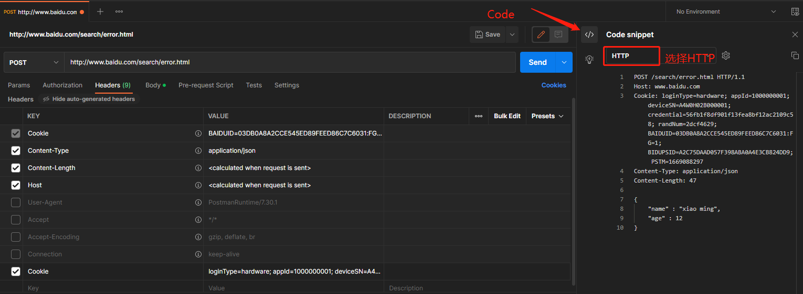
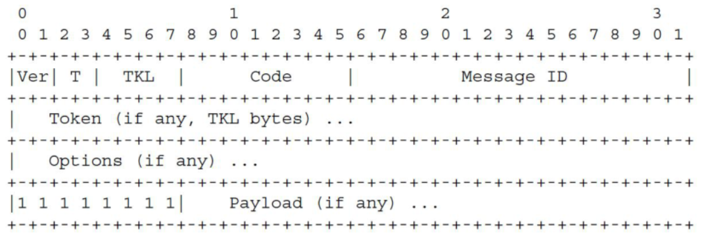
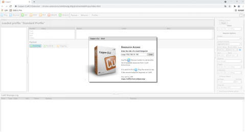
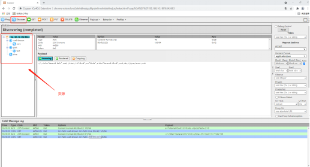
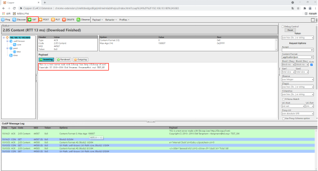
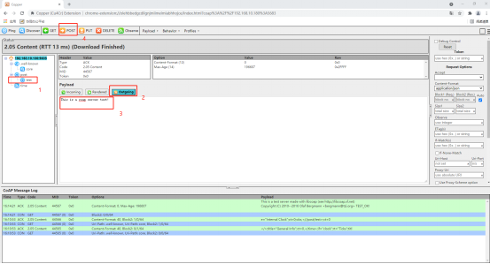

# 8. 网络协议部分

# 8.1. SOCKETS

## 8.1.1. 概述

LWIP协议栈中SOCKET用法

---

## 8.1.2. DEMO工程

`apps/demo/demo_DevkitBoard`

---

## 8.1.3. TCP Client

**示例说明**

通过创建tcp socket连接到指定ip和端口号的服务端。当成功建立连接后，应用程序会向服务端发送ASCII数据， 并等待服务端回复，当客户端成功接收到服务端的数据后，会向服务端发送接收数据成功的信息。

**TCP客户端创建步骤**

1.创建socket

> ```
> void *fd = NULL;
> fd = sock_reg(AF_INET, SOCK_STREAM, 0, NULL, NULL);
> if(NULL == fd)
> {
>         printf("sock_reg fail\n");
> }
> ```

2.设置socket属性（可选）

> ```
> //如：
> unsigned int opt = 1;
> if(sock_setsockopt(fd, IPPROTO_TCP, TCP_QUICKACK, &opt, sizeof(opt)) < 0)
> {
>         printf("sock_setsockopt fail\n");
> }//如：
> unsignedintopt=1;
> if(sock_setsockopt(fd,IPPROTO_TCP,TCP_QUICKACK,&opt,sizeof(opt))<0)
> {
> printf("sock_setsockopt fail\n");
> }
> ```

3.绑定IP地址、端口号等信息（可选）

> ```
> struct sockaddr_in local_addr;
>
> local_addr.sin_family = AF_INET;
> local_addr.sin_addr.s_addr = htonl(INADDR_ANY)
> local_addr.sin_port = htons(32768);
>
> if (sock_bind(fd, (struct sockaddr *)&local_addr), sizeof(local_addr))
> {
>         printf("sock_bind fail\n");
> }
> ```

4.设置连接方IP和端口号, 并连接。

> ```
> struct sockaddr_in dest_addr;
>
> dest_addr.sin_family = AF_INET;
> dest_addr.sin_addr.s_addr = inet_addr("192.168.1.1")
> dest_addr.sin_port = htons(32769);
>
> if(sock_connect(fd, (struct sockaddr *)&dest_addr, sizeof(struct sockaddr_in)))
> {
>         printf("sock_connect fail\n");
> }
> ```

5.接收数据

> ```
> char buf[1024] = {0};
> int recv_len = sock_recvfrom(fd, buf, sizeof(buf), 0, NULL, NULL);
> if(recv_len > 0)
> {
>         printf("received %d Bytes, data : %s\n", recv_len, buf);
> }
> ```

6.发送数据

> ```
> char *send_buf = "123456";
> int send_len = sock_send(fd, send_buf, strlen(send_buf), 0);
> ```

7.关闭socket

> ```
> if(fd)
> {
>         sock_unreg(fd);
>         fd = NULL;
> }
> ```

**示例**

示例代码见 `apps\common\example\network_protocols\sockets\tcp\client\main.c`， 测试时需要在 `apps/demo/demo_DevKitBoard/include/demo_config.h` ，开启宏 `USE_TCP_CLIENT_TEST`。

**操作说明**

* 示例需要运行在STA模式 (注：如何进行sta和ap切换，请参考 Wi-Fi部分 )
* 借助tcq助手创建指定ip和端口号的服务端，并保证tcp助手和客户端处于同一网段下
* 编译工程，烧录镜像，复位启动
* 系统启动并成功联网后，tcp助手会接收到客户端的ASCII数据，同时可以通过tcp助手向客户端发送数据，数据发送成功后可以通过串口软件看到服务端发送回来的数据

**示例流程：**

* `c_main()` 入口1. 创建任务 `tcp_client_start`
* `tcp_client_start` 函数流程1. 通过 `wifi_get_sta_connect_state` 函数检测是否通过dhcp成功获取到ip
  1. 成功通过dhcp获取到ip后，启动 `tcp_client_task` 任务，退出 `tcp_client_start`
* `tcp_client_task` 任务流程1. 通过 `tcp_client_init` 进行TCP Client初始化，包括：创建socket，连接到服务端
  1. 通过 `tcp_send_data` 向服务端发送数据
  2. 通过 `tcp_recv_data` 接收服务端数据

---

## 8.1.4. TCP Server

**示例说明**

通过创建TCP socket并绑定指定端口后开启监听，等待客户端连接。当接收到客户端连接请求并成功建立连接后， 应用程序会等待接收客户端的数据，当服务端成功接收到客户端的数据后，会向对应客户端发送接收数据成功的信息。

**TCP服务端创建步骤**

1.创建socket

> ```
> void *fd = NULL;
> fd = sock_reg(AF_INET, SOCK_STREAM, 0, NULL, NULL);
> if(NULL == fd)
> {
>         printf("sock_reg fail\n");
> }
> ```

2.设置socket属性（可选）

> ```
>  //如：
> unsigned int opt = 1;
> if(sock_setsockopt(fd, SOL_SOCKET, SO_REUSEADDR ,&opt, sizeof(opt)) < 0)
> {
>        printf("sock_setsockopt fail\n");
> }
> ```

3.绑定IP地址、端口号等信息（可选）

> ```
> struct sockaddr_in local_addr;
>
> local_addr.sin_family = AF_INET;
> local_addr.sin_addr.s_addr = htonl(INADDR_ANY)
> local_addr.sin_port = htons(32768);
>
> if (sock_bind(fd, (struct sockaddr *)&local_addr), sizeof(local_addr))
> {
>         printf("sock_bind fail\n");
> }
> ```

4.开启监听

> ```
> if (sock_listen(fd, 3))
> {
>         printf("sock_listen fail\n");
> }
> ```

5.等待客户端连接

> ```
> void *c_fd = NULL;
> int flag = 1;
> struct sockaddr_in c_addr;
> socklen_t len = sizeof(struct sockaddr_in);
>
> c_fd = sock_accept(fd, (struct sockaddr*)&c_addr, &len, NULL, NULL);
> flag = 0;
> if(c_fd == NULL)
> {
>         printf("sock_accept fail\n");
> }
> ```

6.接收数据

> ```
> char buf[1024] = {0};
> int recv_len = sock_recv(fd, buf, sizeof(buf), 0);
> if(recv_len > 0)
> {
>         printf("received %d Bytes, data : %s\n", recv_len, buf);
> }
> ```

7.发送数据

> ```
> char *send_buf = "123456";
> int send_len = sock_send(fd, send_buf, strlen(send_buf), 0);
> ```

8.关闭socket

> ```
> if(fd)
> {
>         flag = 1;
>         sock_set_quit(fd);
>         while(flag)   //等待sock_accept退出后再释放socket，防止释放socket后还在使用。
>         {
>                 os_time_dly(20);
>         }
>         sock_unreg(fd);
>         fd = NULL;
> }
> ```

**示例**

示例代码见 `apps\common\example\network_protocols\sockets\tcp\server\main.c`， 测试时需要在 `apps/demo/demo_DevKitBoard/include/demo_config.h` ，开启宏 `USE_TCP_SERVER_TEST` 。

**操作说明**

* 系统启动并成功联网后，借助tcq助手创建客户端，设置好服务端ip和端口号后发起连接，成功连接后可以通过串口软件看到提示信息， 此时客户端可以向服务端发送一些数据，当服务端成功接收到数据后，会向对应客户端发送接收数据成功的信息。
* 注意：本例程暂时只提供了STA模式下的TCP Server。AP模式下的TCP Server需要自行编写。

**示例流程如下：**

* `c_main()` 入口1. 创建 `tcp_server_start` 任务
* `tcp_server_start` 函数流程1. 调用 `tcp_server_init` 进行初始化，退出 `tcp_server_start`
* `tcp_server_init` 任务流程1. 创建TCP socket。
  1. 创建接收客户端连接请求任务 `tcp_sock_accpet`
  2. 创建接收客户端数据任务 `tcp_recv_handler`
* `tcp_sock_accpet` 函数流程1. 等待客户端连接，成功接收到客户端请求后，会把对应客户端的信息保存到链表中
* `tcp_recv_handler` 函数流程1. 接收客户端数据，成功接收到数据后，向对应客户端发送接收数据成功的信息
* 调用 `tcp_server_exit` 可关闭网路连接，需要使用者自行调用

---

## 8.1.5. UDP Client

**示例说明**

UDP通信无需建立连接关系，创建套接字后便可以向指定服务端发送数据，示例请参考UDP Server

**UDP客户端创建步骤**

1.创建socket

> ```
> void *fd = NULL;
> fd = sock_reg(AF_INET, SOCK_DGRAM, 0, NULL, NULL);
> if(NULL == fd)
> {
>         printf("sock_reg fail\n");
> }
> ```

2.设置socket属性（可选）

> ```
> //如：
> unsigned int millsec = 100;
> if(ock_setsockopt(fd, SOL_SOCKET, SO_SNDTIMEO, (const void *)&millsec, sizeof(millsec)) < 0)
> {
>         printf("sock_setsockopt fail\n");
> }
> ```

3.绑定IP地址、端口号等信息（可选）

> ```
> struct sockaddr_in c_addr;
>
> c_addr.sin_family = AF_INET;
> c_addr.sin_addr.s_addr = htonl(INADDR_ANY)
> c_addr.sin_port = htons(32768);
>
> if (sock_bind(fd, (struct sockaddr *)&c_addr), sizeof(c_addr))
> {
>         printf("sock_bind fail\n");
> }
> ```

4.接收数据

> ```
> int recv_len;
> char recv_buf[1024];
> struct sockaddr_in s_addr = {0};
> socklen_t len = sizeof(s_addr);
>
> for（;;）
> {
>         recv_len = sock_recvfrom(fd, recv_buf, sizeof(recv_buf), 0, \
>                                                         (struct sockaddr *)&s_addr, &len);
>         if(recv_len > 0)
>         {
>                 printf("received %d Bytes, data : %s\n", recv_len, recv_buf);
>         }
> }
> ```

5.发送数据

> ```
> int send_len = sock_sendto(fd, send_buf, strlen(send_buf), 0, \
>                                                    (struct sockaddr *)&s_addr, sizeof(struct sockaddr_in));
>
> ```

6.关闭socket

> ```
> if(fd)
> {
>         sock_unreg(fd);
>         fd = NULL;
> }
> ```

---

## 8.1.6. UDP Server

**示例说明**

通过创建的udp socket并绑定指定ip和端口号后，等待接收客户端数据，当成功接收到数据后，再重新把接收到的数据发送回客户端。

**UDP服务端创建步骤**

1.创建socket

> ```
> void *fd = NULL;
> fd = sock_reg(AF_INET, SOCK_DGRAM, 0, NULL, NULL);
> if(NULL == fd)
> {
>         printf("sock_reg fail\n");
> }
> ```

2.设置socket属性（可选）

> ```
> //如：
> unsigned int opt = 1;
> if(sock_setsockopt(fd, SOL_SOCKET, SO_REUSEADDR ,&opt, sizeof(opt)) < 0)
> {
>         printf("sock_setsockopt fail\n");
> }
> ```

3.绑定IP地址、端口号等信息

> ```
> struct sockaddr_in s_addr;
>
> s_addr.sin_family = AF_INET;
> s_addr.sin_addr.s_addr = htonl(INADDR_ANY)
> s_addr.sin_port = htons(32768);
>
> if (sock_bind(fd, (struct sockaddr *)&s_addr), sizeof(s_addr))
> {
>         printf("sock_bind fail\n");
> }
> ```

4.接收数据

> ```
> int recv_len;
> char recv_buf[1024];
> struct sockaddr_in c_addr = {0};
> socklen_t len = sizeof(c_addr);
>
> for（;;）
> {
>         recv_len = sock_recvfrom(fd, recv_buf, sizeof(recv_buf), 0, \
>                                                         (struct sockaddr *)&c_addr, &len);
>         if(recv_len > 0)
>         {
>                 printf("received %d Bytes, data : %s\n", recv_len, recv_buf);
>         }
> }
> ```

5.发送数据

> ```
> int send_len = sock_sendto(fd, send_buf, strlen(send_buf), 0, \
>                                                 (struct sockaddr *)&c_addr, sizeof(struct sockaddr_in));
> ```

6.关闭socket

> ```
> if(fd)
> {
>         sock_unreg(fd);
>         fd = NULL;
> }
> ```

**操作说明**

* 示例需要运行在STA模式 (注：如何进行sta和ap切换，请参考 Wi-Fi部分 )
* 编译工程，烧录镜像，复位启动。
* 系统启动并成功联网后，借助tcp/udp助手向指定ip和端口号的UDP服务端发送数据，通过串口软件可以看到tcp/udp助手发送过来的数据，同时tcp/udp助手也会接收到客户端返回的同样的数据。

**示例**

示例代码见 `apps\common\example\network_protocols\sockets\udp\server\main.c`， 测试时需要在 `apps/demo/demo_DevKitBoard/include/demo_config.h` ，开启宏 `USE_UDP_SERVER_TEST` 。

**示例流程如下：**

* `c_main()` 入口1. 创建 `udp_server_start` 任务
* `udp_server_start` 函数流程1. 通过 `wifi_get_sta_connect_state` 函数检测是否通过dhcp成功获取到ip
  1. 成功通过dhcp获取到ip后，调用 `udp_server_init` 进行初始化，退出 `udp_server_start`
* `udp_server_init` 函数流程A）创建UDP socket，绑定ip和端口号 B) 创建接收客户端数据任务 `udp_recv_handler`
* `udp_recv_handler` 函数流程1. 等待接收客户端数据，成功接收到数据后再重新把同样的数据发回给客户端
* 调用 `udp_server_exit` 可关闭连接

# 8.2. HTTP

## 8.2.1. 概述

HTTP（超文本传输协议）是应用最为广泛的应用层协议，SDK的http库 中提供了能满足大部分嵌入式开发需求的api接口供开发者使用。

* HTTP常用请求方法的使用如：POST、GET等。
* 通过HTTP协议下载文件流数据。
* 借助其他存储介质（如：flash、SD卡等）POST大文件数据流。
* 作为http服务端使用。

---

## 8.2.2. DEMO工程

`apps/demo/demo_DevkitBoard`

---

## 8.2.3. HTTP请求

**示例说明**

展示HTTP常用请求方法的使用

**示例**

示例代码见 `apps/common/example/network_protocols/http/http_post_get_put/main.c`，测试时需要在 `apps/demo/demo_DevKitBoard/include/demo_config.h` ，开启宏 `USE_HTTP_POST_GET_TEST` 。

**操作说明**

* 示例需要运行在STA模式 (注：如何进行sta和ap切换，请参考 Wi-Fi部分 )
* 选择工程其中一种请求方法进行测试。
* 编译工程，烧录镜像，复位启动
* 系统启动并成功联网后，应用程序会向服务端发送对应请求，可通过串口软件看到打印信息

**示例流程如下：**

* `c_main()` 入口1. 创建任务 `http_test_start`
* `http_test_start` 函数流程1. 通过 `wifi_get_sta_connect_state` 函数检测是否通过dhcp成功获取到ip
  1. 成功通过dhcp获取到ip后，创建任务 `http_test_task`，退出 `http_test_start`
* `http_test_task` 任务流程1. 根据定义的请求方法，初始化http相关参数
  1. 向服务端发送对应请求

**自定义头部:**

```
#define HTTP_DEMO_URL  "http://www.baidu.com/search/error.html"

#define LOG_HTTP_HEAD_OPTION        \
"POST /search/error.html HTTP/1.1\r\n"\
"Host: www.baidu.com\r\n"\
"Connection: close\r\n"\
"Cache-Control: no-store\r\n"\
"Content-type: application/json\r\n"\
"Content-length: 30\r\n"\
"Accept: */*\r\n"\
"Accept-Language: zh-CN,zh,q=0.8\r\n"\
"Cookie: loginType=hardware; appId=1000000001; deviceSN=A4W0H02B000001; credential=56fb1f8df901f13fea8bf12ac2109c58; randNum=2dcf4629\r\n\r\n"

ctx->user_http_header = LOG_HTTP_HEAD_OPTION;        //添加该参数, 则自定义申请头部内容
```

`LOG_HTTP_HEAD_OPTION` 为自定义的头部信息, `Cookie` 为自行添加的信息, 格式如上, 最后一行需多一个 `\r\n` 作为结尾. `POST` 字段所跟的是url的后缀, `Host` 字段所跟的是url的域名, 其他的信息, 可以自行在postman软件中Code找到HTTP选项自行填写.



---

## 8.2.4. HTTP下载文件

**示例说明**

通过HTTP协议，下载URL指定的网络文件存储至指定路径，并具有断点重载的功能

**示例实例**

示例代码见 `apps/common/example/network_protocols/http/http_download/main.c`，测试时需要在 `apps/demo/demo_DevkitBoard/include/demo_config.h` 中开启宏 `USE_HTTP_DOWNLOAD_TEST` 。

**操作说明**

* 示例需要运行在STA模式 (注：如何进行sta和ap切换，请参考 Wi-Fi部分 )
* 设置好下载链接（注：修改HTTP_DOWNLOAD_URL定义），网络文件存储路径（注：修改HTTP_STORAGE_PATH定义）
* 编译工程，烧录镜像，复位启动
* 系统启动，成功联网并且存储设备就绪后，会对指定网络文件进行下载并保存在指定的存储路径下

**示例流程如下：**

* `c_main()` 入口1. 创建任务 `http_download_start`
* `tcp_client_start` 函数流程1. 通过 `wifi_get_sta_connect_state` 函数检测是否通过dhcp成功获取到ip
  1. 成功通过dhcp获取到ip后，调用 `net_file_download_test`，退出 `http_download_start`
* `net_file_download_test` 函数流程1. 通过 `storage_device_ready` 对存储设备状态进行检测，如果存储设备未就绪，会直接退出应用程序
  1. 调用 `create_download_task`
* `create_download_task` 函数流程1. 初始化http相关参数
  1. 创建任务 `download_task`
* `download_task` 任务流程1. 初始化http相关参数
  1. 发起连接请求，建立socket连接
  2. 建立连接成功后，读取网络文件数据，并将数据存储到指定路径下

---

## 8.2.5. HTTP POST SD卡中的文件数据

**示例说明**

出于一些开发需要，开发者需要自定义http头部信息，同时需要post数据量较大的文件数据到http服务器， 但是由于板载的资源不足，当存在sd卡等存储设备时，可借助文件系统将大文件数据post到http服务器。

**示例**

示例代码见 `apps/common/example/network_protocols/http/user_http_head/post_sd/main.c`，测试时需要在 `apps/demo/demo_DevkitBoard/include/demo_config.h` 中开启宏 `USE_HTTP_POST_SD_DATA_TEST` 。

**操作说明**

* 示例需要运行在STA模式 (注：如何进行sta和ap切换，请参考 Wi-Fi部分 )
* 定义需要post到的HTTP_DEMO_URL
* 编译工程，烧录镜像，复位启动
* 系统启动并成功连接网络后，可通过串口软件看到相关打印

**示例流程如下：**

* `c_main()` 入口1. 创建任务 `http_user_header_test`
* `http_user_header_test` 函数流程1. 通过 `wifi_get_sta_connect_state` 函数检测是否通过dhcp成功获取到ip
  1. 通过 `storage_device_ready` 对存储设备状态进行检测
  2. 成功通过dhcp获取到ip并存储设备就绪后，创建任务 `http_test_task`
* `http_test_task` 任务流程1. 设置自定义http头部信息和http连接的相关参数
  1. 通过文件系统读取SD卡中的文件数据到临时缓存，再通过http接口将文件数据流发送到http服务器

Note

该示例为了展示默认的http 报文头部信息无法满足需求，需要用户自定义http 报文头的情况。

---

## 8.2.6. HTTP Server

**示例说明**

展示了http服务器的使用，通过手机连接http服务器获取服务器资源。注意：sdk工程中http server只提供了get请求，其他请求方式暂时不提供。

**示例实例**

示例代码见 `apps/common/example/network_protocols/http/server/main.c`，测试时需要在 `apps/demo/demo_DevkitBoard/include/demo_config.h` 中开启宏 `USE_HTTP_SERVER_TEST` 。

**操作说明**

* 示例需要运行在AP模式 (注：如何进行sta和ap切换，请参考 Wi-Fi部分 )
* 编译工程，烧录镜像，复位启动
* 系统启动后，连接AP wifi，成功连接AP wifi后，在手机浏览器中输入网址192.168.1.1:9080/index.html，跳转到该网址后手机上就会获取到http服务器的网页页面数据。

**示例流程如下：**

* `c_main()` 入口1. 创建任务 `http_server_start`
* `http_server_start` 函数流程1. 延时一段时间等待ap wifi稳定后，创建任务http_server_task
* `http_test_task` 任务流程1. 通过 `http_virfile_reg` 注册资源
  1. `http_get_server_init` 初始化http服务器，并等待客户端连接。

## 8.2.7. 常见问题

* 如何进行http通信调试？（使用http通信失败？）

答：由于自定义http头部需要开发者对http协议有一定程度的理解，很多时候无法进行http通信都是由于http通信协议格式错误， 因此调试时需要先借助其他软件，如：postman等，将http通信调通，然后仿照其头部协议格式进行程序编写。同时详细对比例程中的自定义http头部与开发者自行编写的http头部是否存在错误。

* 如何使用https添加证书?

答: 参考 示例代码 `apps\common\example\network_protocols\mqtts\main.c` 下https请求的证书添加。

* 如何查看设备发送的http内容

答：1.可以利用WIFI抓包（注：如何使用WIFI抓包，请参考 WIFI抓包使用说明 ）;

2.以http post为例，正常情况下，当开发者自定义了http头部并添加 `ctx->user_http_header = LOG_HTTP_HEAD_OPTION;` 后，调用 `httpcli_post(ctx)` ，将会发送宏 `LOG_HTTP_HEAD_OPTION` 的内容，`httpcli_post() ``；会进行判断 ``user_http_header ``中是否为 ``NULL` ， `NULL` 则执行发送固定的http头部，否则发送 `user_http_header` 内的数据。因此确保宏 `LOG_HTTP_HEAD_OPTION` 没有写错即可。

# 8.3. MQTT CLIENT

## 8.3.1. 概述

MQTT 是轻量级的发布/订阅消息协议

## 8.3.2. DEMO工程

`apps/demo/demo_DevKitBoard`

## 8.3.3. MQTT示例

**示例说明**

通过MQTT 协议连接阿里云服务器，并向阿里云订阅主题和发布消息

**MQTT流程**

1.mqtt参数初始化

> ```
> unsigned char sendbuf[80], readbuf[80];
> MQTTClient client;
> Network network;
> MQTTPacket_connectData connectData = MQTTPacket_connectData_initializer;
>
> NetworkInit(&network);
> MQTTClientInit(&client, &network, 30000, sendbuf, sizeof(sendbuf), readbuf, sizeof(readbuf));
> ```

2.mqtt网络层连接

> ```
> char* address = "iot.eclipse.org";
> if ((rc = NetworkConnect(&network, address, 1883)) != 0)
>     printf("Return code from network connect is %d\n", rc);
> ```

3.mqtt协议层连接

> ```
> connectData.MQTTVersion = 3;
> connectData.clientID.cstring = "FreeRTOS_sample";
>
> if ((rc = MQTTConnect(&client, &connectData)) != 0)
>     printf("Return code from MQTT connect is %d\n", rc);
> else
>     printf("MQTT Connected\n");
> ```

4.主题订阅（可选）

> ```
> void messageArrived(MessageData* data)
> {
>         printf("Message arrived on topic %.*s: %.*s\n", data->topicName->lenstring.len, data->topicName->lenstring.data,
>             data->message->payloadlen, data->message->payload);
> }
>
> if ((rc = MQTTSubscribe(&client, "FreeRTOS/sample/#", 2, messageArrived)) != 0)
>     printf("Return code from MQTT subscribe is %d\n", rc);
> ```

5.消息发布（可选）

> ```
> MQTTMessage message;
> char payload[30] = "mqtt test!";
>
> message.qos = 1;
> message.retained = 0;
> message.payload = payload;
> message.payloadlen = strlen(payload);
>
> if ((rc = MQTTPublish(&client, "FreeRTOS/sample/a", &message)) != 0)
>     printf("Return code from MQTT publish is %d\n", rc);
> ```

6.MQTTYield调用

> ```
> while (1)
> {
>         if ((rc = MQTTYield(&client, 1000)) != 0)
>                 printf("Return code from yield is %d\n", rc);
> }
> ```

**MQTT接口说明**

1. 网络接口初始化

| **函数**   | void NewNetwork(Network *n) |
| ---------------- | --------------------------- |
| **描述**   | 网络接口初始化              |
| **参数**   | n：Network结构体指针        |
| **返回值** | void                        |

2. 客户端初始化

| **函数**   | void MQTTClient(Client *c, Network *network, unsigned int command_timeout_ms, unsigned char *buf, size_t buf_size, unsigned char *readbuf, size_t readbuf_size)                                                             |
| ---------------- | --------------------------------------------------------------------------------------------------------------------------------------------------------------------------------------------------------------------------- |
| **描述**   | 客户端初始化                                                                                                                                                                                                                |
| **参数**   | c：Client结构体指针； network：Network结构体指针； command_timeout_ms：命令超时时间，单位：毫秒； buf：写缓存指针，内存由用户分配； buf_size：写缓存大小； readbuf：读缓存指针，内存由用户分配； readbuf_size：读缓存大小； |
| **返回值** | void                                                                                                                                                                                                                        |

3. 网络层连接

| **函数**   | int ConnectNetwork(Network *n, char *addr, int port)              |
| ---------------- | ----------------------------------------------------------------- |
| **描述**   | 网络层连接                                                        |
| **参数**   | n：Network结构体指针; addr：MQTT服务器地址; port：MQTT服务器端口; |
| **返回值** | 0：成功 其他：失败                                                |

4. MQTT协议层连接

| **函数**   | int MQTTConnect(Client *c, MQTTPacket_connectData *options) |
| ---------------- | ----------------------------------------------------------- |
| **描述**   | MQTT协议层连接                                              |
| **参数**   | c：Client结构体指针; options：连接参数 ;                    |
| **返回值** | 0：成功 其他：失败                                          |

5. 主题订阅

| **函数**   | int MQTTSubscribe(Client *c, const char *topicFilter, enum QoS qos, messageHandler messageHandler)                                     |
| ---------------- | -------------------------------------------------------------------------------------------------------------------------------------- |
| **描述**   | 向MQTT服务器订阅主题                                                                                                                   |
| **参数**   | c：Client结构体指针; topicFilter：订阅的主题; qos：订阅的服务质量等级; messageHandler：接收回调，当订阅的主题有信息下发时，在这里接收; |
| **返回值** | 0：成功 其他：失败                                                                                                                     |

6. 取消订阅的主题

| **函数**   | int MQTTUnsubscribe(Client *c, const char *topicFilter); |
| ---------------- | -------------------------------------------------------- |
| **描述**   | 向MQTT服务器取消订阅的主题                               |
| **参数**   | c：Client结构体指针; topicFilter：想要取消的主题;        |
| **返回值** | 0：成功 其他：失败                                       |

7. 发布消息

| **函数**   | int MQTTPublish(Client *c, const char *topicName, MQTTMessage *message)     |
| ---------------- | --------------------------------------------------------------------------- |
| **描述**   | 发布消息                                                                    |
| **参数**   | c：Client结构体指针； topicFilter：消息发布主题； message：需要发布的消息； |
| **返回值** | 0：成功 其他：失败                                                          |

8. 断开MQTT协议层连接

| **函数**   | int MQTTDisconnect(Client *c)                                       |
| ---------------- | ------------------------------------------------------------------- |
| **描述**   | 断开MQTT协议层连接                                                  |
| **参数**   | c：Client结构体指针; （注意：该接口调用后只是断开MQTT协议层的连接） |
| **返回值** | 0：成功 其他：失败                                                  |

9. 阻塞等待数据接收

| **函数**   | int MQTTYield(Client *c, int timeout_ms)                                     |
| ---------------- | ---------------------------------------------------------------------------- |
| **描述**   | 阻塞等待数据接收                                                             |
| **参数**   | c：Client结构体指针; timeout_ms: 接收阻塞时间;（注意：该接口需要被循环调用） |
| **返回值** | 0：成功 其他：失败                                                           |

**示例**

示例代码见 `apps\common\example\network_protocols\mqtt\main.c`， 测试时需要在 `apps/demo/demo_DevKitBoard/include/demo_config.h` ，开启宏 `USE_MQTT_TEST` 。

**示例流程如下：**

* 示例需要运行在STA模式 (注：如何进行sta和ap切换，请参考 Wi-Fi部分 )
* 根据在阿里云上创建的设备，设置好address、username、password、subscribeTopic、publishTopic和clientID等信息，配置格式请参考参考文档。
* 编译工程，烧录镜像，复位启动。
* 系统启动并成功联网后，可通过串口软件看到打印信息。

## 8.3.4. 常见问题

* 如何进行mqtt调试？

答：mqtt无法订阅或发布消息，一般跟连接配置参数设置和格式等有关。 可以借助其他MQTT客户端软件如：MQTT.fx等，先成功连接mqtt服务器并可以进行订阅和发布后，再仿照其参数进行mqtt程序配置。

# 8.4. WEBSOCKET CLIENT

## 8.4.1. 概述

Websocke是一种在TCP连接上进行全双工通信的协议

## 8.4.2. DEMO工程

`apps/demo/demo_DevkitBoard`

## 8.4.3. Websocket示例

**示例说明**

websocket示例工程展示了作为客户端发送数据到websocket服务器，并从服务器接收数据的示例

**示例**

示例代码见 `apps\common\example\network_protocols\websocket\main.c`， 测试时需要在 `apps/demo/demo_DevKitBoard/include/demo_config.h` ，开启宏 `USE_WEBSOCKET_TEST` 。

**操作说明**

* 示例需要运行在STA模式 (注：如何进行sta和ap切换，请参考 Wi-Fi部分 )
* 编译工程，烧录镜像，复位启动
* 系统启动并成功联网后，websocket客户端会循环发送数据到服务器，并接收websocket服务器的数据

**示例流程如下：**

* `c_main()` 入口1. 创建任务 `websocket_start`
* `websocket_start` 函数流程1. 通过 `wifi_get_sta_connect_state` 函数检测是否通过dhcp成功获取到ip
  1. 成功通过dhcp获取到ip后，调用 `websocket_client_thread_create` 创建任务 `websockets_client_main_thread`，退出 `websocket_start`
* `websockets_client_main_thread` 任务流程1. 初始化websocket相关参数和API（注：大多数接口都是内部已经实现好，用户只需要实现回调函数用于数据处理），连接websocket服务器
  1. 连接成功后，创建 `websocket_client_heart` 任务和 `websocket_client_recv` 任务，接着循环向websocket服务器发送数据
* `websockets_callback` 为接收数据回调函数，用户可以进行数据处理

# 8.5. COAP

## 8.5.1. 概述

---

CoAP是受限制的应用协议（Constrained Application Protocol）的简称



* Ver（版本编号）固定为0b01
* T(报文类型)* coap协议中定义了4中报文类型，分别为：

  * CON(Confirmable，T=0b00):需要确认的报文类型。
  * NON(Non-Confirmable, T=0b01)：不需要确认的报文类型。
  * ACK(Acknowledgement， T=0b10):应答报文
  * Reset（T=0b11）：复位报文
* TKL（标签长度）
* Code（格式：c（3bit class type）.dd(5bit detail code)）（1）表示请求时* Code=0.01,表示GET方法

  * Code=0.02，表示POST方法
  * Code=0.03，表示PUT方法
  * Code=0.04，表示DELETE方法

  （2）表示响应时* Code=0.00，表示空报文

  * Code=2.xx，表示为正确的响应
  * Code=4.xx，表示为客户端的错误响应
  * Code=5.xx，表示为服务器的错误响应
* Message ID（报文序号） - COAP请求和对应的COAP响应采用相同的Message ID
* Token(标签)
* Options（选项） - 选项包括Uri-Host、Uri-Path、Uri-Port、Content-Format、Accept等。
* 0xFF（分隔符）
* payload（数据）

---

## 8.5.2. DEMO工程

`apps/demo/demo_DevkitBoard`

---

## 8.5.3. COAP Client

**示例说明**

展示了coap client的工程示例

**示例实例**

示例代码见 `apps\common\example\network_protocols\coap\coap_client\main.c`， 测试时需要在 `apps/demo/demo_DevKitBoard/include/demo_config.h` ，开启宏 `USE_COAP_CLIENT_TEST` 。

**操作说明**

* 示例需要运行在STA模式 (注：如何进行sta和ap切换，请参考 Wi-Fi部分 )
* 编译工程，烧录镜像，复位启动
* 系统启动并成功联网后，向指定coap服务器发送报文，可通过串口软件看到相关输出打印

**示例流程如下：**

* `c_main()` 入口1. 创建任务 `coap_client_start`
* `coap_client_start` 函数流程1. 通过 `wifi_get_sta_connect_state` 函数检测是否通过dhcp成功获取到ip
  1. 成功通过dhcp获取到ip后，调用 `coap_client_test`
* `coap_client_test` 任务流程1. 通过GET方法向coap服务器发送confirmabel报文

---

## 8.5.4. COAP Server

**示例说明**

展示了coap server的工程示例

**示例实例**

示例代码见 `apps\common\example\network_protocols\coap\coap_server\main.c`， 测试时需要在 `apps/demo/demo_DevKitBoard/include/demo_config.h` ，开启宏 `USE_COAP_SERVER_TEST` 。

**操作说明**

* 编译工程，烧录镜像，复位启动
* 系统启动并成功联网后，coap服务器等待客户端连接
* 利用copper插件作为客户端，连接coap服务器并向服务器发起GET,POST和PUT请求，可通过串口软件看到相关输出打印。

**示例流程如下：**

* `c_main()` 入口1. 创建任务 `coap_server_start`
* `coap_server_start` 函数流程1. 通过 `wifi_get_sta_connect_state` 函数检测是否通过dhcp成功获取到ip
  1. 成功通过dhcp获取到ip后，调用 `coap_server_test` 创建coap服务器

## 8.5.5. COAP Server调试方法

1.利用copper插件作为客户端连接设备coap服务器。



2.点击Discover，查看coap服务器能提供哪些资源。



3.通过GET方法获取资源。



4.通过POST提交数据，通过串口可查看服务器接收到的数据。



# 8.6. NTP

## 8.6.1. 概述

ntp网络时间协议用法

---

## 8.6.2. 配置说明

* 用户可以在文件 `include_lib/net/lwip_2_1_3/lwip/app/ntp/ntp.h` 添加自己的ntp服务器：

```
//此处添加ntp服务器,请自行测试ntp服务器是否正常
 static const char *ntp_host[] = {
       "s2a.time.edu.cn",
       "s2b.time.edu.cn",
       "s2c.time.edu.cn",
       // "s2d.time.edu.cn",
       // "s2e.time.edu.cn",
       // "s2f.time.edu.cn",
       // "s2g.time.edu.cn",
       // "s2h.time.edu.cn",
       // "s2j.time.edu.cn",
       // "s2k.time.edu.cn",
       // "s2m.time.edu.cn",
};
```

* 打印控制,用户可以打开关闭DEBUG,ERR打印信息

```
#define NTP_DBUG_INFO_ON 0               /*!< NTP client debug information on/off */
#define NTP_ERR_INFO_ON  1               /*!< NTP client error information on/off */
```

* 用户可以在文件 `apps/common/net/wifi_conf.c` 中配置是否开机调用ntp

```
constu8ntp_get_time_init=1;//连上网后调用ntp向ntp_host列表所有服务器获取时间, 0为关闭, 1为开启
```

## 8.6.3. API Reference

**Functions**

int **ntp_client_get_time_once**(const char *host, struct tm *s_tm, int recv_to)
Get time from ntp server

**Parameters:**
host – NTP server host name
s_tm – Save time information
recv_to – The value of socket receive timeout(ms)

**Returns:**
0: sucess
-1: fail

int **ntp_client_get_time_all**(struct tm *s_tm, int recv_to)
Get time from all ntp_host list server

**Parameters:**
s_tm – Save time information
recv_to – The value of socket receive timeout(ms)

**Returns:**
0: sucess
-1: fail

u8 **ntp_client_get_time_status**(void)
Get the status of the time from ntp server

**Returns:**
0: sucess
-1: fail or still getting

void **ntp_client_get_time**(const char *host)
Get time from ntp server,and save to the rtc,if it has.

**Note**
This api is a loop, is will exit when getting time successful or calling ntp_client_get_time_exit function. When it succeed, it will post the net_event NET_NTP_GET_TIME_SUCC and set the ntp_client_time_status to 1.

**Parameters:**
host – NTP server host name, if NULL, it will visit all the ntp_host list.

void **ntp_client_get_time_exit**(void)
Exit the ntp_client_get_time function.

void **ntp_client_get_time_clear**(void)
clear the status of the time from ntp server

## 8.6.4. 示例实例

示例代码见 `apps/common/example/network_protocols/ntp/main.c`， 测试时需要在 `apps/demo/demo_DevKitBoard/include/demo_config.h` ，开启宏 `USE_NTP_TEST` 。

**操作说明**

* 编译工程，烧录镜像，复位启动
* 系统启动并成功联网后，开始向ntp服务器发起请求。

**示例流程如下：**

* `c_main()` 入口1. 创建任务 `ntp_test`
* `ntp_test` 函数流程1. 通过 `wifi_get_sta_connect_state` 函数检测是否通过dhcp成功获取到ip
  1. 成功通过dhcp获取到ip后，线程调用 `ntp_test2` 创建获取所有NTP服务器函数
  2. 模仿弱网情况, 主动退出NTP请求
  3. 获取一次请求状态
  4. 清除请求状态
  5. 请求获取指定NTP服务器
  6. 再次获取状态
