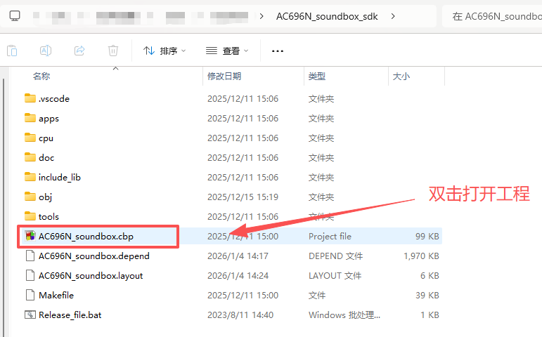
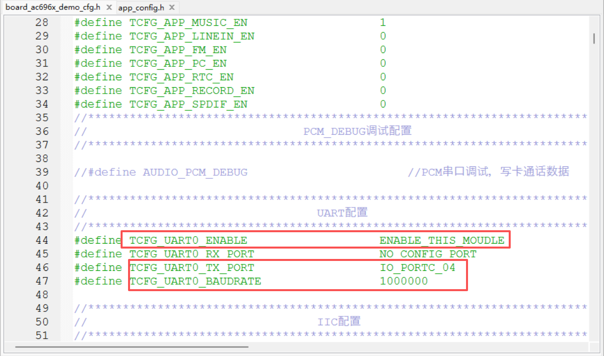
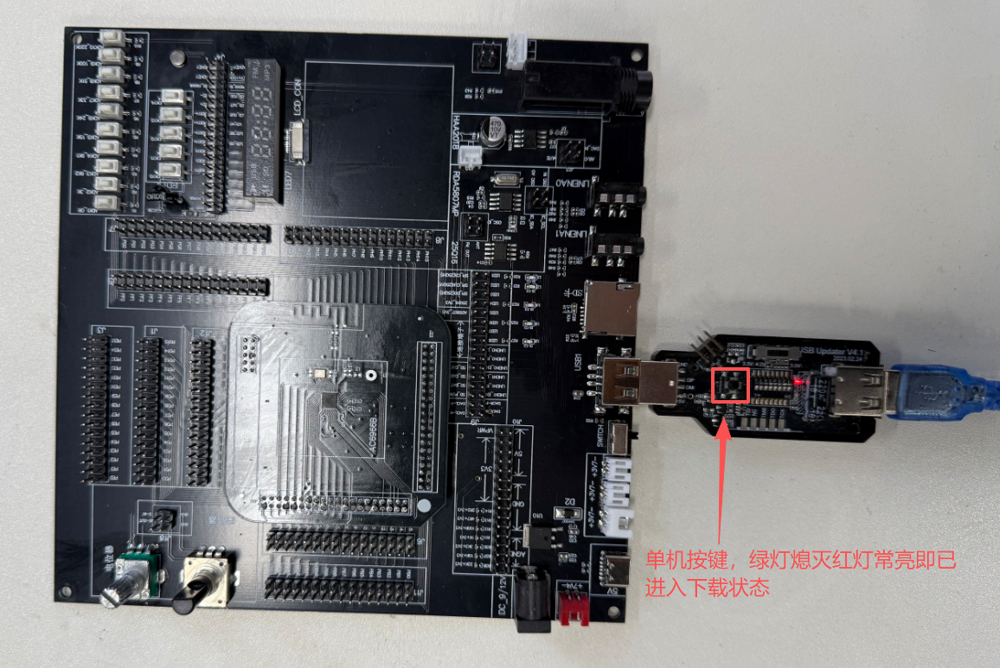
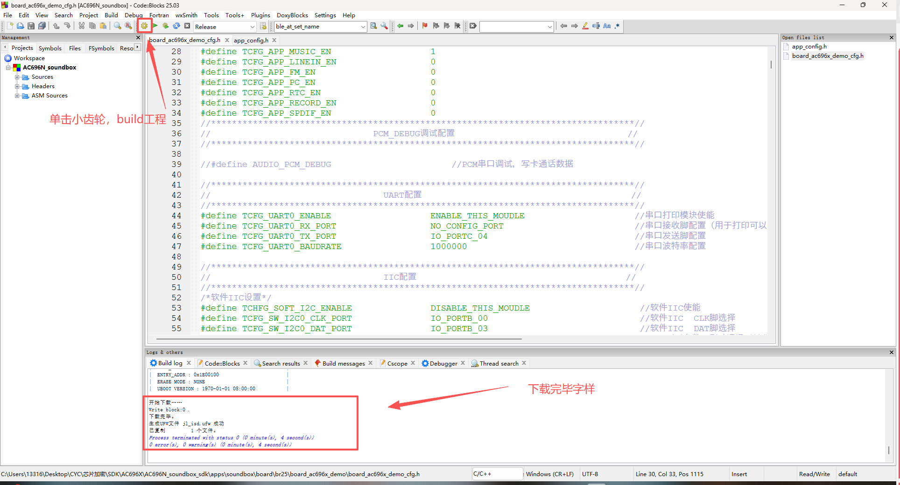
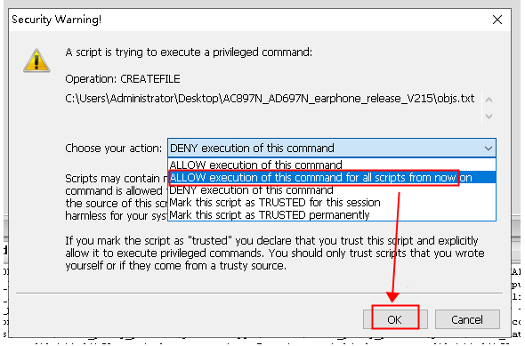

# 1. 快速上手
1. 下载并安装 [Windows版Code::Blocks](https://pkgman.jieliapp.com/s/codeblocks)

   打开安装好的 Code::Blocks 后，关闭 Code::Blocks （这是为了让Code::Blocks生成一些基础设置信息）

2. 下载并安装 [最新版本的杰理Windows版工具链](https://pkgman.jieliapp.com/s/win-toolchain)，如果需要编译固件，参考[固件文件处理工具](docs/Environment/固件文件处理工具/1.md)

3. 下载并安装 [杰里包管理器](https://pkgman.jieliapp.com/s/pkgman)。

4. 下载相关SDK，请戳：[代码仓库](https://gitcode.com/yunthinker)。

5. 下载项目进开发板，以696系列为例：

  * 解压后双击打开工程

   

  * 快捷键ALT+G搜索打开文件'board_ac696x_demo_cfg.h'

  * 根据当前串口脚和波特率连接串口工具

  

  * 连接下载工具

   

  * 点击小齿轮build工程

  * 如果提示Security Warning按下图选择

当看到”下载完毕“字样即下载成功，就可以上电通过串口工具进行调试啦。详细步骤见 [环境搭建](docs/Environment/程序开发相关工具/1.md)